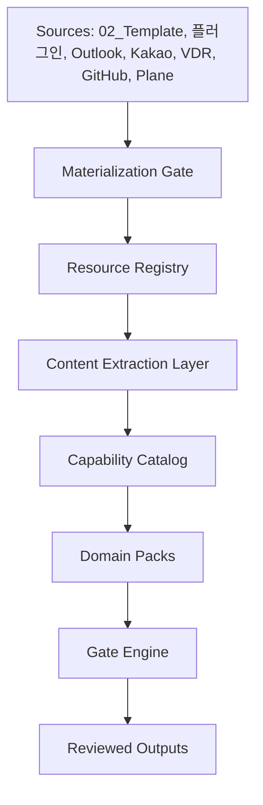
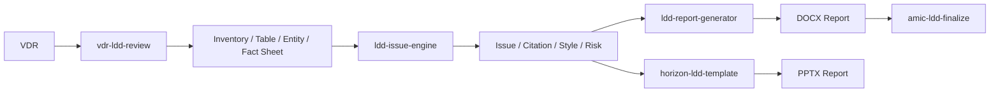
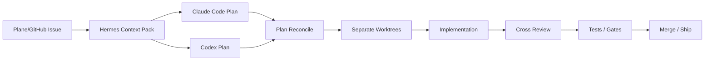

# 로펌용 Hermes Harness 아키텍처

## 목표

로펌용 Hermes Harness는 사건별 기억과 운영 흐름을 보존하는 계층입니다. AI가 결론을 내리는 시스템이 아니라, 사람이 놓치기 쉬운 업무 흐름을 계속 정리하고 경고하는 시스템입니다.

핵심 산출물은 다음입니다.

- matter daily brief
- task and deadline register
- evidence and document matrix
- pending client question list
- weekly WIP and billing draft
- governance or litigation risk map

## 계층 구조

`02_Template`와 `플러그인` 본문 추출 결과, 하네스의 중심은 단순 matter store가 아니라 resource/capability control plane이어야 한다.

Domain pack은 다음처럼 분리한다.

- `law-firm`: LDD, 계약서, 소송서면, 회사법, 의견서, 이메일 회신, 수임제안서
- `personal-dev`: 개인 개발 프로젝트 관리, Claude Code/Codex 교차 리뷰, GitHub/Plane workflow
- `creative-content`: 웹소설, 동영상, PPTX 보고자료, agent UI 실험
- `document`: DOCX/PPTX/XLSX/PDF 추출, 서식 품질검사, 디자인 시스템

## Matter Operating Store

초기 버전은 JSON 파일로 시작합니다. 실제 배포에서는 Postgres 또는 기존 DMS/ERP의 matter ID를 기준으로 연결합니다.

최소 데이터 모델은 다음입니다.

- `matter_id`: 내부 사건 번호
- `client`: 의뢰인
- `practice_area`: 업무 분야
- `confidentiality`: 접근등급과 처리 정책
- `team`: 파트너, 시니어, 주니어, paralegal 등 역할
- `communications`: 이메일, 메신저, 회의록 요약
- `documents`: 계약서, 의견서, 준비서면, 증거, 공시, 이사회 자료
- `tasks`: 담당자, 기한, 상태, 출처
- `deadlines`: 법원, 거래, 고객, 내부 기한
- `risks`: 법률 리스크가 아니라 운영상 검토 필요 신호
- `billing`: WIP, 비청구 항목, 견적 관련 메모

## Hermes의 역할

Hermes는 다음 일을 맡습니다.

- skill/plugin/script/template을 `Capability Catalog`에서 찾아 실행합니다.
- `AGENTS.md`와 matter data contract를 기준으로 작업 방식을 고정합니다.
- MCP 또는 terminal tool로 기존 시스템과 연결합니다.
- cron으로 매일/매주 brief를 생성합니다.
- 메신저 gateway를 통해 담당자에게 확인 요청을 보낼 수 있습니다.
- Claude Code와 Codex가 같은 프로젝트를 작업할 때 worktree, plan diff, review diff, test gate를 조율합니다.

초기 구현은 skill + CLI script 방식입니다. MCP는 시스템 연동이 안정화된 뒤 붙입니다.

## Resource/Capability Control Plane

본문 추출 결과 현재 로컬 파일 1,045개에서 다음 capability 후보가 확인됐다.

- `law_firm.ldd_vdr_review`
- `law_firm.contract_drafting_review`
- `platform.plugin_skill_registry`
- `document.format_qa`
- `law_firm.amic_style_system`
- `law_firm.corporate_documents`
- `law_firm.litigation_briefing`
- `document.pptx_design_system`
- `law_firm.legal_memo_opinion`
- `platform.extractor_workbench`
- `law_firm.email_reply`
- `law_firm.engagement_proposal`
- `personal.project_development_harness`
- `personal.creative_content_factory`

이 계층은 다음 레지스트리를 가진다.

- `Resource Registry`: 모든 파일의 경로, hash, extraction 상태, domain, sensitivity, lineage
- `Capability Catalog`: 플러그인/스킬/스크립트/템플릿을 호출 가능한 업무 능력으로 등록
- `Plugin Lineage Registry`: latest, legacy, backup, broken archive를 분리
- `Extractor Registry`: 문서 유형별 extractor chain, fact schema, validation rule
- `Template Intelligence Layer`: DOCX/PPTX 스타일, 표, 번호 체계, 문단 패턴 fingerprint

## LDD Pipeline

현재 `플러그인/05_LDD`에는 이미 다음 파이프라인이 있다.

따라서 LDD는 처음부터 독립 subsystem으로 설계한다.

- 원문 파일과 추출 사실을 분리 저장한다.
- issue, citation, risk, report paragraph를 provenance graph로 연결한다.
- `case_citer`, `law_currency_tracker`, `cross_document_validator`를 gate로 승격한다.
- 보고서 생성기와 서식/디자인 renderer를 분리한다.

## Claude Code / Codex 협업

개인 개발 하네스는 `agent-skills`의 workflow를 기반으로 한다.

원칙:

- Claude Code와 Codex는 같은 branch를 동시에 수정하지 않는다.
- Hermes는 각 agent의 계획, 변경 파일, 테스트 결과, 리뷰 의견을 저장한다.
- 중요한 변경은 상대 agent가 review lane에서 검토한다.
- 최종 merge는 test gate와 사람 승인을 통과해야 한다.

## LLM 사용 경계

LLM이 해도 되는 일:

- 요약
- 누락 후보 탐지
- task 후보 제안
- client question 초안
- 내부 브리프 초안
- 문서 간 불일치 후보 표시

LLM이 단독으로 해서는 안 되는 일:

- 법률 의견 최종 판단
- 소송 전략 결정
- 법원 제출 문안 확정
- 고객에게 직접 발송
- 비밀정보 접근권한 변경
- 청구 금액 확정

## 첫 배포 범위

1. 샘플 matter JSON으로 daily brief 생성
2. KakaoTalk export와 Outlook email을 communication 후보로 수집
3. 회의록에서 task/deadline 후보 추출
4. 변호사가 review status를 붙임
5. matter별 weekly WIP report 생성

이 범위를 넘기 전에 접근권한, 감사로그, 보존정책, 고객별 동의 범위를 먼저 확정합니다.
