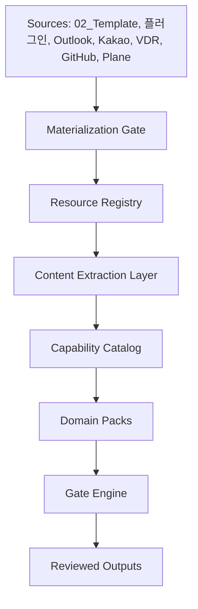
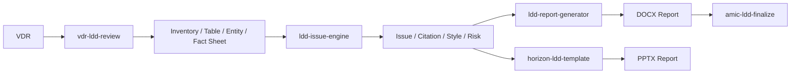
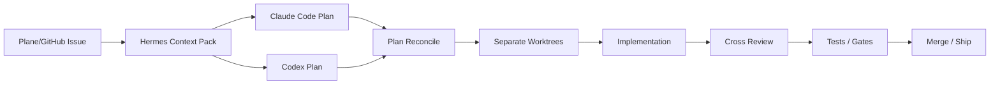

# Hermes Project Operations Harness 아키텍처

## 목표

Hermes Project Operations Harness는 개발 프로젝트와 domain-specific 업무를 같은 control plane 위에서 관리하는 플랫폼입니다. 로펌 matter 운영은 이 플랫폼 위에 올라가는 domain pack 중 하나이며, 플랫폼의 기본 중심은 project context, 다음 액션, blocker, review gate, release readiness, audit trail을 안정적으로 관리하는 것입니다.

이 시스템은 AI가 최종 결론을 내리는 제품이 아니라, 사람이 놓치기 쉬운 업무 흐름을 계속 정리하고 경고하며 검토 가능한 산출물을 만드는 운영 계층입니다.

## Hue Keynote 검증 루프 원칙

`Hue_Keynote.pdf`의 운영 원칙은 [Hue Keynote Harness Operating Loop](hue-keynote-harness-operating-loop.md), [Hermes Long Range Roadmap P1200-P3200](hermes-long-range-roadmap-p1200-p3200.md), [Hermes Long Range Roadmap P4001-P8000](hermes-long-range-roadmap-p4001-p8000.md)에 반영한다.

Hermes에서 completion claim은 evidence가 아니다. completion claim이 PASS가 되려면 `evidence_ref`, `reviewer_ref`, `hard_gate_ref`, 책임 owner, block reason 또는 next allowed action이 함께 있어야 한다. Memory Bank는 단순 저장소가 아니라 다음 실행 조건을 바꾸는 grounded recall 계층이며, 실패는 사과나 재시도가 아니라 scaffold, receipt, rollback, hard gate, memory 중 하나를 바꾸는 상태 변경으로 이어져야 한다. P4001 이후에는 Codex/Claude 대화 자체도 source material로 보존하고, user correction이나 review conflict 같은 conversation improvement signal을 plan amendment, rule extraction, hard hook, validation fixture, next execution condition 후보로 승격해야 한다.

P4601-P5000 이후 개발 콘솔의 기본 milestone review process는 `Codex implementation packet -> Harness deterministic validation -> Claude Code Opus max independent review -> finding loop and revalidation -> review receipt registration -> single-owner trust classification`이다. 현재 P8000 milestone mode에서는 human adjudication을 제외하므로 protected closeout, protected final decision, enterprise trust claim은 계속 BLOCK으로 남긴다.

P5001-P5400 Verification Orchestration Runtime은 standard validator, dual-run result, negative fixture, CI required check, GitHub Actions evidence, signed attestation verify, Claude review receipt completion을 하나의 normalization layer로 묶는다. 이 계층이 ready여도 live GitHub Actions, signed attestation verification, completed Claude review receipt with durable raw JSON이 없으면 P5400 closeout은 BLOCK이다.

P5401-P5800 Multi-Engine Orchestration은 Codex primary developer, Harness deterministic validator, Claude Code Opus max independent reviewer, external evidence observer, future reviewer candidate를 명시적 engine registry로 분리한다. reviewer는 source mutation, final approval, enterprise trust claim을 만들 수 없고, 모델 업그레이드는 alias/id, compatibility review, rollback model, receipt evidence 없이는 적용할 수 없다.

P5801-P6200 Review and Enterprise Trust Hardening은 위 리뷰 프로세스를 실제 trust tier로 고정한다. GitHub independent review, branch/ruleset evidence, required status checks, signed attestation verification, completed Claude Code Opus max receipt with durable raw JSON, single-owner exception, no-human boundary, negative fixtures를 같은 normalization plane에 올린다. 이 단계가 ready여도 single-owner mode에서는 `LOWER_TRUST_INTERNAL_ONLY`만 허용하며, independent GitHub review나 attestation 같은 외부 evidence가 없으면 enterprise trust와 protected closeout은 계속 BLOCK이다.

P6201-P6600 Product and Domain SaaS Factory는 Hermes를 여러 SaaS 개발 계획의 control harness로 만든다. HR Solution, Law Firm OS, Hermes Harness, Zendd Bridge 같은 프로젝트를 SaaS project intake와 requirement traceability matrix에 등록하고, personal-dev/law-firm/creative-document/connectors-resource/trading-read-only domain pack을 재사용 가능한 `domain -> goal -> workflow -> evidence -> review -> gate` 계약으로 관리한다. 이 단계는 제품 출시, 외부 repo/service write, raw HR/client/sensitive data ingestion, protected closeout, enterprise trust, Work OS production claim을 열지 않는다.

P6601-P7000 Controlled Execution Write and Deploy는 allowlist, sandbox/timeout, redaction/secret scan, generated patch candidate, receipt-gated apply boundary, deploy receipt, rollback binding, post-apply validation, negative fixture를 준비한다. 현재 no-human milestone mode에서는 command execution, patch apply, deploy, external project write, protected action은 계속 false다. 즉 Hermes는 실행을 준비하는 계약과 UI를 만들지만, 실제 실행 권한은 열지 않는다.

P7001-P7300 Memory Bank Storage Event and Observability Plane은 Codex/Claude transcript, claim, evidence, validation, review receipt, gate verdict, plan update, next-condition을 append-only event와 object reference로 저장하는 기반이다. transcript raw body는 기본 노출하지 않고, review receipt는 durable raw JSON object ref와 normalized finding ref로 남긴다. 이 단계는 storage/observability only이며 runtime recall과 retrieval layer는 P7301-P7600 전까지 false로 유지한다.

P7301-P7600 Retrieval Ontology and Context Recall Layer는 append-only memory event를 project, domain, workflow, phase, gate, evidence, review, transcript, next-condition ontology로 색인하고, source-cited search, extracted fact recall, conflict resolution, relation graph, next-session recall bundle, boundary filter, freshness policy로 묶는다. 이 단계의 milestone review process도 `Codex implementation packet -> Harness deterministic validation -> Claude Code Opus max independent review receipt -> finding loop and revalidation -> review receipt registration -> single-owner trust classification`이다. Recall bundle은 다음 세션 컨텍스트 후보일 뿐이고, raw transcript recall, uncited recall, cross-domain recall, auto context mutation, protected final approval, enterprise trust, Work OS production claim은 계속 false다.

P7601-P7800 Security Governance Compliance and Rule Conflict Plane은 secret/raw material leak, prompt injection, rule conflict, stale gate, incident recovery, compliance theater를 hard governance row로 만든다. 검증 규칙이 늘어나면서 생기는 충돌과 drift도 source/evidence/reviewer/gate/next-action 구조로 노출한다. 이 단계도 Claude Code Opus max review receipt를 요구하지만 reviewer mutation, protected closeout, enterprise trust, runtime execution, write, Work OS claim은 열지 않는다.

P7801-P8000 Full Work OS UI and Production Freeze는 Queue, Plans, Conversations, Evidence, Reviews, Gates, Memory, Security, Domains, Runs, Settings, Audit navigation과 closed-loop maturity evidence, operator action inbox, domain rollout matrix, API/handbook alignment, milestone Claude review ledger, trust tier publication, negative fixture, production-readiness freeze packet을 고정한다. 이 단계의 완료는 UI/운영 계약 freeze이지 production release가 아니다. L6/L7 proof, protected closeout, enterprise-independent evidence가 없으면 Work OS production claim과 enterprise trust claim은 계속 false다.

P8001-P8080 P8000 Closeout Review Clean Checkpoint는 P8000 구현분을 closeout packet으로 묶고 Claude Code Opus max review receipt, durable raw JSON, normalized finding loop, deterministic validation evidence, git status evidence를 gate로 연결한다. 이 checkpoint는 no-human milestone mode를 유지하므로 human adjudication을 다시 넣지 않는다. Codex self-approval, Claude final approval, validator-only trust, protected closeout, enterprise trust, Work OS production claim, commit/push/merge side effect는 계속 false다.

P8081-P8160 Conversation Capture Contract는 Codex와 Claude Code 대화를 Harness source material로 저장하는 계약을 고정한다. 각 source는 `engine_id`, `session_id`, `transcript_ref`, raw/full/redacted transcript ref를 가져야 하며 raw/full body는 기본 UI 비노출, redacted summary만 UI 노출 가능하다. 이 계약은 goal, phase, blocker, decision, validation item 추출 row를 만들지만, 추출 자체를 truth나 final approval로 승격하지 않는다.

P8161-P8240 Plan Registry And Progress Engine은 conversation capture source를 바탕으로 long-term plan, phase, milestone, owner engine, status를 계산한다. 각 phase는 `planned`, `in_progress`, `blocked`, `pass`, `review_pending` 중 하나의 상태를 갖고 validator, evidence, gate, Claude review receipt ref와 연결된다. stale plan, missing conversation, validation not run, review receipt missing, context drift는 UI에 표시되는 상태이지 자동 PASS가 아니다. Human gate, production PASS, enterprise PASS, protected closeout은 계속 false다.

P8241-P8400 Work OS UI v0 and Harness-Governed Development Loop는 plan progress를 Project Control Dashboard, Phase Detail View, Conversation Timeline, Review Console로 투영하고, Codex Primary Engine Lane, Claude Review Lane, Harness Validation Lane, P8400 Freeze를 같은 artifact로 묶는다. UI는 project selector, current goal, phase status, claim/evidence/gate/check/review receipt, redacted conversation summary, decision, blocker, validation event, Claude review status, finding loop, unresolved finding을 보여준다. Codex 작업은 plan/phase에 귀속되고 Claude review receipt는 milestone마다 요구되며 Harness validator 결과는 UI와 plan status에 반영된다. 이 단계도 UI/loop freeze일 뿐이므로 Human gate, Codex final approval, Claude final approval, reviewer mutation, production PASS, enterprise PASS, protected closeout, runtime execution, write action은 계속 false다.

P8401-P8600 Live Session Source Store, Read-Only API Projection, and UI Handoff Adapter는 P8400 UI/loop artifact를 입력으로 받아 Codex, Claude, Harness validator, UI handoff live session source를 append-only store row로 정규화하고, redacted conversation materializer, Work OS GET-only API projection, bounded UI handoff manifest/snapshot, cited next-session restore bundle로 넘긴다. raw/full transcript body는 object ref로만 남고 UI/API에는 redacted summary와 citation ref만 노출된다. 이 단계도 handoff contract freeze일 뿐이므로 Human gate, Codex final approval, Claude final approval, reviewer mutation, production PASS, enterprise PASS, protected closeout, runtime execution, write action, external connector write, raw transcript API exposure는 계속 false다.

P8601-P8800 Work OS Live Control Surface, Artifact-Backed API Server, and Session Ingestion Adapter는 P8600 artifact를 source로 읽어 artifact-backed GET-only API route row, Codex/Claude/Harness/UI session ingestion row, redacted timeline projection, project control surface, phase detail surface, review/finding surface, live progress refresh, bounded UI runtime contract, P8800 freeze row로 투영한다. 이 단계는 실제 Work OS 화면/API가 참조할 수 있는 local control surface 계약이지만, API write, raw/full transcript body response, session ingestion mutation, refresh mutation, protected UI action, Human gate, Codex final approval, Claude final approval, reviewer mutation, production PASS, enterprise PASS, protected closeout, runtime execution, write action, external connector write는 계속 false다.

P8801-P9000 Read-Only Work OS API Server, Live UI Binding, Browser Smoke Evidence, and P9000 Freeze는 P8800 artifact를 실제 local `node:http` 기반 GET/HEAD-only API와 browser HTML shell로 연결한다. `/api/work-os/*` route는 sanitized view model만 반환하고, UI는 project control, phase detail, redacted timeline, review console, gate console, refresh status를 read-only fetch binding으로 표시한다. Browser smoke evidence는 nonblank shell, API binding, raw/secret key 비노출, protected action control 부재, refresh GET binding을 확인한다. 이 단계도 live local control surface smoke일 뿐이므로 API write, raw/full payload key response, secret-bearing key response, refresh mutation, protected UI action, Human gate, Codex final approval, Claude final approval, production PASS, enterprise PASS, protected closeout, runtime execution, write action, external connector write는 계속 false다.

P9001-P9200 Work OS Project Runtime Handoff and Goal Execution View는 P9000 read-only API/UI smoke artifact와 API projection을 source로 삼아 여러 project/workflow의 current goal, phase, validation state, review lane, session handoff ref, next action, commit checkpoint를 read-only execution view로 투영한다. Hermes는 계속 범용 project/workflow control-plane harness이며 law-firm, Zendd, trading, creative-document, connectors/resource 같은 domain pack은 전체 제품이 아니라 project/workflow context로만 표시된다. 이 단계도 execution view freeze일 뿐이므로 domain pack product promotion, P9000 endpoint lock, raw/full session body display, Human gate completion, Codex final approval, Claude final approval, reviewer mutation, single-owner enterprise trust, protected closeout, production PASS, enterprise PASS, runtime execution, write action, external connector write, UI git write는 계속 false다.

P9201-P9400 Work OS Goal Execution API Binding and Project Drilldown Surface는 P9200 goal execution artifact를 source로 읽어 `/api/work-os/goals`, `/api/work-os/goal-detail`, `/api/work-os/project-drilldown`, `/api/work-os/next-actions`, `/api/work-os/commits`, `/api/work-os/session-handoffs`, `/api/work-os/combined-status` 같은 GET/HEAD-only drilldown route와 browser drilldown shell로 투영한다. 이 단계는 routine read-only projection tranche라 Claude Code Opus 4.8 max review는 기본 생략 대상이며, review/next-action/commit semantics가 read-only projection을 넘어 변경될 때만 closeout review packet을 준비한다. API/UI write, raw/full transcript body display, secret-bearing response key, domain pack product promotion, Human gate completion, Codex final approval, Claude final approval, reviewer mutation, single-owner enterprise trust, protected closeout, production PASS, enterprise PASS, runtime execution, write action, external connector write, UI git write는 계속 false다.

P9401-P9600 Multi-Project SaaS Control Plane은 P9400 drilldown artifact를 source로 읽어 여러 SaaS/project의 registry, repo metadata, current goal risk, validation/review state, blocker/next action matrix, domain boundary guard, operator control summary를 read-only control plane으로 묶는다. Hermes는 여전히 특정 SaaS나 domain pack 자체가 아니라 여러 SaaS 개발을 통제하는 범용 harness다. 이 단계는 multi-project visibility와 boundary guard를 강화하지만 API write, repo git write, connector write, cross-project data mixing, domain pack product promotion, Human gate completion, Codex final approval, Claude final approval, production PASS, enterprise PASS, runtime execution, write action은 계속 false다.

P9601-P9800 Requirement Traceability Kernel은 P9600 multi-project control artifact를 source로 읽어 requirement, PRD, spec, issue, test, evidence, claim, gate, check, release note, closeout state를 read-only trace graph로 연결한다. 이 단계는 evidence trust에 직접 영향을 주므로 Claude Code Opus 4.8 max 또는 최신 Opus equivalent의 read-only closeout review receipt가 P9800 freeze의 required evidence다. Coverage gap, missing requirement id, missing PRD/spec/issue, missing test/evidence, missing claim/gate/check, missing release/closeout, missing Claude review, blocking Claude finding은 BLOCK이며, Codex/Claude final approval, production PASS, enterprise PASS, runtime execution, write action, connector write는 계속 false다.

P9801-P10000 Product Build Verification Loop는 P9800 requirement trace graph를 source로 읽어 traced requirement를 feature implementation packet, test/evidence binding, review packet, Claude review receipt, normalized finding loop, revalidation evidence, closeout readiness, read-only API/UI projection으로 연결한다. 이 단계는 "기능을 만들었다"는 주장을 검증 가능한 build packet으로 재구성하는 루프이며, missing P9800 source, missing feature packet, missing test evidence, missing review packet, missing Claude receipt, blocking Claude finding, missing revalidation, unsafe authority expansion은 BLOCK이다. Codex는 implementation packet과 review packet을 준비할 수 있지만 최종 승인자가 아니며, Claude도 read-only reviewer evidence일 뿐 source mutation, final approval, protected closeout, production PASS, enterprise PASS, runtime execution, write action, connector write를 열 수 없다.

P10001-P10200 Claude Review Integration Lane은 P10000 product build verification artifact와 P10000 Claude receipt를 source로 읽어 Claude Code Opus max 또는 최신 Opus equivalent review를 Hermes의 표준 reviewer evidence lane으로 정식화한다. 이 단계는 review request packet, model/effort evidence, receipt intake, finding normalization, unresolved finding blocker, revalidation binding, read-only API/UI projection, authority boundary를 고정한다. Missing P10000 source, missing source review receipt, missing review request, missing model/effort evidence, missing completed P10200 receipt, unresolved finding, blocking finding, missing revalidation, reviewer mutation, Claude final approval, production PASS, enterprise PASS는 BLOCK이다. Claude review는 여전히 최종 승인이나 GitHub independent approval, human owner adjudication, protected closeout을 대체하지 않는다.

P10201-P10400 CI/GitHub Evidence Bridge는 P10200 Claude review integration artifact를 source로 읽어 GitHub remote binding, branch protection/ruleset, required checks, GitHub Actions run, PR review/commit SHA, signed attestation, evidence freshness/provenance를 read-only evidence plane으로 투영한다. 이 단계는 external evidence visibility와 blocker visibility를 만드는 단계이며 GitHub write, merge, branch protection mutation, required check mutation, attestation generation, release closeout, production PASS, enterprise trust는 계속 false다. Missing or stale GitHub evidence, missing PR approval, actions run commit mismatch, attestation without commit binding, raw payload exposure, final approval expansion은 external closeout BLOCK으로 표시되어야 하며, bridge ready가 release 또는 enterprise readiness를 의미하지 않는다.

P10401-P10600 Local Session Capture And Memory Store는 P10400 CI/GitHub evidence bridge artifact를 source로 읽어 Codex, Claude, Harness validator, UI handoff 세션을 durable local evidence ref로 저장하는 계약을 만든다. 이 단계는 source id, engine id, session id, run id, transcript ref, redacted summary ref, object hash/provenance ref, decision/blocker/validation/review/phase-progress event row, duplicate/stale/uncited/cross-domain drift detector, GET/HEAD-only API projection을 고정한다. Raw/full transcript body는 UI/API에 노출하지 않고, redacted summary와 citation ref만 노출 가능하다. Runtime recall, retrieval truth, source mutation, API write, Codex/Claude final approval, production PASS, enterprise PASS는 계속 false다.

P10601-P10800 Context Recall And Drift Guard는 P10600 local session capture artifact를 source로 읽어 다음 세션 context recall 후보를 citation, freshness, conflict, uncited-memory, cross-domain boundary guard로 감싼다. 이 단계는 goal/decision/blocker/validation/review/phase-progress recall candidate, citation enforcement, stale-as-current block, visible conflict, uncited memory blocker, project/domain/tenant/client/resource boundary, GET/HEAD-only API/UI projection, required Claude Opus review receipt를 고정한다. Recall bundle은 다음 세션 후보일 뿐 truth layer가 아니며 raw/full transcript recall, auto context mutation, runtime recall, API write, Codex/Claude final approval, production PASS, enterprise PASS는 계속 false다.

P10801-P11800 Global Operator Console Design System은 P10800 recall/drift guard 다음에 UI reference pack을 Hermes 전체 operator console design evidence로 승격한다. 이 단계는 `hermes-operator-console-2026-06-06`을 P9000 전용 화면으로 쓰지 않고, Global Operator Queue, Object Inspector Panel, Trace Spine, Evidence Timeline, Review Gate Detail, Readiness Rule Matrix, Review Evidence Trace, negative UI fixture, visual/accessibility regression 계약으로 재구성한다. UI는 Source -> Claim -> Requirement -> Evidence -> Gate -> Review -> Verdict -> Next Action spine을 공통 언어로 사용하며, raw/full body 노출, write/protected action, Codex/Claude final approval, production PASS, enterprise PASS, domain pack product identity는 계속 false다.

P11001-P11200 Global UI Contract는 P10801-P11000 reference intake artifact를 source로 읽어 실제 UI가 따라야 할 전역 object model, navigation IA, Object Inspector Panel, Review/Gate Boundary, Conversation Source Detail, Domain Pack Context, UI Negative Invariants, GET/HEAD-only API Projection, Accessibility/Density contract를 고정한다. 이 단계는 token/component 구현이나 제품 화면 구현이 아니라 UI 계약 freeze다. P11200이 ready여도 raw/full body 노출, secret key 노출, write/protected action, Codex/Claude final approval, production PASS, enterprise PASS, domain pack product identity, phase/tranche top navigation은 계속 false다.

P11201-P11400 Global UI Design Foundation은 P11001-P11200 Global UI Contract artifact를 source로 읽어 Global Operator Queue와 trace detail UI가 소비할 design token, table/list primitive, detail/inspector primitive, timeline primitive, boundary notice/receipt row, Readiness Rule Matrix, Review Evidence Trace, component state matrix, UI smoke fixture plan을 고정한다. 이 단계는 아직 제품 화면 구현이나 P11800 design-system freeze가 아니며, token/component foundation이 ready여도 raw/full body 노출, secret key 노출, write/protected action, Codex/Claude final approval, production PASS, enterprise PASS, domain pack product identity, KPI scorecard, review trace final approval은 계속 false다.

P11401-P11600 Global UI Operator Queue는 P11201-P11400 Design Foundation artifact를 source로 읽어 read-only Global Operator Queue, queue row/source card, Object Inspector Panel, Requirement Trace Detail, Review Gate Detail, Evidence Timeline, Conversation Source Detail, Domain Pack Detail, UI/API smoke projection을 고정한다. 이 단계는 actual operator UI의 v0 계약이지만 아직 P11800 design-system freeze가 아니며, 화면이 ready여도 raw/full body 노출, secret key 노출, write/protected action, form/button execution, API mutation, Codex/Claude final approval, production PASS, enterprise PASS, domain pack product identity, KPI dashboard home은 계속 false다.

P11601-P11800 Global UI Governance Freeze는 P11401-P11600 Operator Queue artifact를 source로 읽어 negative UI fixture, visual regression fixture, accessibility regression, read-only UI/API governance smoke, boundary copy audit, Claude Code Opus max review receipt, Claude finding loop, design-system freeze matrix를 결합한다. 이 단계는 Global Operator Console design-system freeze milestone이므로 durable Claude review evidence가 필요하지만, Claude review는 review evidence일 뿐 final approval이나 enterprise-independent trust가 아니다. P11800이 ready여도 raw/full body 노출, secret key 노출, write/protected action, form/button execution, API mutation, Codex/Claude final approval, production PASS, enterprise PASS, domain pack product identity, KPI dashboard home은 계속 false다.

P11801-P12000 SaaS Quality Gate Packs는 P11800 Global UI Governance Freeze artifact를 source로 읽어 security, permissions, data model, UX, API, performance, docs, deployment, rollback, provenance gate pack을 reusable registry로 고정한다. 이 단계는 여러 SaaS/project 개발에 공통으로 적용할 gate pack 계약을 만드는 것이며, P11800 source가 blocked이면 P12000도 blocked 상태와 source blocker를 보존하고 `ready_for_p12001_handoff=false`로 남긴다. Gate pack registry가 ready여도 raw/full body 노출, secret key 노출, write/protected action, form/button execution, API mutation, Codex/Claude final approval, production PASS, enterprise PASS, release approval, domain pack product identity는 계속 false다.

P12001-P12200 Domain Pack SDK v2는 P12000 SaaS Quality Gate Packs artifact를 source로 읽어 HR, law-firm, CRM, ERP, document, trading, future SaaS context가 같은 reusable domain-pack SDK 계약으로 Hermes에 붙도록 고정한다. 이 단계는 domain pack을 Hermes 제품 identity로 승격하지 않고, pack manifest v2, capability interface, data boundary, review authority, gate pack binding, compatibility/migration, contribution contract를 같은 행 구조로 표준화한다. P12000 source가 blocked이면 SDK contract rows는 준비되어도 P12200은 blocked 상태와 source blocker를 보존하고 `ready_for_p12201_handoff=false`로 남긴다. SDK v2 registry가 ready여도 raw/full body 노출, secret key 노출, write/protected action, connector write, Codex/Claude final approval, production PASS, enterprise PASS, domain pack product identity는 계속 false다.

P12201-P12400 Controlled Execution Sandbox는 P12200 Domain Pack SDK v2 artifact를 source로 읽어 receipt-gated command allowlist, repo-local sandbox profile, redaction and secret scan, timeout/heartbeat/kill policy, rollback/evidence binding, dry-run/no-op candidate ledger, high-risk Claude review receipt gate, read-only operator/API projection을 고정한다. 이 단계는 실제 command execution이나 receipt application을 수행하지 않으며, P12200 source가 blocked이거나 durable Claude Code Opus max execution sandbox review receipt가 없으면 P12400도 blocked 상태와 source/review blocker를 보존하고 `ready_for_p12401_handoff=false`로 남긴다. Controlled sandbox contract가 ready여도 raw/full body 노출, secret key 노출, network by default, secret read, write/protected action, connector write, Codex/Claude final approval, production PASS, enterprise PASS는 계속 false다.

P12401-P12600 Patch Candidate Lane은 P12400 Controlled Execution Sandbox artifact를 source로 읽어 generated patch candidate, diff packet, rollback plan, validation ref, Claude Code Opus max patch review receipt gate, protected scope negative fixture, read-only operator/API projection, no-direct-apply authority guard를 고정한다. 이 단계는 patch를 생성하거나 적용하지 않고, P12400 source가 blocked이거나 durable Claude patch candidate review receipt가 없으면 P12600도 blocked 상태와 source/review blocker를 보존하고 `ready_for_p12601_handoff=false`로 남긴다. Patch candidate contract가 ready여도 direct apply, file write, protected action, connector write, runtime execution, Codex/Claude final approval, production PASS, enterprise PASS는 계속 false다.

P12601-P12800 Human/Owner Adjudication Option은 P12600 Patch Candidate Lane artifact를 source로 읽어 owner adjudication receipt schema, protected closeout mapping, independent review separation, single-owner trust downgrade, adjudication queue, finding disposition, read-only operator/API projection, authority guard를 고정한다. 이 단계는 owner receipt를 protected closeout input으로만 다루며, independent GitHub review, enterprise-independent review, production PASS, enterprise PASS, Codex/Claude final approval을 대체하지 않는다. P12600 source가 blocked이거나 owner adjudication receipt가 없으면 P12800도 blocked 상태와 source/receipt blocker를 보존하고 `ready_for_p12801_handoff=false`로 남긴다.

P12801-P13000 Release Readiness Control Plane은 P12800 Human/Owner Adjudication Option artifact를 source로 읽어 release candidate, migration readiness, rollback/restore plan, incident response plan, production checklist, signed provenance/attestation gate, Claude Code Opus max release review gate, read-only release projection, release authority guard, release freeze state를 고정한다. 이 단계는 release 후보와 blocker를 운영 표면에 보여주지만 deployment, migration execution, rollback execution, release approval, protected action, production PASS, enterprise PASS, Codex/Claude final approval을 열지 않는다. P12800 source가 blocked이거나 signed provenance evidence 또는 Claude release review receipt가 없으면 P13000도 blocked 상태와 source/provenance/review blocker를 보존하고 `ready_for_p13001_handoff=false`로 남긴다.

P13001-P13400 Enterprise Trust Hardening Control Plane은 P13000 Release Readiness Control Plane artifact를 source로 읽어 independent review hardening, attestation hardening, SBOM/dependency evidence, supply-chain policy, audit trail hardening, backup/restore posture, recovery posture, Claude Code Opus max enterprise trust review gate, authority guard를 고정한다. 이 단계는 enterprise-grade trust evidence 요구조건을 더 촘촘하게 만들지만 protected closeout, deployment, release approval, production PASS, enterprise PASS, enterprise trust claim, Codex/Claude final approval을 열지 않는다. P13000 source가 blocked이거나 Claude enterprise trust review receipt가 없으면 P13400도 blocked 상태와 source/review blocker를 보존하고 `ready_for_p13401_handoff=false`로 남긴다.

P13401-P13800 Observability And Cost Plane은 P13400 Enterprise Trust Hardening Control Plane artifact를 source로 읽어 test duration, flaky check, review latency, token/cost, evidence freshness, gate failure, validation drift, read-only projection, observability authority guard를 고정한다. 이 단계는 검증 사이클의 운영 품질을 관측 가능하게 만들지만 telemetry collector, metric write, budget mutation, external provider call, raw transcript/source exposure, protected closeout, deployment, release approval, production PASS, enterprise PASS, enterprise trust claim, Codex/Claude final approval을 열지 않는다. P13400 source가 blocked이면 P13800도 blocked 상태와 source blocker를 보존하고 `ready_for_p13801_handoff=false`로 남긴다.

P13801-P14200 Product Ops Automation은 P13800 Observability And Cost Plane artifact를 source로 읽어 roadmap, sprint, issue, changelog, support feedback, customer request, Harness state link, read-only product ops projection, product ops authority guard를 고정한다. 이 단계는 product ops signal을 Harness state와 evidence에 연결하지만 roadmap write, sprint mutation, issue write, changelog publish, support reply, customer contact, external project write, raw contact/source exposure, protected closeout, deployment, release approval, production PASS, enterprise PASS, enterprise trust claim, Codex/Claude final approval을 열지 않는다. P13800 source가 blocked이면 P14200도 blocked 상태와 source blocker를 보존하고 `ready_for_p14201_handoff=false`로 남긴다.

P14201-P14600 Security And Compliance Maturity는 P14200 Product Ops Automation artifact를 source로 읽어 SOC2-style control, access review, secret scanning, prompt-injection guard, data retention, incident workflow, compliance evidence link, Claude Code Opus max security compliance review gate, security authority guard를 고정한다. 이 단계는 security/compliance maturity signal을 강화하지만 access mutation, secret read, raw secret exposure, destructive delete, incident auto close, compliance PASS, protected closeout, deployment, release approval, production PASS, enterprise PASS, enterprise trust claim, connector write, runtime execution, Codex/Claude final approval을 열지 않는다. P14200 source가 blocked이거나 Claude security compliance review receipt가 없으면 P14600도 blocked 상태와 source/review blocker를 보존하고 `ready_for_p14601_handoff=false`로 남긴다.

P14601-P15000 Multi-Engine Orchestration은 P14600 Security And Compliance Maturity artifact를 source로 읽어 engine registry, role authority matrix, routing decision contract, evidence class mapping, cross-engine conflict guard, Claude Code Opus max orchestration review gate, read-only multi-engine projection, orchestration authority guard를 고정한다. 이 단계는 Codex, Claude, CI, deterministic local validators, advisory local model의 역할과 evidence class를 분리하지만 cross-engine final approval, self-review approval, reviewer mutation, CI authority escalation, local advisory final approval, protected action routing, engine execution, protected closeout, deployment, release approval, production PASS, enterprise PASS, enterprise trust claim, connector write, runtime execution, Codex/Claude final approval을 열지 않는다. P14600 source가 blocked이거나 Claude orchestration review receipt가 없으면 P15000도 blocked 상태와 source/review blocker를 보존하고 `ready_for_p15001_handoff=false`로 남긴다.

P15001-P15400 SaaS Factory Mode는 P15000 Multi-Engine Orchestration artifact를 source로 읽어 project template contract, requirement matrix contract, validation plan contract, review lane contract, domain pack composition, release gate blueprint, bootstrap read-only projection, factory authority guard를 고정한다. 이 단계는 여러 SaaS/project 개발을 시작하기 위한 reusable blueprint를 만들지만 project creation, repo write, secret generation, connector provisioning, deployment, production PASS, enterprise PASS, enterprise trust claim, protected closeout, release approval, write/protected action, connector write, runtime execution, raw source exposure, Codex/Claude final approval을 열지 않는다. P15000 source가 blocked이면 P15400도 blocked 상태와 source blocker를 보존하고 `ready_for_p15401_handoff=false`로 남긴다.

P15401-P15800 Connector And External App Governance는 P15400 SaaS Factory Mode artifact를 source로 읽어 external app registry, connector capability matrix, consent/auth receipt, ingestion quarantine, external app evidence mapping, cross-app boundary guard, Claude Code Opus max connector governance review gate, connector read-only projection, connector authority guard를 고정한다. 이 단계는 여러 SaaS/project가 외부 앱과 connector를 안전하게 다룰 수 있는 governance 계약을 만들지만 external app connection, credential lookup, secret read, raw export, ingestion start, connector provisioning, connector write, external service mutation, cross-app data join, deployment, release approval, production PASS, enterprise PASS, enterprise trust claim, protected closeout, runtime execution, Codex/Claude final approval을 열지 않는다. P15400 source가 blocked이거나 Claude connector governance review receipt가 없으면 P15800도 blocked 상태와 source/review blocker를 보존하고 `ready_for_p15801_handoff=false`로 남긴다.

P15801-P16200 Execution/Write Authority Maturity는 P15800 Connector And External App Governance artifact를 source로 읽어 action class registry, receipt-gated candidate lane, command allowlist policy, write scope policy, rollback/recovery binding, post-action validation, Claude Code Opus max execution/write authority review gate, read-only authority projection, execution/write authority guard를 고정한다. 이 단계는 제한 실행과 write 후보를 검토 가능한 control-plane 계약으로 성숙시키지만 receipt application, candidate execution, command execution, runtime execution, direct file write, generated patch apply, protected action, connector write, external service mutation, deployment, release approval, production PASS, enterprise PASS, enterprise trust claim, protected closeout, raw source exposure, secret read, Codex/Claude final approval을 열지 않는다. P15800 source가 blocked이거나 Claude execution/write authority review receipt가 없으면 P16200도 blocked 상태와 source/review blocker를 보존하고 `ready_for_p16201_handoff=false`로 남긴다.

P16201-P16600 Production Governance Hardening은 P16200 Execution/Write Authority Maturity artifact를 source로 읽어 release candidate governance, production evidence bundle, environment config boundary, incident runbook readiness, backup/restore readiness, SLO observability readiness, Claude Code Opus max production governance review gate, read-only production projection, production authority guard를 고정한다. 이 단계는 여러 SaaS/project workflow의 production readiness evidence를 강화하지만 deployment, release approval, production PASS, enterprise PASS, enterprise trust claim, protected closeout, environment config write, migration execution, rollback execution, runtime execution, write/protected action, connector write, external service mutation, raw source exposure, secret read, Codex/Claude final approval을 열지 않는다. P16200 source가 blocked이거나 Claude production governance review receipt가 없으면 P16600도 blocked 상태와 source/review blocker를 보존하고 `ready_for_p16601_handoff=false`로 남긴다.

P16601-P16800 Platform Freeze는 P16600 Production Governance Hardening artifact를 source로 읽어 source chain binding, roadmap ledger freeze, validation matrix freeze, review cadence freeze, authority boundary freeze, SaaS factory handoff freeze, operator evidence projection, Claude Code Opus max platform freeze review gate, closeout packet projection을 고정한다. 이 단계는 P13801-P16800 advanced harness roadmap의 freeze packet을 만들지만 deployment, release approval, production PASS, enterprise PASS, enterprise trust claim, protected closeout, human gate bypass, independent review bypass, single-owner enterprise trust, environment config write, migration execution, rollback execution, runtime execution, write/protected action, connector write, external service mutation, raw source exposure, secret read, Codex/Claude final approval을 열지 않는다. P16600 source가 blocked이거나 Claude platform freeze review receipt가 없으면 P16800도 blocked 상태와 source/review blocker를 보존하고 `ready_for_post_p16800_handoff=false`로 남긴다.

P16801-P17200 Freeze Evidence Activation은 P16800 Platform Freeze artifact를 source로 읽어 freeze evidence packet activation, Claude Code Opus max review receipt intake, finding loop, evidence gap projection, post-P16800 handoff recheck, activation operator projection, authority guard revalidation, activation closeout packet을 고정한다. 이 단계는 P16800 source가 구조적으로 준비되어 있지만 fresh review receipt나 finding closeout이 부족한 상태를 재계산하는 layer이며, deployment, release approval, production PASS, enterprise PASS, enterprise trust claim, protected closeout, human gate bypass, independent review bypass, single-owner enterprise trust, environment config write, migration execution, rollback execution, runtime execution, write/protected action, connector write, external service mutation, raw source exposure, secret read, reviewer mutation, Codex/Claude final approval을 열지 않는다. P16800 source가 없으면 validation failure이고, source structural freeze가 준비되지 않았거나 Claude receipt가 없거나 unresolved finding이 있으면 valid BLOCK과 visible blocker를 보존하고 `ready_for_p17201_handoff=false`로 남긴다.

P17201-P17600 Freeze Evidence Completion은 P17200 Freeze Evidence Activation artifact를 source로 읽어 freeze evidence inventory, Claude Code Opus max review packet execution, completion review receipt intake, finding remediation loop, revalidation evidence capture, P17601 handoff gate projection, blocker burn-down, operator completion projection, authority guard, closeout packet을 고정한다. 이 단계는 P17200 activation 구조에 실제 review/revalidation evidence를 연결하는 milestone이므로 durable Claude review evidence가 필요하지만, Claude review는 review evidence일 뿐 final approval이나 enterprise-independent trust가 아니다. P17200 source artifact가 디스크에 없으면 builder가 P17200 activation source를 in-memory로 재계산해 conservative BLOCK을 만들고, 명시적으로 전달된 P17200 source가 unavailable이면 validation failure다. P17200 handoff source, Claude completion review receipt, finding remediation, revalidation receipt가 부족하면 valid BLOCK과 visible blocker를 보존하고 `ready_for_p17601_handoff=false`로 남긴다. deployment, release approval, production PASS, enterprise PASS, enterprise trust claim, protected closeout, human gate bypass, independent review bypass, single-owner enterprise trust, environment config write, migration execution, rollback execution, runtime execution, write/protected action, connector write, external service mutation, raw source exposure, secret read, reviewer mutation, Codex/Claude final approval은 계속 닫힌다.

P17601-P18000 Trust Delta Ledger는 P17600 Freeze Evidence Completion artifact를 source로 읽어 source binding, trust baseline, evidence quality delta, review/finding delta, validation freshness delta, authority boundary delta, operator trust projection, trust debt ledger, P18001 handoff gate, P18000 freeze rows를 고정한다. 이 단계는 trust score나 enterprise trust claim을 만들지 않고, 어떤 evidence와 blocker가 실제 handoff 신뢰를 제한하는지만 보여준다. P17600 source가 blocked이거나 unresolved finding, validation blocker, full-suite debt, trust debt가 남아 있으면 valid BLOCK과 visible trust debt를 보존하고 `ready_for_p18001_handoff=false`로 남긴다. deployment, release approval, production PASS, enterprise PASS, enterprise trust claim, protected closeout, human gate bypass, independent review bypass, single-owner enterprise trust, environment config write, migration execution, rollback execution, runtime execution, write/protected action, connector write, external service mutation, raw source exposure, secret read, reviewer mutation, Codex/Claude final approval은 계속 닫힌다.

P18001-P18400 Check-Mode Guard Normalization은 P18000 Trust Delta Ledger가 드러낸 no-write validation debt를 실제 write leak과 scanner blind spot으로 분리한다. 기존 `check-no-write-policy` 검증은 `arg === "--check"` multi-line parser만 인식해 `value === "--check"` one-line parser를 실패로 오판할 수 있으므로, 이 단계는 parser 변수명과 branch 형태에 덜 취약한 shared scanner helper, guarded generator file ledger, offender finding rows, scanner positive/negative fixtures, P18400 freeze rows를 추가한다. P18000의 broader trust debt, unresolved findings, full-suite debt는 carryover로 남기며 지워지지 않는다. deployment, release approval, production PASS, enterprise PASS, enterprise trust claim, protected closeout, human gate bypass, independent review bypass, runtime execution, write/protected action, connector write, external service mutation, raw source exposure, secret read, reviewer mutation, Codex/Claude final approval은 계속 닫힌다.

P18401-P18800 Check-Mode Scanner Robustness는 P18400 Claude Code Opus max review가 남긴 nonblocking scanner findings를 validator hardening으로 닫는다. 이 단계는 parseArgs 중심 scanner, tokenizer-aware branch/body matching, equality/reversed equality/loose equality/switch/array includes parser fixture, comment/string/template fake assignment negative fixture, guard convention ledger, row collection schema coverage, summary/boundary readiness semantics, P18800 freeze rows를 추가한다. P18400 source가 없으면 in-memory로 재계산하되 broader trust debt는 지우지 않는다. deployment, release approval, production PASS, enterprise PASS, enterprise trust claim, protected closeout, human gate bypass, independent review bypass, runtime execution, write/protected action, connector write, external service mutation, raw source exposure, secret read, reviewer mutation, Codex/Claude final approval은 계속 닫힌다.

핵심 산출물은 다음입니다.

- development daily brief
- issue, blocker, review queue, release readiness summary
- worktree, diff review, test, PR draft, rollback plan
- matter daily brief
- task and deadline register
- evidence and document matrix
- pending client question list
- weekly WIP and billing draft
- governance or litigation risk map

## 계층 구조

`02_Template`와 `플러그인` 본문 추출 결과, 하네스의 중심은 단일 domain store가 아니라 resource/capability control plane이어야 한다.

Domain pack은 다음처럼 분리한다.

- `law-firm`: LDD, 계약서, 소송서면, 회사법, 의견서, 이메일 회신, 수임제안서
- `personal-dev`: 개인 개발 프로젝트 관리, Claude Code/Codex 교차 리뷰, GitHub/Plane workflow
- `creative-content`: 웹소설, 동영상, PPTX 보고자료, agent UI 실험
- `document`: DOCX/PPTX/XLSX/PDF 추출, 서식 품질검사, 디자인 시스템

## Domain Operating Stores

초기 버전은 JSON 파일로 시작합니다. 실제 배포에서는 Postgres 또는 기존 DMS/ERP/GitHub/issue tracker의 stable ID를 기준으로 연결합니다.

Personal-dev domain의 최소 데이터 모델은 다음입니다.

- `project_id`: 내부 프로젝트 번호 또는 저장소 식별자
- `repository`: repo path, language, framework, test/build command
- `issues`: source system, issue id, priority, status, owner
- `tasks`: 다음 액션, blocker, due date, review status
- `plans`: Claude Code/Codex/shared plan candidate와 reconciliation 상태
- `worktrees`: lane, branch, touched files, cleanup state
- `diffs`: captured diff, protected file scan, review findings
- `tests`: canonical test matrix와 pass/fail evidence
- `release`: PR draft, release note, rollback plan, technical debt

Law-firm domain의 최소 데이터 모델은 다음입니다.

- `matter_id`: 내부 사건 번호
- `client`: 의뢰인
- `practice_area`: 업무 분야
- `confidentiality`: 접근등급과 처리 정책
- `team`: 파트너, 시니어, 주니어, paralegal 등 역할
- `communications`: 이메일, 메신저, 회의록 요약
- `documents`: 계약서, 의견서, 준비서면, 증거, 공시, 이사회 자료
- `tasks`: 담당자, 기한, 상태, 출처
- `deadlines`: 법원, 거래, 고객, 내부 기한
- `risks`: 법률 리스크가 아니라 운영상 검토 필요 신호
- `billing`: WIP, 비청구 항목, 견적 관련 메모

## Hermes의 역할

Hermes는 다음 일을 맡습니다.

- skill/plugin/script/template을 `Capability Catalog`에서 찾아 실행합니다.
- `AGENTS.md`와 matter data contract를 기준으로 작업 방식을 고정합니다.
- MCP 또는 terminal tool로 기존 시스템과 연결합니다.
- cron으로 매일/매주 brief를 생성합니다.
- 메신저 gateway를 통해 담당자에게 확인 요청을 보낼 수 있습니다.
- Claude Code와 Codex가 같은 프로젝트를 작업할 때 worktree, plan diff, review diff, test gate를 조율합니다.

초기 구현은 skill + CLI script 방식입니다. MCP는 시스템 연동이 안정화된 뒤 붙입니다.

## Resource/Capability Control Plane

본문 추출 결과 현재 로컬 파일 1,045개에서 다음 capability 후보가 확인됐다.

- `law_firm.ldd_vdr_review`
- `law_firm.contract_drafting_review`
- `platform.plugin_skill_registry`
- `document.format_qa`
- `law_firm.amic_style_system`
- `law_firm.corporate_documents`
- `law_firm.litigation_briefing`
- `document.pptx_design_system`
- `law_firm.legal_memo_opinion`
- `platform.extractor_workbench`
- `law_firm.email_reply`
- `law_firm.engagement_proposal`
- `personal.project_development_harness`
- `personal.creative_content_factory`

이 계층은 다음 레지스트리를 가진다.

- `Resource Registry`: 모든 파일의 경로, hash, extraction 상태, domain, sensitivity, lineage
- `Capability Catalog`: 플러그인/스킬/스크립트/템플릿을 호출 가능한 업무 능력으로 등록
- `Plugin Lineage Registry`: latest, legacy, backup, broken archive를 분리
- `Extractor Registry`: 문서 유형별 extractor chain, fact schema, validation rule
- `Template Intelligence Layer`: DOCX/PPTX 스타일, 표, 번호 체계, 문단 패턴 fingerprint

## LDD Pipeline

현재 `플러그인/05_LDD`에는 이미 다음 파이프라인이 있다.

따라서 LDD는 처음부터 독립 subsystem으로 설계한다.

- 원문 파일과 추출 사실을 분리 저장한다.
- issue, citation, risk, report paragraph를 provenance graph로 연결한다.
- `case_citer`, `law_currency_tracker`, `cross_document_validator`를 gate로 승격한다.
- 보고서 생성기와 서식/디자인 renderer를 분리한다.

## Claude Code / Codex 협업

개인 개발 하네스는 `agent-skills`의 workflow를 기반으로 한다.

원칙:

- Claude Code와 Codex는 같은 branch를 동시에 수정하지 않는다.
- Hermes는 각 agent의 계획, 변경 파일, 테스트 결과, 리뷰 의견을 저장한다.
- 중요한 변경은 상대 agent가 review lane에서 검토한다.
- 현재 P8000 no-human milestone mode에서는 Claude Code Opus max review receipt와 Harness validation을 통과해도 `single-owner + Claude-reviewed` lower-trust로만 표시한다.
- protected closeout, protected final decision, enterprise trust, 또는 실제 배포 merge 권한을 주장하려면 별도 승인 체계가 다시 열려야 한다.

## LLM 사용 경계

LLM이 해도 되는 일:

- 요약
- 누락 후보 탐지
- task 후보 제안
- client question 초안
- 내부 브리프 초안
- 문서 간 불일치 후보 표시

LLM이 단독으로 해서는 안 되는 일:

- 법률 의견 최종 판단
- 소송 전략 결정
- 법원 제출 문안 확정
- 고객에게 직접 발송
- 비밀정보 접근권한 변경
- 청구 금액 확정

## 첫 배포 범위

1. 샘플 matter JSON으로 daily brief 생성
2. KakaoTalk export와 Outlook email을 communication 후보로 수집
3. 회의록에서 task/deadline 후보 추출
4. 변호사가 review status를 붙임
5. matter별 weekly WIP report 생성

이 범위를 넘기 전에 접근권한, 감사로그, 보존정책, 고객별 동의 범위를 먼저 확정합니다.

## P18801-P19200 Trust Debt Recalibration

P18801-P19200은 P18800 Check-Mode Scanner Robustness 이후 남은 trust debt를 재계산한다. P18400/P18800이 닫은 no-write scanner debt는 closed debt credit으로 분리하고, production/enterprise trust, independent review, durable validation, release/write/execution/connector/raw/final approval debt는 carried-forward 상태로 남긴다.

Claude Code Opus max review receipt와 full-suite validation receipt는 P19201 handoff 입력이지만 최종 승인이나 enterprise trust가 아니다. receipt가 없으면 P19200 계약은 valid BLOCK으로 유지되고 P19201 handoff만 닫힌다.

## P19201-P19600 Post-Handoff Trust Intake

P19201-P19600은 P19200 Trust Debt Recalibration이 연 P19201 handoff를 다음 control-plane source로 소비한다. 이 단계는 P19200 summary를 그대로 신뢰하지 않고, source artifact, review receipt, full-suite receipt, commit ref, freshness window, authority boundary를 다시 행 단위로 분리해 P19601 handoff를 계산한다.

P19600이 ready여도 production PASS, enterprise trust, release approval, deployment, runtime execution, write/protected action, connector write, raw exposure, secret read, reviewer mutation, final automated approval은 계속 false다. P19601 handoff는 source ready, receipts pass, freshness pass, commit ref present, authority boundary closed일 때만 열린다.

## P19601-P20000 Trust Evidence Clean Checkpoint

P19601-P20000은 P19600 Post-Handoff Trust Intake 이후의 trust evidence chain을 clean checkpoint로 묶는다. P16800 이후 freeze, activation, completion, trust delta, check-mode normalization, scanner robustness, trust recalibration, post-handoff intake를 visible chain으로 연결하고, 각 validator가 검증한 것과 검증하지 않은 것을 verification-of-verification matrix로 분리한다.

P20000이 ready여도 이는 다음 control-plane handoff ready일 뿐이며 production PASS, enterprise trust, release approval, deployment, runtime execution, write/protected action, connector write, raw exposure, secret read, reviewer mutation, final automated approval은 계속 false다. Full npm test는 항상 요구하지 않고, broad trust/release/write/schema freeze 또는 명시적 closeout 요구가 있을 때만 required condition으로 표시한다.

## P20001-P20400 Post-P20000 Operator Handoff

P20001-P20400은 P20000 Trust Evidence Clean Checkpoint 이후의 evidence를 다음 운영자가 소비할 수 있는 handoff packet으로 투영한다. P20000 source binding, trust consumption map, operator handoff packet, boundary debt projection, verification consumption guard, regression adjacent command packet, P20400 clean checkpoint를 분리해 "무엇을 볼 수 있고 무엇을 아직 할 수 없는지"를 행 단위로 고정한다.

P20400이 ready여도 이는 다음 control-plane handoff ready일 뿐이며 production PASS, enterprise trust, release approval, deployment, runtime execution, write/protected action, connector write, raw exposure, secret read, reviewer mutation, final automated approval은 계속 false다. Claude review와 full npm test는 routine read-only projection에는 요구하지 않고, high-risk authority/freeze/release/write/connector/schema 전환 또는 명시적 closeout 요구가 있을 때만 required condition으로 표시한다.

## P20401-P20800 Post-P20400 Launch Envelope

P20401-P20800은 P20400 Post-P20000 Operator Handoff 이후의 packet을 다음 실행자가 안전하게 시작할 수 있는 launch envelope로 바꾼다. P20400 source binding, handoff consumption queue, action eligibility matrix, review cadence router, validation launch packet, boundary guard projection, P20800 launch checkpoint를 분리해 read-only/validation action과 protected action을 같은 PASS로 섞지 않도록 한다.

P20800이 ready여도 이는 다음 control-plane handoff ready일 뿐이며 production PASS, enterprise trust, release approval, deployment, runtime execution, write/protected action, connector write, raw exposure, secret read, reviewer mutation, final automated approval은 계속 false다. Claude review와 full npm test는 routine read-only projection에는 요구하지 않고, high-risk authority/freeze/release/write/connector/schema 전환 또는 명시적 closeout 요구가 있을 때만 required condition으로 표시한다.

## P20801-P21200 Validation Runbook Readiness

P20801-P21200은 P20800 Post-P20400 Launch Envelope 이후의 allowed read-only/validation surface를 command execution이 아닌 validation runbook readiness로 투영한다. P20800 source binding, launch evidence queue, command evidence plan, review escalation rules, no-action boundary runbook, runbook operator projection, P21200 clean checkpoint를 분리해 어떤 evidence가 필요한지와 어떤 protected action이 계속 금지되는지 함께 보여준다.

P21200이 ready여도 이는 다음 control-plane handoff ready일 뿐이며 production PASS, enterprise trust, release approval, deployment, runtime execution, write/protected action, connector write, raw exposure, secret read, reviewer mutation, final automated approval은 계속 false다. Command evidence plan은 명령 실행 권한이 아니라 검증 증거 요구사항이며, Claude review와 full npm test는 high-risk 전환 또는 명시적 closeout 요구가 있을 때만 required condition으로 표시한다.

## P21201-P21600 Validation Evidence Receipt Intake

P21201-P21600은 P21200 Validation Runbook Readiness 이후의 command evidence plan을 validation evidence receipt intake 계약으로 변환한다. P21200 source binding, validation evidence receipt schema, redacted result capture, freshness/completeness guard, operator evidence inbox, no-execution/raw boundary, P21600 clean checkpoint를 분리해 어떤 검증 receipt가 필요하고 어떤 누락/중복/stale/source mismatch 상태가 BLOCK으로 보이는지 행 단위로 고정한다.

P21600이 ready여도 이는 receipt intake structure가 다음 handoff로 넘어갈 수 있다는 뜻이지 실제 receipt 수령, production PASS, enterprise trust, release approval, deployment, runtime execution, write/protected action, connector write, raw exposure, secret read, reviewer mutation, final automated approval을 열었다는 뜻이 아니다. Receipt intake는 raw stdout/stderr, secret material, full transcript를 저장하지 않고 hash, redacted summary, evidence_ref, source commit ref 중심의 redacted evidence surface만 허용한다.

## P21601-P22000 Validation Receipt Candidate Queue

P21601-P22000은 P21600 Validation Evidence Receipt Intake 이후의 receipt intake contract를 validation receipt candidate queue, redacted result digest index, acceptance decision matrix, operator verification index로 투영한다. 이 단계는 receipt 후보 슬롯과 누락 상태를 operator가 볼 수 있게 만들지만 candidate presence, payload acceptance, final authority를 서로 다른 상태로 분리한다.

P22000이 ready여도 이는 다음 receipt completion/reconciliation handoff ready일 뿐이며 실제 receipt 수령, final validation pass, production PASS, enterprise trust, release approval, deployment, runtime execution, write/protected action, connector write, raw exposure, secret read, reviewer mutation, final automated approval은 계속 false다. Result digest index는 raw stdout/stderr, secret material, full transcript 대신 hash, redacted summary ref, evidence_ref, source commit ref 중심의 metadata만 허용한다.

## P22001-P22400 Validation Receipt Completion Reconciliation Readiness

P22001-P22400은 P22000 Validation Receipt Candidate Queue 이후의 candidate queue를 validation receipt completion reconciliation readiness로 투영한다. Receipt completion gap ledger, digest integrity guard, acceptance reconciliation, operator completion index를 분리해 missing candidate, incomplete digest, unaccepted payload, completion gap 상태가 clean PASS처럼 사라지지 않도록 한다.

P22400이 ready여도 이는 다음 control-plane handoff ready일 뿐이며 actual receipt completion, final validation pass, production PASS, enterprise trust, release approval, deployment, runtime execution, write/protected action, connector write, raw exposure, secret read, reviewer mutation, final automated approval은 계속 false다. Completion reconciliation readiness는 completion claim이나 final authority가 아니라 operator가 다음 receipt completion 작업을 볼 수 있게 하는 read-only evidence surface다.

## P22401-P22800 Receipt Completion Operator Workbench

P22401-P22800은 P22400 Validation Receipt Completion Reconciliation Readiness 이후의 completion gap을 receipt completion operator workbench와 read-only remediation planning surface로 투영한다. Operator workbench task queue, remediation plan drafts, evidence request packets, review escalation router, no-apply boundary를 분리해 "무엇을 보완해야 하는지"는 보이지만 "자동으로 적용하거나 승인하는지"는 계속 false로 유지한다.

P22800이 ready여도 이는 operator workbench readiness일 뿐이며 actual receipt completion, final validation pass, production PASS, enterprise trust, release approval, deployment, runtime execution, write/protected action, connector write, raw exposure, secret read, reviewer mutation, final automated approval은 계속 false다. Remediation plan은 advisory draft이고 evidence request는 raw output이 아닌 redacted metadata 요구사항이다.

## P22801-P23200 Receipt Workbench API Read Model

P22801-P23200은 P22800 Receipt Completion Operator Workbench의 task, remediation draft, evidence request, review router 상태를 dashboard-ready read model과 read-only API projection 계약으로 투영한다. Projection은 GET/HEAD-only route row, sanitized field map, UI status summary, no-route boundary를 제공해 operator console이 읽을 수 있는 형태를 만들지만 실제 API server start, route handler registration, route execution은 열지 않는다.

P23200이 ready여도 이는 read model readiness일 뿐이며 actual receipt completion, API write, dashboard mutation, production PASS, enterprise trust, release approval, deployment, runtime execution, write/protected action, connector write, raw exposure, secret read, reviewer mutation, final automated approval은 계속 false다. Raw stdout/stderr, secret material, full transcript, protected payload는 dashboard/API projection에서 금지 필드로 남는다.

## P23201-P23600 Receipt Workbench Dashboard Handoff Smoke

P23201-P23600은 P23200 Receipt Workbench API Read Model 이후의 read-only projection을 operator dashboard가 소비할 수 있는 handoff smoke contract로 투영한다. Dashboard consumer contract, API-to-surface adapter smoke matrix, operator visibility rules, no-serve/no-mutation boundary를 분리해 UI가 task, evidence, review, blocker 상태를 잃지 않고 읽을 수 있음을 확인한다.

P23600이 ready여도 이는 dashboard handoff smoke readiness일 뿐이며 actual API service, live fetch, route handler registration, route execution, dashboard mutation, receipt completion, production PASS, enterprise trust, release approval, deployment, runtime execution, write/protected action, connector write, raw exposure, secret read, reviewer mutation, final automated approval은 계속 false다. Smoke case는 ready/empty/blocked/error 상태를 표현하지만 production serving이나 mutation 권한을 의미하지 않는다.

## P23601-P24000 Receipt Workbench Operator Dashboard Screen Contract

P23601-P24000은 P23600 Receipt Workbench Dashboard Handoff Smoke 이후의 handoff rows를 operator dashboard screen contract로 투영한다. Header, summary, task, evidence, review, blocker, detail, next-action slot과 ready/empty/loading/error/blocked/stale/review-pending/redacted-payload 상태를 분리해 화면이 무엇을 보여야 하는지 검증 가능한 형태로 고정한다.

P24000이 ready여도 이는 screen contract readiness일 뿐이며 actual UI route, server start, route handler registration, live fetch, click action, dashboard mutation, receipt completion, production PASS, enterprise trust, release approval, deployment, runtime execution, write/protected action, connector write, raw exposure, secret read, reviewer mutation, final automated approval은 계속 false다. Screen row는 read-only binding과 visibility guard이며 production operator console serving이나 action authority가 아니다.

## P24001-P24400 Receipt Workbench Dashboard Artifact Preview

P24001-P24400은 P24000 Receipt Workbench Operator Dashboard Screen Contract 이후의 screen slot과 read-only binding을 dashboard artifact preview 계약으로 투영한다. Status, summary, task, evidence, review, blocker, detail, next-action preview surface와 ready/empty/loading/error/blocked/stale/review-pending/redacted-payload snapshot fixture를 분리해 operator가 볼 preview data shape을 검증 가능한 형태로 고정한다.

P24400이 ready여도 이는 dashboard artifact preview readiness일 뿐이며 actual UI rendering, render server, browser run, screenshot capture, live fetch, click action, dashboard mutation, export, publish, route mount, receipt completion, production PASS, enterprise trust, release approval, deployment, runtime execution, write/protected action, connector write, raw exposure, secret read, reviewer mutation, final automated approval은 계속 false다. Preview artifact는 bounded read-only snapshot 계약이며 production operator console rendering이나 action authority가 아니다.

## P24401-P24800 Receipt Workbench Preview Bundle Handoff

P24401-P24800은 P24400 Receipt Workbench Dashboard Artifact Preview 이후의 preview surface, snapshot fixture, data projection을 read-only bundle handoff 계약으로 묶는다. Bundle manifest, fixture gallery, handoff payload, operator review affordance를 분리해 dashboard integration이 source refs, blockers, redaction, stale state, no-action notice를 잃지 않고 소비할 수 있게 한다.

P24800이 ready여도 이는 preview bundle handoff readiness일 뿐이며 actual UI serving, route mount, render server, browser preview, screenshot capture, live fetch, click action, state mutation, export, publish, receipt completion, production PASS, enterprise trust, release approval, deployment, runtime execution, write/protected action, connector write, raw exposure, secret read, reviewer mutation, final automated approval은 계속 false다. Bundle row는 dashboard handoff용 bounded metadata이며 production operator console serving이나 action authority가 아니다.

## P24801-P25200 Receipt Workbench Dashboard Consumer Fixture Smoke

P24801-P25200은 P24800 Receipt Workbench Preview Bundle Handoff 이후의 bundle manifest, fixture gallery, handoff payload를 dashboard consumer fixture smoke 계약으로 투영한다. Dashboard consumer fixture contract, fixture smoke case, read-only adapter map, consumer visibility guard를 분리해 operator dashboard integration이 expected state를 잃지 않고 검증할 수 있게 한다.

P25200이 ready여도 이는 dashboard consumer fixture smoke readiness일 뿐이며 actual dashboard serving, route mount, live fetch, rendering, browser run, click action, write/state mutation, export, publish, receipt completion, production PASS, enterprise trust, release approval, deployment, runtime execution, write/protected action, connector write, raw exposure, secret read, reviewer mutation, final automated approval은 계속 false다. Consumer fixture row는 read-only in-memory projection 계약이며 production operator console serving이나 action authority가 아니다.

## P25201-P25600 Receipt Workbench Fixture Acceptance Handoff

P25201-P25600은 P25200 Receipt Workbench Dashboard Consumer Fixture Smoke 이후의 consumer fixture, smoke case, adapter map을 fixture acceptance readiness handoff 계약으로 묶는다. Acceptance readiness checklist, smoke evidence index, operator handoff contract, acceptance visibility guard를 분리해 operator가 fixture readiness와 blocker를 읽을 수 있게 하지만 실제 acceptance verdict는 만들지 않는다.

P25600이 ready여도 이는 fixture acceptance readiness handoff일 뿐이며 actual acceptance verdict, approval, closeout, apply, route mount, live fetch, mutation, export, publish, receipt completion, production PASS, enterprise trust, release approval, deployment, runtime execution, write/protected action, connector write, raw exposure, secret read, reviewer mutation, final automated approval은 계속 false다. Acceptance row는 read-only readiness metadata이며 protected closeout이나 production authority가 아니다.

## P25601-P26000 Receipt Workbench Operator Queue Status Projection

P25601-P26000은 P25600 Receipt Workbench Fixture Acceptance Handoff 이후의 readiness checklist, smoke evidence, operator handoff contract를 operator queue status projection으로 투영한다. Operator queue item, queue status summary, read-only filter map, operator attention guard를 분리해 운영자가 무엇을 검토해야 하는지 볼 수 있게 하지만 queue action이나 acceptance authority는 열지 않는다.

P26000이 ready여도 이는 operator queue status projection readiness일 뿐이며 actual queue action, write, route mount, live fetch, mutation, approval, closeout, acceptance verdict, export, publish, final approval, production PASS, enterprise trust, release approval, deployment, runtime execution, write/protected action, connector write, raw exposure, secret read, reviewer mutation, final automated approval은 계속 false다. Queue row는 read-only operator status metadata이며 protected closeout이나 production authority가 아니다.

## P26001-P26400 Receipt Workbench Operator Queue API Read Model Handoff

P26001-P26400은 P26000 Receipt Workbench Operator Queue Status Projection 이후의 queue item, status summary, filter, attention guard를 API가 읽을 수 있는 read-model handoff 계약으로 투영한다. GET/HEAD-only route contract, sanitized queue field projection, queue API status matrix, no-serve boundary를 분리해 다음 dashboard/API handoff가 source refs, blockers, redaction, no-server/no-action notice를 잃지 않게 한다.

P26400이 ready여도 이는 queue API read-model handoff readiness일 뿐이며 actual server start, route mount, route handler registration, route execution, live fetch, mutating method, queue action, approval, closeout, acceptance verdict, export, publish, final approval, production PASS, enterprise trust, release approval, deployment, runtime execution, write/protected action, connector write, raw exposure, secret read, reviewer mutation, final automated approval은 계속 false다. Queue API row는 read-only metadata contract이며 production API serving이나 action authority가 아니다.

## P26401-P26800 Receipt Workbench Operator Queue Dashboard Consumer Handoff Smoke

P26401-P26800은 P26400 Receipt Workbench Operator Queue API Read Model Handoff 이후의 GET/HEAD-only route contract, sanitized field projection, queue API status matrix를 dashboard consumer handoff smoke 계약으로 투영한다. Queue dashboard consumer contract, queue API adapter smoke matrix, fixture state coverage, consumer visibility guard를 분리해 다음 UI adapter 단계가 source refs, blockers, redaction, no-render/no-action notice를 잃지 않게 한다.

P26800이 ready여도 이는 dashboard consumer handoff smoke readiness일 뿐이며 actual UI rendering, browser run, server start, route mount, route handler registration, route execution, live fetch, click action, state mutation, approval, closeout, acceptance verdict, export, publish, final approval, production PASS, enterprise trust, release approval, deployment, runtime execution, write/protected action, connector write, raw exposure, secret read, reviewer mutation, final automated approval은 계속 false다. Consumer smoke row는 read-only metadata contract이며 production dashboard serving이나 action authority가 아니다.

## P26801-P27200 Receipt Workbench Operator Queue Screen Slot Contract

P26801-P27200은 P26800 Receipt Workbench Operator Queue Dashboard Consumer Handoff Smoke 이후의 consumer contract, adapter smoke, fixture state coverage, visibility guard를 operator queue screen slot 계약으로 묶는다. P26800 source binding, operator queue screen slot contract, queue slot binding matrix, queue state view contract, detail/next-action visibility map, no-UI-render boundary를 분리해 다음 UI adapter fixture 단계가 화면 슬롯, 상태, blocker, next action의 read-only 출처를 잃지 않게 한다.

P27200이 ready여도 이는 operator queue screen slot contract readiness일 뿐이며 actual UI route mount, rendering, browser run, live refresh, click action, command/approve/closeout button enablement, state mutation, write, export, publish, final approval, production PASS, enterprise trust, release approval, deployment, runtime execution, write/protected action, connector write, raw exposure, secret read, reviewer mutation, final automated approval은 계속 false다. Screen slot row는 read-only UI handoff metadata이며 production dashboard serving이나 action authority가 아니다.

## P27201-P27600 Receipt Workbench Operator Queue UI Adapter Fixture Preview

P27201-P27600은 P27200 Receipt Workbench Operator Queue Screen Slot Contract 이후의 screen slot, slot binding, state view, detail/next-action visibility를 operator queue UI adapter fixture preview 계약으로 투영한다. P27200 source binding, UI adapter fixture preview, slot snapshot matrix, state fixture preview contract, bounded handoff stub, no-render/no-action boundary를 분리해 다음 UI adapter handoff 단계가 source refs, state refs, blocker, redaction, no-action notice를 잃지 않게 한다.

P27600이 ready여도 이는 UI adapter fixture preview readiness일 뿐이며 actual UI route mount, rendering, browser run, live refresh, network fetch, screenshot capture, click action, command/approve/closeout button enablement, state mutation, write, export, publish, final approval, production PASS, enterprise trust, release approval, deployment, runtime execution, write/protected action, connector write, raw exposure, secret read, reviewer mutation, final automated approval은 계속 false다. Fixture preview row는 read-only UI handoff metadata이며 production dashboard serving, visual QA completion, or action authority가 아니다.

## P27601-P28000 Receipt Workbench Operator Queue UI Handoff Bundle

P27601-P28000은 P27600 Receipt Workbench Operator Queue UI Adapter Fixture Preview 이후의 fixture preview, slot snapshot, state fixture preview, bounded handoff stub를 read-only UI handoff bundle과 adapter manifest로 묶는다. P27600 source binding, UI handoff bundle manifest, read-only adapter manifest, operator queue handoff view contract, review affordance visibility map, no-serve/no-render boundary를 분리해 다음 local UI binding 단계가 source refs, state refs, blocker, redaction, no-action notice를 잃지 않게 한다.

P28000이 ready여도 이는 UI handoff bundle readiness일 뿐이며 actual server start, route registration, route mount, route execution, UI rendering, browser run, live refresh, network fetch, screenshot capture, click action, command/approve/closeout button enablement, state mutation, write, export, publish, final approval, production PASS, enterprise trust, release approval, deployment, runtime execution, write/protected action, connector write, raw exposure, secret read, reviewer mutation, final automated approval은 계속 false다. Bundle row는 read-only UI handoff metadata이며 production dashboard serving, visual QA completion, or action authority가 아니다.

## P28001-P28400 Receipt Workbench Operator Queue Local UI Binding Smoke

P28001-P28400은 P28000 Receipt Workbench Operator Queue UI Handoff Bundle 이후의 handoff bundle, adapter manifest, handoff view, review affordance를 local UI binding smoke 계약으로 묶는다. P28000 source binding, local UI binding smoke, static shell binding map, GET-only fixture fetch contract, visible blocker/no-action projection, no-server/no-browser boundary를 분리해 다음 local UI shell 단계가 source refs, safe DOM anchors, fixture refs, blocker, no-action notice를 잃지 않게 한다.

P28400이 ready여도 이는 local UI binding smoke readiness일 뿐이며 actual server start, route registration, route mount, route execution, DOM rendering, browser run, browser smoke, live refresh, network fetch, screenshot capture, click action, keyboard action, command/approve/closeout button enablement, state mutation, write, HTML file write, export, publish, final approval, production PASS, enterprise trust, release approval, deployment, runtime execution, write/protected action, connector write, raw exposure, secret read, reviewer mutation, final automated approval은 계속 false다. Local UI binding row는 read-only UI handoff metadata이며 production dashboard serving, visual QA completion, or action authority가 아니다.

## P28401-P28800 Receipt Workbench Operator Queue Static Shell Handoff

P28401-P28800은 P28400 Receipt Workbench Operator Queue Local UI Binding Smoke 이후의 local binding smoke, static shell binding, GET-only fixture fetch, blocker/no-action projection을 static shell handoff 계약으로 묶는다. P28400 source binding, static shell handoff contract, shell section binding map, fixture slot projection, blocked state copy surface, no-serve/no-render authority를 분리해 다음 static shell implementation 단계가 source refs, safe DOM anchors, fixture slots, blocked copy surface를 잃지 않게 한다.

P28800이 ready여도 이는 static shell handoff readiness일 뿐이며 actual server start, route registration, route mount, route execution, DOM rendering, browser run, browser smoke, live refresh, network fetch, screenshot capture, click action, keyboard action, command/approve/closeout button enablement, state mutation, write, HTML file write, export, publish, final approval, production PASS, enterprise trust, release approval, deployment, runtime execution, write/protected action, connector write, raw exposure, secret read, reviewer mutation, final automated approval은 계속 false다. Static shell handoff row는 read-only UI handoff metadata이며 production dashboard serving, visual QA completion, or action authority가 아니다.

## P28801-P29200 Receipt Workbench Operator Queue Static Shell Candidate

P28801-P29200은 P28800 Receipt Workbench Operator Queue Static Shell Handoff 이후의 shell sections, fixture slot projections, blocked copy surfaces를 static shell implementation candidate 계약으로 묶는다. P28800 source binding, static shell candidate contract, section template manifest, fixture hydration stub map, blocked control copy binding, no-serve/no-DOM boundary를 분리해 다음 implementation tranche가 section template, fixture hydration stub, disabled control copy binding을 잃지 않게 한다.

P29200이 ready여도 이는 static shell implementation candidate readiness일 뿐이며 actual server start, route registration, route mount, route execution, DOM rendering, browser run, browser smoke, client hydration, live refresh, network fetch, screenshot capture, click action, keyboard action, command/approve/closeout button enablement, state mutation, write, HTML file write, export, publish, final approval, production PASS, enterprise trust, release approval, deployment, runtime execution, write/protected action, connector write, raw exposure, secret read, reviewer mutation, final automated approval은 계속 false다. Static shell candidate row는 read-only implementation metadata이며 production dashboard serving, visual QA completion, or action authority가 아니다.

## P29201-P29600 Receipt Workbench Operator Queue Static Shell Assembly Plan

P29201-P29600은 P29200 Receipt Workbench Operator Queue Static Shell Candidate 이후의 section template, fixture hydration stub, disabled control copy binding을 static shell assembly plan 계약으로 묶는다. P29200 source binding, static shell assembly plan contract, template composition manifest, read-only state slot map, accessibility/blocked copy guard, no-build/no-render boundary를 분리해 다음 tranche가 조립 순서, safe DOM anchor, read-only state slot, disabled-copy guard를 잃지 않게 한다.

P29600이 ready여도 이는 static shell assembly metadata readiness일 뿐이며 actual build, server start, route registration, route mount, route execution, DOM rendering, browser run, browser smoke, client hydration, live refresh, network fetch, screenshot capture, click action, keyboard action, command/approve/closeout button enablement, state mutation, write, HTML file write, export, publish, final approval, production PASS, enterprise trust, release approval, deployment, runtime execution, write/protected action, connector write, raw exposure, secret read, reviewer mutation, final automated approval은 계속 false다. Assembly plan row는 read-only static shell composition metadata이며 production dashboard serving, visual QA completion, or action authority가 아니다.

## P29601-P30000 Receipt Workbench Operator Queue Static Shell Assembly Handoff

P29601-P30000은 P29600 Receipt Workbench Operator Queue Static Shell Assembly Plan 이후의 assembly plan, template composition, read-only state slot, accessibility/blocked copy guard를 static shell assembly handoff packet으로 묶는다. P29600 source binding, assembly handoff packet, template target map, state/copy slot binding matrix, static asset hook guard, no-apply/no-build boundary를 분리해 다음 tranche가 target hint, data attribute, CSS/token hook, read-only binding을 잃지 않게 한다.

P30000이 ready여도 이는 static shell assembly handoff metadata readiness일 뿐이며 actual apply, file write, template write, CSS write, asset import, asset build, build, server start, route registration, route mount, route execution, DOM rendering, browser run, browser smoke, client hydration, live refresh, network fetch, screenshot capture, click action, keyboard action, command/approve/closeout button enablement, state mutation, write, HTML file write, export, publish, final approval, production PASS, enterprise trust, release approval, deployment, runtime execution, write/protected action, connector write, raw exposure, secret read, reviewer mutation, final automated approval은 계속 false다. Assembly handoff row는 read-only implementation handoff metadata이며 production dashboard serving, visual QA completion, or action authority가 아니다.

## P30001-P30400 Receipt Workbench Operator Queue Static Shell File Plan Candidate

P30001-P30400은 P30000 Receipt Workbench Operator Queue Static Shell Assembly Handoff 이후의 handoff packet, template target, state/copy binding, static asset hook을 static shell file plan candidate로 구체화한다. P30000 source binding, file plan candidate, template file target candidate, state/copy integration candidate, asset/token candidate, no-write/no-build boundary를 분리해 다음 tranche가 candidate path, data attribute, state/copy binding, asset/token hook을 잃지 않게 한다.

P30400이 ready여도 이는 static shell file plan candidate metadata readiness일 뿐이며 actual file create, file write, template apply, template write, CSS write, asset import, asset build, build, server start, route registration, route mount, route execution, DOM rendering, browser run, browser smoke, client hydration, live refresh, network fetch, screenshot capture, click action, keyboard action, command/approve/closeout button enablement, state mutation, write, HTML file write, export, publish, final approval, production PASS, enterprise trust, release approval, deployment, runtime execution, write/protected action, connector write, raw exposure, secret read, reviewer mutation, final automated approval은 계속 false다. File plan candidate row는 read-only implementation placement metadata이며 production dashboard serving, visual QA completion, or action authority가 아니다.

## P30401-P30800 Receipt Workbench Operator Queue Static Shell Implementation Binding Candidate

P30401-P30800은 P30400 Receipt Workbench Operator Queue Static Shell File Plan Candidate 이후의 file plan, template target, state/copy integration, asset/token 후보를 static shell implementation binding candidate로 구체화한다. P30400 source binding, implementation placement candidate, component/template binding candidate, read-only data binding candidate, visual token binding candidate, no-authority boundary를 분리해 다음 tranche가 component slot, route hint, read-model field, CSS/token hook을 잃지 않게 한다.

P30800이 ready여도 이는 static shell implementation binding metadata readiness일 뿐이며 actual file create, file write, template apply, template write, component write, CSS write, asset import, asset build, build, server start, route registration, route mount, route execution, DOM rendering, browser run, browser smoke, client hydration, live refresh, network fetch, screenshot capture, click action, keyboard action, command/approve/closeout button enablement, state mutation, write, HTML file write, export, publish, final approval, production PASS, enterprise trust, release approval, deployment, runtime execution, write/protected action, connector write, raw exposure, secret read, reviewer mutation, final automated approval은 계속 false다. Implementation binding candidate row는 read-only component/data/token placement metadata이며 production dashboard serving, visual QA completion, or action authority가 아니다.

## P30801-P31200 Receipt Workbench Operator Queue Static Shell Implementation Handoff Package

P30801-P31200은 P30800 Receipt Workbench Operator Queue Static Shell Implementation Binding Candidate 이후의 implementation placement, component/template binding, read-only data binding, visual token binding 후보를 static shell implementation handoff package로 묶는다. P30800 source binding, handoff package candidate, implementation file manifest candidate, fixture/smoke plan candidate, reviewer handoff note candidate, no-implementation boundary를 분리해 다음 tranche가 target file, export name, fixture hint, smoke plan, reviewer context를 잃지 않게 한다.

P31200이 ready여도 이는 static shell implementation handoff package metadata readiness일 뿐이며 actual file create, file write, template apply, template write, component write, fixture execution, CSS write, asset import, asset build, build, server start, route registration, route mount, route execution, DOM rendering, browser run, browser smoke, visual smoke execution, screenshot capture, client hydration, live refresh, network fetch, click action, keyboard action, command/approve/closeout button enablement, state mutation, write, HTML file write, export, publish, review completion, final approval, production PASS, enterprise trust, release approval, deployment, runtime execution, write/protected action, connector write, raw exposure, secret read, reviewer mutation, final automated approval은 계속 false다. Implementation handoff package row는 read-only implementation package metadata이며 production dashboard serving, visual QA completion, or action authority가 아니다.

## P31201-P31600 Ambiguous Request Intake

P31201-P31600은 P31200 static shell implementation handoff package 이후의 generic request ambiguity contract다. Prompt source intake, intent parser, task type registry, spec schema selector, slot clarity scoring, ambiguity threshold policy를 분리해 Hermes가 모호한 요구를 곧바로 실행하지 않고 어떤 질문과 스펙 슬롯이 필요한지 판정할 수 있게 한다. 이 단계는 Ouroboros식으로 seed/spec/evaluate/replay를 선명하게 만드는 개념만 흡수하며, Ouroboros나 Nous Hermes를 runtime, approval, deploy, write, or enterprise trust authority로 채택하지 않는다.

P31600이 ready여도 이는 clarifying question engine handoff readiness일 뿐이며 actual user question send, answer capture, seed synthesis, seed apply, runtime execution, write action, protected action, connector write, deployment, review completion, final approval, production PASS, enterprise trust, raw prompt exposure, secret read, reviewer mutation, final automated approval은 계속 false다. Ambiguous request intake row는 metadata-only clarity and threshold evidence이며, 실행 가능한 명령이나 최종 스펙 자체가 아니다.

## P31601-P32000 Question Planner and Conflict Detector

P31601-P32000은 P31600 Ambiguous Request Intake 이후의 question planning and conflict detection contract다. Missing specification slots에서 clarifying question candidate를 만들고, protected action, high-risk ambiguity, authority-boundary gap, threshold 초과를 conflict row로 표시하며, clarification bundle과 priority policy를 생성해 다음 answer capture state machine이 질문 순서와 차단 이유를 잃지 않게 한다.

P32000이 ready여도 이는 answer capture state machine handoff readiness일 뿐이며 actual question send, user answer capture, seed synthesis, seed apply, runtime execution, write action, protected action, connector write, deployment, review completion, final approval, production PASS, enterprise trust, raw prompt exposure, secret read, reviewer mutation, final automated approval은 계속 false다. Question planner row는 read-only planning metadata이며 사용자의 답변을 받았거나 intent가 최종 확정됐다는 의미가 아니다.

## P32001-P32400 Answer Capture and Spec State Machine

P32001-P32400은 P32000 Question Planner and Conflict Detector 이후의 answer capture contract and spec state machine이다. Clarification bundle별 expected answer ref, answer receipt requirement, raw answer redaction boundary, state transition validator를 분리해 다음 seed readiness 단계가 어떤 답변 증거와 redaction 상태를 요구해야 하는지 잃지 않게 한다.

P32400이 ready여도 이는 seed readiness gate handoff readiness일 뿐이며 actual answer capture, raw answer persist/exposure, seed synthesis, seed apply, runtime execution, write action, protected action, connector write, deployment, review completion, final approval, production PASS, enterprise trust, secret read, reviewer mutation, final automated approval은 계속 false다. Answer capture row는 future answer receipt contract metadata이며 사용자의 답변이 현재 존재하거나 최종 spec이 완성됐다는 의미가 아니다.

## P32401-P32800 Seed Synthesis Candidate and Execution Readiness Gate

P32401-P32800은 P32400 Answer Capture and Spec State Machine 이후의 seed synthesis candidate and execution readiness gate다. Answer receipt가 아직 없는 상태에서도 seed candidate shell, execution readiness gate, seed review packet candidate, seed blocker ledger를 만들어 missing answer receipt, incomplete seed, review packet requirement, no-execution boundary를 operator가 볼 수 있게 한다.

P32800이 ready여도 이는 defaults/no-fake-clarity guard handoff readiness일 뿐이며 actual final seed, seed apply, runtime execution, write action, protected action, connector write, deployment, review completion, final approval, production PASS, enterprise trust, raw answer exposure, secret read, reviewer mutation, final automated approval은 계속 false다. Seed synthesis candidate row는 실행 가능한 seed가 아니라 실행이 왜 아직 불가능한지를 드러내는 blocked metadata다.

## P32801-P33200 Defaults Assumptions and No-Fake-Clarity Guard

P32801-P33200은 P32800 Seed Synthesis Candidate and Execution Readiness Gate 이후의 defaults assumptions and no-fake-clarity guard다. Defaults assumptions ledger, assumption risk classifier, no-fake-clarity guard, clarification replay precondition, blocked seed handoff를 분리해 Hermes가 missing answer나 assumption을 실제 사용자 답변처럼 취급하지 못하게 한다.

P33200이 ready여도 이는 UI projection and replay ledger handoff readiness일 뿐이며 actual default apply, missing answer replacement, assumption-as-fact, spec clear verdict, seed unblock, final seed, runtime execution, write action, protected action, connector write, deployment, review completion, final approval, production PASS, enterprise trust, raw answer exposure, secret read, reviewer mutation, final automated approval은 계속 false다. Defaults row는 fake clarity를 막기 위한 labeled assumption metadata이며 최종 스펙이나 실행 근거가 아니다.

## P33201-P33600 UI Projection and Replay Ledger

P33201-P33600은 P33200 Defaults Assumptions and No-Fake-Clarity Guard 이후의 UI projection and replay ledger contract다. UI projection slot map, replay ledger candidate, operator handoff surface, replay evidence guard, no-action UI boundary를 분리해 Hermes가 blocked clarification replay를 화면에 보여주되 answer capture, replay receipt accept, seed unblock, command dispatch, state mutation, or execution을 열지 못하게 한다.

P33600이 ready여도 이는 clarification replay capture handoff readiness일 뿐이며 actual answer capture, raw answer exposure, replay receipt auto-accept, replay verification PASS, seed recheck, seed unblock, final seed, runtime execution, write action, protected action, connector write, deployment, review completion, final approval, production PASS, enterprise trust, secret read, reviewer mutation, final automated approval은 계속 false다. UI projection row는 operator-visible blocked work metadata이며 action surface, final spec, or execution authority가 아니다.

## P33601-P34000 Clarification Replay Capture Contract

P33601-P34000은 P33600 UI Projection and Replay Ledger 이후의 clarification replay capture contract다. Redacted answer receipt intake, question replay trace binding, replay ledger completion candidate, seed recheck candidate, no-execution/no-raw boundary를 분리해 Hermes가 향후 어떤 답변 증거를 요구하는지 보이게 하되 actual answer capture나 raw answer persistence를 열지 못하게 한다.

P34000이 ready여도 이는 seed recheck validation handoff readiness일 뿐이며 actual answer capture, raw answer persist/exposure, replay receipt auto-accept, replay completion, replay verification PASS, seed recheck execution/PASS, seed unblock, final seed, runtime execution, write action, protected action, connector write, deployment, review completion, final approval, production PASS, enterprise trust, secret read, reviewer mutation, final automated approval은 계속 false다. Clarification replay row는 future evidence contract metadata이며 captured answer, completed replay, executable seed, or approval authority가 아니다.

## P34001-P34400 Seed Recheck Validation Contract

P34001-P34400은 P34000 Clarification Replay Capture Contract 이후의 seed recheck validation contract다. Clarification sufficiency evidence, missing answer blocker rule, seed recheck validator candidate, no-fake-execution gate, operator seed recheck projection을 분리해 Hermes가 ready, candidate, executed, PASS, blocked 상태를 혼동하지 않게 한다.

P34400이 ready여도 이는 commercial spec readiness handoff readiness일 뿐이며 actual clarification sufficiency PASS, replay verification PASS, seed recheck execution/PASS, seed unblock, final seed, runtime execution, write action, protected action, connector write, deployment, review completion, final approval, production PASS, enterprise trust, secret read, reviewer mutation, final automated approval은 계속 false다. Seed recheck validation row는 검증 계약 metadata이며 executable seed, final spec, action authority, or approval authority가 아니다.

## P34401-P34800 Clarification Answer Receipt Candidate Queue

P34401-P34800은 P34400 Seed Recheck Validation Contract 이후의 clarification answer receipt candidate queue and conflict resolution ledger다. Redacted answer receipt queue, conflict resolution ledger candidate, stale context recheck candidate, answer receipt evidence packet candidate, operator queue projection, no-raw-capture boundary를 분리해 Hermes가 답변 receipt를 받을 준비를 보이게 하되 actual answer capture나 raw answer exposure를 열지 못하게 한다.

P34800이 ready여도 이는 commercial spec registration handoff readiness일 뿐이며 actual answer capture, raw answer persist/exposure, receipt accept, conflict resolution PASS, stale context PASS, evidence packet completion, commercial spec readiness PASS, runtime execution, write action, protected action, connector write, deployment, review completion, final approval, production PASS, enterprise trust, secret read, reviewer mutation, final automated approval은 계속 false다. Answer receipt queue row는 future receipt intake metadata이며 captured answer, final spec, action authority, or approval authority가 아니다.

## P34801-P35200 Commercial Spec Registration Candidate

P34801-P35200은 P34800 Clarification Answer Receipt Candidate Queue 이후의 commercial spec registration candidate다. Commercial spec readiness projection, requirement traceability binding candidate, project plan registration candidate, spec conflict/freshness blocker, operator commercial spec projection, no-registration authority boundary를 분리해 Hermes가 상용 spec/plan 등록 후보를 보이게 하되 actual registration이나 PASS를 열지 못하게 한다.

P35200이 ready여도 이는 plan registry control-plane handoff readiness일 뿐이며 actual spec readiness PASS, requirement traceability PASS, commercial spec registration, project plan registration, plan registry mutation, runtime execution, write action, protected action, connector write, deployment, review completion, final approval, production PASS, enterprise trust, secret read, reviewer mutation, final automated approval은 계속 false다. Commercial spec registration row는 future plan registry metadata이며 registered plan, final spec, action authority, or approval authority가 아니다.

## P35201-P35600 Plan Registry Control-Plane Candidate

P35201-P35600은 P35200 Commercial Spec Registration Candidate 이후의 plan registry control-plane candidate다. Plan registry candidate, goal/phase manifest binding candidate, project workflow registration candidate, registry blocker ledger, operator plan registry projection, no-registry-mutation boundary를 분리해 Hermes가 Work OS plan state handoff를 보이게 하되 actual registry mutation을 열지 못하게 한다.

P35600이 ready여도 이는 Work OS plan state handoff readiness일 뿐이며 actual plan registry record create, goal/phase manifest write, project workflow registration, registry status PASS, runtime execution, write action, protected action, connector write, deployment, review completion, final approval, production PASS, enterprise trust, secret read, reviewer mutation, final automated approval은 계속 false다. Plan registry row는 future Work OS state metadata이며 registered workflow, written manifest, action authority, or approval authority가 아니다.

## P35601-P36000 Work OS Plan State Projection

P35601-P36000은 P35600 Plan Registry Control-Plane Candidate 이후의 Work OS plan state projection이다. Work OS plan state projection, goal/phase/workflow read model, stale/blocker ledger, operator UI/API handoff projection, no-state-mutation boundary를 분리해 Hermes가 operator surface에 읽기용 plan state 후보를 넘길 수 있게 하되 actual state mutation을 열지 못하게 한다.

P36000이 ready여도 이는 operator plan state handoff readiness일 뿐이며 actual plan registry record write, goal/phase status update, workflow registration, task creation, blocker clearance, API write, runtime execution, write action, protected action, connector write, deployment, review completion, final approval, production PASS, enterprise trust, secret read, reviewer mutation, final automated approval은 계속 false다. Work OS plan state row는 future read-model metadata이며 registered workflow, mutable plan state, action authority, or approval authority가 아니다.

## P36001-P36400 Work OS Plan State API Read Model

P36001-P36400은 P36000 Work OS Plan State Projection 이후의 API read model candidate다. Plan state API read model, UI consumer smoke fixture, API route response contract, no-API-write boundary를 분리해 Hermes가 Work OS UI 소비자가 읽을 fixture와 response shape를 볼 수 있게 하되 actual API server, route registration, API write, UI mutation을 열지 못하게 한다.

P36400이 ready여도 이는 UI consumer smoke handoff readiness일 뿐이며 actual API server start, runtime route registration, network call requirement, API POST/PATCH/DELETE, UI mutation, status editing, action button enablement, runtime execution, write action, protected action, connector write, deployment, review completion, final approval, production PASS, enterprise trust, secret read, reviewer mutation, final automated approval은 계속 false다. API read model row는 future UI/route contract metadata이며 running API, mutable UI, action authority, or approval authority가 아니다.

## P36401-P36800 Work OS Plan State Static UI Adapter

P36401-P36800은 P36400 Work OS Plan State API Read Model 이후의 static UI adapter candidate다. Static UI adapter candidate, screen slot binding, static shell fixture, interaction smoke rows, no-live-UI-mutation boundary를 분리해 Hermes가 Work OS UI가 소비할 정적 화면 후보를 볼 수 있게 하되 actual live UI mount나 UI mutation을 열지 못하게 한다.

P36800이 ready여도 이는 static UI handoff readiness일 뿐이며 actual live UI mount, runtime fetch, event-handler mutation, form submit, route navigation, state persistence, generated file write, runtime execution, write action, protected action, connector write, deployment, review completion, final approval, production PASS, enterprise trust, secret read, reviewer mutation, final automated approval은 계속 false다. Static UI adapter row는 future static shell metadata이며 running UI, mutable state, action authority, or approval authority가 아니다.

## P36801-P37200 Work OS Plan State Static Bundle Handoff

P36801-P37200은 P36800 Work OS Plan State Static UI Adapter 이후의 static bundle handoff candidate다. Static bundle manifest candidate, static bundle file plan candidate, static bundle handoff package, operator preview bundle rows, no-generated-file-apply boundary를 분리해 Hermes가 정적 UI bundle 후보를 리뷰 가능한 metadata로 볼 수 있게 하되 actual generated file write/apply를 열지 못하게 한다.

P37200이 ready여도 이는 preview bundle handoff readiness일 뿐이며 actual generated file write, generated file apply, artifact persist, asset copy, shell overwrite, manifest publish, preview server start, live mount, runtime execution, write action, protected action, connector write, deployment, review completion, final approval, production PASS, enterprise trust, secret read, reviewer mutation, final automated approval은 계속 false다. Static bundle row는 future preview metadata이며 written file, applied patch, running preview, action authority, or approval authority가 아니다.

## P37201-P37600 Work OS Static Bundle Review Packet Candidate

P37201-P37600은 P37200 Work OS Plan State Static Bundle Handoff 이후의 static bundle review packet candidate다. Review packet candidate, review evidence summary, finding seed row, reviewer lane request candidate, no-review-completion boundary를 분리해 Hermes가 정적 bundle 후보를 리뷰 가능한 packet metadata로 볼 수 있게 하되 actual review receipt, reviewer dispatch, finding resolution, approval, or closeout을 열지 못하게 한다.

P37600이 ready여도 이는 review request handoff readiness일 뿐이며 actual review receipt create/accept, Claude review execution, human adjudication, finding resolution, approval, closeout, generated file write/apply, runtime execution, write action, protected action, connector write, deployment, final approval, production PASS, enterprise trust, secret read, reviewer mutation, final automated approval은 계속 false다. Review packet row는 future review request metadata이며 completed review, accepted receipt, resolved finding, or approval authority가 아니다.

## P37601-P38000 Work OS Static Bundle Review API Read Model

P37601-P38000은 P37600 Work OS Static Bundle Review Packet Candidate 이후의 read-only API read model candidate다. Review packet API response candidate, UI consumer fixture, route response contract, no-receipt-accept/API-write boundary를 분리해 Hermes가 정적 bundle review packet 후보를 화면 소비 가능한 response metadata로 볼 수 있게 하되 actual API server, route registration, receipt accept, reviewer dispatch, or UI mutation을 열지 못하게 한다.

P38000이 ready여도 이는 static bundle review UI handoff readiness일 뿐이며 actual API server start, runtime route registration, API POST/PATCH/DELETE, review receipt accept, Claude review execution, reviewer dispatch, human adjudication, finding resolution, UI mutation, runtime execution, write action, protected action, connector write, deployment, final approval, production PASS, enterprise trust, secret read, reviewer mutation, final automated approval은 계속 false다. Review API row는 future read-only response metadata이며 accepted review receipt, running API, mutable UI, completed review, or approval authority가 아니다.

## P38001-P38400 Work OS Static Bundle Review Static UI Adapter

P38001-P38400은 P38000 Work OS Static Bundle Review API Read Model 이후의 static review UI adapter candidate다. Static review UI adapter candidate, review screen slot contract, review static shell fixture, review interaction smoke row, no-live-UI/receipt-accept boundary를 분리해 Hermes가 정적 review 화면 후보를 볼 수 있게 하되 actual live UI mount, receipt accept, reviewer dispatch, or event mutation을 열지 못하게 한다.

P38400이 ready여도 이는 static review UI handoff readiness일 뿐이며 actual live UI mount, runtime fetch, event handler mutation, form submit, state persist, review receipt accept, reviewer dispatch, Claude review execution, human adjudication, finding resolution, runtime execution, write action, protected action, connector write, deployment, final approval, production PASS, enterprise trust, secret read, reviewer mutation, final automated approval은 계속 false다. Static review UI row는 future static shell metadata이며 accepted review receipt, running UI, mutable state, completed review, or approval authority가 아니다.

## P38401-P38800 Work OS Static Bundle Review UI Handoff Bundle

P38401-P38800은 P38400 Work OS Static Bundle Review Static UI Adapter 이후의 read-only UI handoff bundle candidate다. Static review UI handoff manifest, read-only review screen package, operator review handoff view, review handoff affordance visibility, no-serve/no-receipt-accept boundary를 분리해 Hermes가 이후 구현자가 검토할 수 있는 UI handoff bundle metadata를 만들 수 있게 하되 actual server, route mount, live render, receipt accept, reviewer dispatch, or button action을 열지 못하게 한다.

P38800이 ready여도 이는 review UI package handoff readiness일 뿐이며 actual server start, route mount, route registration, live render, browser run, runtime fetch, live refresh, event mutation, form submit, state persist, review receipt create/accept, reviewer dispatch, Claude review execution, human adjudication, finding resolution, runtime execution, write action, protected action, connector write, deployment, final approval, production PASS, enterprise trust, secret read, raw payload exposure, reviewer mutation, final automated approval은 계속 false다. UI handoff bundle row는 future implementation metadata이며 running UI, accepted receipt, completed review, resolved finding, or approval authority가 아니다.

## P38801-P39200 Work OS Static Bundle Review UI Implementation Binding Candidate

P38801-P39200은 P38800 Work OS Static Bundle Review UI Handoff Bundle 이후의 implementation binding candidate다. Implementation file plan candidate, component binding candidate, read-only data binding candidate, visual token binding candidate, no-file-apply/no-build boundary를 분리해 Hermes가 이후 구현자가 검토할 수 있는 파일/컴포넌트/데이터/토큰 후보를 볼 수 있게 하되 actual file create/write/apply, build, server start, live render, receipt accept, reviewer dispatch, or approval action을 열지 못하게 한다.

P39200이 ready여도 이는 implementation binding metadata handoff readiness일 뿐이며 actual file create, file write, generated file apply, template apply, component write, CSS write, asset copy/build, server start, route mount, live render, browser smoke, network fetch, review receipt create/accept, reviewer dispatch, Claude review execution, human adjudication, finding resolution, runtime execution, write action, protected action, connector write, deployment, final approval, production PASS, enterprise trust, secret read, raw payload exposure, final automated approval은 계속 false다. Implementation binding row는 future implementation planning metadata이며 applied patch, built UI, accepted review receipt, completed review, or approval authority가 아니다.

## P39201-P39600 Work OS Static Bundle Review UI Implementation Handoff Package

P39201-P39600은 P39200 Work OS Static Bundle Review UI Implementation Binding Candidate 이후의 implementation handoff package candidate다. Implementation handoff package candidate, implementation file manifest candidate, fixture/smoke plan candidate, reviewer handoff note candidate, no-implementation boundary를 분리해 Hermes가 다음 구현 단계가 참고할 파일/fixture/reviewer context metadata를 잃지 않게 하되 actual file create/write/apply, fixture execution, build, browser run, review completion, receipt accept, or approval action을 열지 못하게 한다.

P39600이 ready여도 이는 implementation handoff package metadata readiness일 뿐이며 actual file create, file write, file apply, generated file apply, template apply, component write, CSS write, fixture execution, asset copy/import/build, server start, route registration, route mount, live render, browser run, browser smoke, visual smoke execution, screenshot capture, client hydration, live refresh, network fetch, runtime fetch, click action, command/approve/closeout button enablement, state mutation, receipt create/accept, reviewer dispatch, review completion, Claude review execution, human adjudication, finding resolution, runtime execution, write action, protected action, connector write, deployment, export, publish, final approval, production PASS, enterprise trust, secret read, raw payload exposure, human gate bypass, independent review bypass, final automated approval은 계속 false다. Implementation handoff package row는 future implementation package metadata이며 applied patch, built UI, visual QA, accepted review, completed review, approval, or production authority가 아니다.

## P39601-P40000 Work OS Static Bundle Review UI Implementation Review Packet Candidate

P39601-P40000은 P39600 Work OS Static Bundle Review UI Implementation Handoff Package 이후의 implementation review packet candidate다. Implementation review packet candidate, implementation review evidence summary, implementation finding seed, implementation reviewer lane request candidate, no-review-completion boundary를 분리해 Hermes가 다음 review intake lane에서 참고할 검토 단서와 reviewer request metadata를 볼 수 있게 하되 actual review receipt create/accept, reviewer dispatch, Claude review execution, finding resolution, file apply, or approval action을 열지 못하게 한다.

P40000이 ready여도 이는 implementation review request metadata handoff readiness일 뿐이며 actual review completion, review receipt create/accept, reviewer dispatch, Claude review execution, human adjudication, finding resolution, approval, closeout, file apply, file write, generated file apply, fixture execution, build, browser run, visual smoke execution, runtime execution, write action, protected action, connector write, deployment, final approval, production PASS, enterprise trust, secret read, raw payload exposure, human gate bypass, independent review bypass, final automated approval은 계속 false다. Review packet row는 future review intake metadata이며 accepted review receipt, completed Claude review, resolved finding, applied patch, approval, or production authority가 아니다.

## P40001-P40400 Work OS Static Bundle Review UI Implementation Review API Read Model

P40001-P40400은 P40000 Work OS Static Bundle Review UI Implementation Review Packet Candidate 이후의 implementation review API read model candidate다. Implementation review API response candidate, route contract, UI consumer fixture, read-only payload shape, no-mutation/review-execution boundary를 분리해 Hermes가 다음 UI/API handoff lane에서 읽을 수 있는 review metadata를 보이게 하되 actual API server, route registration, API write, receipt accept, reviewer dispatch, Claude execution, finding resolution, raw payload exposure, or file apply를 열지 못하게 한다.

P40400이 ready여도 이는 implementation review API read model handoff readiness일 뿐이며 actual API server start, runtime route registration, runtime route execution, API POST/PATCH/PUT/DELETE, API state mutation, UI mutation, review receipt create/accept, reviewer dispatch, Claude review execution, human adjudication, finding resolution, raw payload exposure, secret read, file write/apply, generated file apply, build, browser run, approval, closeout, deployment, final approval, production PASS, enterprise trust, human gate bypass, independent review bypass, final automated approval은 계속 false다. Implementation review API row는 future read-only response metadata이며 accepted review receipt, completed Claude review, resolved finding, applied patch, running API, mutable UI, approval, or production authority가 아니다.

## P40401-P40800 Work OS Static Bundle Review UI Implementation Review Static UI Adapter

P40401-P40800은 P40400 Work OS Static Bundle Review UI Implementation Review API Read Model 이후의 implementation review static UI adapter candidate다. Static UI adapter candidate, implementation review screen slot contract, implementation review static shell fixture, implementation review interaction smoke row, no-live-UI/receipt-accept boundary를 분리해 Hermes가 implementation review API read model을 정적 화면 metadata로 투영할 수 있게 하되 actual live UI mount, runtime fetch, receipt accept, reviewer dispatch, Claude execution, file apply, or event mutation을 열지 못하게 한다.

P40800이 ready여도 이는 implementation review static UI adapter handoff readiness일 뿐이며 actual live UI mount, runtime fetch, event-handler mutation, form submit, state persistence, route navigation, live browser requirement, generated file write, asset pipeline, review receipt create/accept, reviewer dispatch, Claude review execution, human adjudication, finding resolution, runtime execution, write action, protected action, connector write, deployment, final approval, production PASS, enterprise trust, secret read, human gate bypass, independent review bypass, final automated approval은 계속 false다. Implementation review static UI row는 future static shell metadata이며 running UI, mutable state, accepted review receipt, completed review, resolved finding, approval, or production authority가 아니다.

## P40801-P41200 Work OS Static Bundle Review UI Implementation Review UI Handoff Bundle

P40801-P41200은 P40800 Work OS Static Bundle Review UI Implementation Review Static UI Adapter 이후의 implementation review UI handoff bundle candidate다. Implementation review UI handoff manifest, read-only screen package, operator handoff view, handoff affordance visibility, no-serve/no-receipt-accept boundary를 분리해 Hermes가 implementation review static UI metadata를 다음 구현/검토 단계에 넘길 수 있게 하되 actual server, route mount, live render, browser run, receipt accept, reviewer dispatch, Claude execution, finding resolution, or approval action을 열지 못하게 한다.

P41200이 ready여도 이는 implementation review UI package handoff readiness일 뿐이며 actual server start, route mount, route registration, live render, browser run, runtime fetch, live refresh, event mutation, form submit, state persist, review receipt create/accept, reviewer dispatch, Claude review execution, human adjudication, finding resolution, runtime execution, write action, protected action, connector write, deployment, final approval, production PASS, enterprise trust, secret read, raw payload exposure, human gate bypass, independent review bypass, final automated approval은 계속 false다. Implementation review UI handoff row는 future handoff metadata이며 running UI, accepted receipt, completed review, resolved finding, applied patch, approval, or production authority가 아니다.

## P41201-P41600 Work OS Static Bundle Review UI Implementation Review Local UI Binding Smoke

P41201-P41600은 P41200 Work OS Static Bundle Review UI Implementation Review UI Handoff Bundle 이후의 local UI binding smoke candidate다. Local UI binding smoke, static shell binding map, GET-only fixture fetch contract, visible blocker/no-action projection, no-server/no-browser boundary를 분리해 Hermes가 implementation review UI handoff metadata를 local shell 구현 후보로 연결할 수 있게 하되 actual server start, route registration, route mount, DOM rendering, browser run, screenshot capture, click action, state mutation, receipt accept, reviewer dispatch, or approval action을 열지 못하게 한다.

P41600이 ready여도 이는 local UI binding smoke readiness일 뿐이며 actual server start, route registration, route mount, route execution, DOM rendering, browser run, browser smoke, live refresh, network fetch, screenshot capture, click action, keyboard action, command/approve/closeout button enablement, state mutation, write, HTML file write, export, publish, final approval, production PASS, enterprise trust, deployment, runtime execution, write/protected action, connector write, raw exposure, secret read, reviewer mutation, human gate bypass, independent review bypass, final automated approval은 계속 false다. Local UI binding row는 read-only implementation review UI metadata이며 production dashboard serving, visual QA completion, accepted review, or action authority가 아니다.

## P41601-P42000 Work OS Static Bundle Review UI Implementation Review Static Shell Handoff

P41601-P42000은 P41600 Work OS Static Bundle Review UI Implementation Review Local UI Binding Smoke 이후의 static shell handoff candidate다. Static shell handoff contract, shell section binding map, fixture slot projection, blocked state copy surface, no-serve/no-render authority를 분리해 Hermes가 implementation review UI metadata를 다음 static shell 구현 후보로 넘길 수 있게 하되 actual server start, route registration, route mount, route execution, DOM rendering, browser run, screenshot capture, click action, keyboard action, state mutation, receipt accept, reviewer dispatch, approval action을 열지 못하게 한다.

P42000이 ready여도 이는 static shell handoff metadata readiness일 뿐이며 actual server start, route registration, route mount, route execution, DOM rendering, browser run, browser smoke, live refresh, network fetch, screenshot capture, click action, keyboard action, command/approve/closeout button enablement, state mutation, write, HTML file write, export, publish, final approval, production PASS, enterprise trust, deployment, runtime execution, write/protected action, connector write, raw exposure, secret read, reviewer mutation, human gate bypass, independent review bypass, final automated approval은 계속 false다. Static shell handoff row는 read-only implementation review UI metadata이며 served UI, visual QA completion, accepted review, completed review, resolved finding, applied patch, approval, or production authority가 아니다.

## P42001-P42400 Work OS Static Bundle Review UI Implementation Review Static Shell Candidate

P42001-P42400은 P42000 Work OS Static Bundle Review UI Implementation Review Static Shell Handoff 이후의 static shell implementation candidate다. Static shell candidate contract, section template manifest, fixture hydration stub map, blocked control copy binding, no-serve/no-DOM boundary를 분리해 Hermes가 implementation review shell 후보를 검토 가능한 metadata로 구성할 수 있게 하되 actual server start, route registration, route mount, route execution, DOM rendering, browser run, client hydration, screenshot capture, click action, keyboard action, state mutation, HTML file write, receipt accept, reviewer dispatch, approval action을 열지 못하게 한다.

P42400이 ready여도 이는 static shell candidate metadata readiness일 뿐이며 actual server start, route registration, route mount, route execution, DOM rendering, browser run, browser smoke, live refresh, network fetch, client hydration, screenshot capture, click action, keyboard action, command/approve/closeout button enablement, state mutation, write, HTML file write, export, publish, final approval, production PASS, enterprise trust, deployment, runtime execution, write/protected action, connector write, raw exposure, secret read, reviewer mutation, human gate bypass, independent review bypass, final automated approval은 계속 false다. Static shell candidate row는 read-only implementation review UI metadata이며 served UI, visual QA completion, accepted review, completed review, resolved finding, applied patch, written shell file, approval, or production authority가 아니다.

## P42401-P42800 Work OS Static Bundle Review UI Implementation Review Static Shell Assembly Plan

P42401-P42800은 P42400 Work OS Static Bundle Review UI Implementation Review Static Shell Candidate 이후의 static shell assembly plan이다. Static shell assembly plan contract, template composition manifest, read-only state slot map, accessibility blocked copy guard, no-build/no-render boundary를 분리해 Hermes가 implementation review shell 후보의 조립 계획을 검토 가능한 metadata로 구성할 수 있게 하되 actual build, server start, route registration, route mount, route execution, DOM rendering, browser run, client hydration, screenshot capture, click action, keyboard action, state mutation, HTML file write, receipt accept, reviewer dispatch, approval action을 열지 못하게 한다.

P42800이 ready여도 이는 static shell assembly plan metadata readiness일 뿐이며 actual build, server start, route registration, route mount, route execution, DOM rendering, browser run, browser smoke, live refresh, network fetch, client hydration, screenshot capture, click action, keyboard action, command/approve/closeout button enablement, state mutation, write, HTML file write, export, publish, final approval, production PASS, enterprise trust, deployment, runtime execution, write/protected action, connector write, raw exposure, secret read, reviewer mutation, human gate bypass, independent review bypass, final automated approval은 계속 false다. Static shell assembly row는 read-only implementation review UI metadata이며 built UI, served UI, visual QA completion, accepted review, completed review, resolved finding, applied patch, written shell file, approval, or production authority가 아니다.

## P42801-P43200 Work OS Static Bundle Review UI Implementation Review Static Shell Assembly Handoff

P42801-P43200은 P42800 Work OS Static Bundle Review UI Implementation Review Static Shell Assembly Plan 이후의 static shell assembly handoff다. Assembly handoff packet, template target map, state/copy slot binding matrix, static asset hook guard, no-apply/no-build boundary를 분리해 Hermes가 implementation review shell 조립 계획을 다음 file-plan candidate가 소비할 수 있는 handoff metadata로 구성할 수 있게 하되 actual template apply, file write, CSS write, asset import, asset build, build, server start, route registration, route mount, route execution, DOM rendering, browser run, client hydration, screenshot capture, click action, keyboard action, state mutation, HTML file write, receipt accept, reviewer dispatch, approval action을 열지 못하게 한다.

P43200이 ready여도 이는 static shell assembly handoff metadata readiness일 뿐이며 template apply, file write, CSS write, asset import, asset build, actual build, server start, route registration, route mount, route execution, DOM rendering, browser run, browser smoke, live refresh, network fetch, client hydration, screenshot capture, click action, keyboard action, command/approve/closeout button enablement, state mutation, write, HTML file write, export, publish, final approval, production PASS, enterprise trust, deployment, runtime execution, write/protected action, connector write, raw exposure, secret read, reviewer mutation, human gate bypass, independent review bypass, final automated approval은 계속 false다. Static shell assembly handoff row는 read-only implementation review UI metadata이며 built UI, served UI, visual QA completion, accepted review, completed review, resolved finding, applied patch, written shell file, approval, or production authority가 아니다.

## P43201-P43600 Work OS Static Bundle Review UI Implementation Review Static Shell File Plan Candidate

P43201-P43600은 P43200 Work OS Static Bundle Review UI Implementation Review Static Shell Assembly Handoff 이후의 static shell file plan candidate다. Static shell file plan candidate, template file target candidate, state/copy integration candidate, asset/token candidate, no-write/no-build boundary를 분리해 Hermes가 implementation review shell의 파일 후보 경로와 integration metadata를 검토 가능한 file-plan metadata로 구성할 수 있게 하되 actual file create, file write, template apply, template write, CSS write, asset import, asset build, build, server start, route registration, route mount, route execution, DOM rendering, browser run, client hydration, screenshot capture, click action, keyboard action, state mutation, HTML file write, receipt accept, reviewer dispatch, approval action을 열지 못하게 한다.

P43600이 ready여도 이는 static shell file plan candidate metadata readiness일 뿐이며 file create, file write, template apply, template write, CSS write, asset import, asset build, actual build, server start, route registration, route mount, route execution, DOM rendering, browser run, browser smoke, live refresh, network fetch, client hydration, screenshot capture, click action, keyboard action, command/approve/closeout button enablement, state mutation, write, HTML file write, export, publish, final approval, production PASS, enterprise trust, deployment, runtime execution, write/protected action, connector write, raw exposure, secret read, reviewer mutation, human gate bypass, independent review bypass, final automated approval은 계속 false다. Static shell file plan candidate row는 read-only implementation review UI metadata이며 created file, written file, built UI, served UI, visual QA completion, accepted review, completed review, resolved finding, applied patch, approval, or production authority가 아니다.

## P43601-P44000 Work OS Static Bundle Review UI Implementation Review Static Shell Implementation Binding Candidate

P43601-P44000은 P43600 Work OS Static Bundle Review UI Implementation Review Static Shell File Plan Candidate 이후의 static shell implementation binding candidate다. Implementation placement candidate, component/template binding candidate, read-only data binding candidate, visual token binding candidate, no-authority boundary를 분리해 Hermes가 implementation review shell의 placement, component, read-only data, token binding metadata를 검토 가능한 후보로 구성할 수 있게 하되 actual file create, file write, component write, template apply, template write, CSS write, asset import, asset build, build, server start, route registration, route mount, route execution, DOM rendering, browser run, client hydration, screenshot capture, click action, keyboard action, state mutation, HTML file write, receipt accept, reviewer dispatch, approval action을 열지 못하게 한다.

## P44001-P44400 Work OS Static Bundle Review UI Implementation Review Static Shell Implementation Handoff Package

P44001-P44400은 P44000 Work OS Static Bundle Review UI Implementation Review Static Shell Implementation Binding Candidate 이후의 static shell implementation handoff package다. Handoff package candidate, implementation file manifest candidate, fixture/smoke plan candidate, reviewer handoff note candidate, no-implementation boundary를 분리해 Hermes가 implementation review shell binding metadata를 다음 closeout/review package 후보가 소비할 수 있는 read-only handoff metadata로 구성할 수 있게 하되 actual file create, file write, component write, template apply, template write, CSS write, asset import, asset build, build, server start, route registration, route mount, route execution, DOM rendering, browser run, fixture execution, visual smoke, screenshot capture, client hydration, network fetch, click action, keyboard action, state mutation, HTML file write, review completion, approval action, deployment, production PASS, enterprise trust를 열지 못하게 한다.

## P44401-P44800 Work OS Static Bundle Review UI Implementation Review Static Shell Implementation Review Packet Candidate

P44401-P44800은 P44400 Work OS Static Bundle Review UI Implementation Review Static Shell Implementation Handoff Package 이후의 implementation review packet candidate다. Implementation review packet candidate, implementation review evidence summary, implementation finding seed, implementation reviewer lane request candidate, no-review-completion boundary를 분리해 Hermes가 static shell implementation handoff package를 다음 review/intake lane에서 검토 가능한 metadata로 구성할 수 있게 하되 actual review receipt create/accept, reviewer dispatch, Claude execution, finding resolution, human adjudication, file apply/write, component write, fixture execution, build, browser run, approval action, closeout, deployment, production PASS, enterprise trust를 열지 못하게 한다.

P44000이 ready여도 이는 static shell implementation binding candidate metadata readiness일 뿐이며 file create, file write, component write, template apply, template write, CSS write, asset import, asset build, actual build, server start, route registration, route mount, route execution, DOM rendering, browser run, browser smoke, live refresh, network fetch, client hydration, screenshot capture, click action, keyboard action, command/approve/closeout button enablement, state mutation, write, HTML file write, export, publish, final approval, production PASS, enterprise trust, deployment, runtime execution, write/protected action, connector write, raw exposure, secret read, reviewer mutation, human gate bypass, independent review bypass, final automated approval은 계속 false다. Static shell implementation binding candidate row는 read-only implementation review UI metadata이며 created file, written component, built UI, served UI, visual QA completion, accepted review, completed review, resolved finding, applied patch, approval, or production authority가 아니다.

## P44801-P45200 Work OS Static Bundle Review UI Implementation Review Static Shell Implementation Review API Read Model

P44801-P45200은 P44800 Work OS Static Bundle Review UI Implementation Review Static Shell Implementation Review Packet Candidate 이후의 implementation review API read model candidate다. Implementation review API response candidate, route contract, UI consumer fixture, read-only payload shape, no-mutation/review-execution boundary를 분리해 Hermes가 static shell implementation review packet metadata를 다음 UI/API handoff lane에서 읽을 수 있게 하되 actual API server, route registration, route execution, API write, receipt accept/create, reviewer dispatch, Claude execution, finding resolution, raw payload exposure, secret read, file apply/write, build, browser run, approval action, closeout, deployment, production PASS, enterprise trust를 열지 못하게 한다.

P45200이 ready여도 이는 static shell implementation review packet metadata를 읽는 read-only API model readiness일 뿐이며 server start, route registration, runtime route execution, network call, POST/PATCH/PUT/DELETE, API write, state mutation, receipt acceptance, reviewer dispatch, Claude review execution, finding resolution, raw payload exposure, secret read, file apply, file write, build, browser run, approval, closeout, deployment, production PASS, enterprise trust는 계속 false다. API read model row는 executable route, accepted review, completed review, resolved finding, applied patch, written file, built UI, served UI, approval, or production authority가 아니다.

## P45201-P45600 Work OS Static Bundle Review UI Implementation Review Static Shell Implementation Review Static UI Adapter

P45201-P45600은 P45200 Work OS Static Bundle Review UI Implementation Review Static Shell Implementation Review API Read Model 이후의 static UI adapter candidate다. Static UI adapter candidate, implementation review screen slot contract, static shell fixture, interaction smoke row, no-live-UI/receipt-accept boundary를 분리해 Hermes가 static shell implementation review API read model을 정적 화면 metadata로 투영할 수 있게 하되 actual live UI mount, runtime fetch, event mutation, form submit, state persist, route navigation, receipt accept/create, reviewer dispatch, Claude execution, finding resolution, file apply/write, build, browser run, approval action, closeout, deployment, production PASS, enterprise trust를 열지 못하게 한다.

P45600이 ready여도 이는 static shell implementation review metadata를 static UI adapter 후보로 읽는 readiness일 뿐이며 live UI mount, runtime fetch, event handler mutation, form submit, state persist, route navigation, action button enablement, status edit, write API, generated file write, asset pipeline, receipt acceptance, reviewer dispatch, Claude review execution, finding resolution, runtime/write/protected action, connector write, deployment, final approval, production PASS, enterprise trust는 계속 false다. Static UI adapter row는 mounted UI, served UI, visual QA completion, accepted review, completed review, resolved finding, applied patch, written file, approval, or production authority가 아니다.

## P45601-P46000 Work OS Static Bundle Review UI Implementation Review Static Shell Implementation Review UI Handoff Bundle

P45601-P46000은 P45600 Work OS Static Bundle Review UI Implementation Review Static Shell Implementation Review Static UI Adapter 이후의 review UI handoff bundle candidate다. Implementation review UI handoff manifest, read-only review screen package, operator handoff view, affordance visibility, no-serve/no-receipt-accept boundary를 분리해 Hermes가 static shell implementation review UI metadata를 다음 구현 검토 단계에 넘길 수 있게 하되 actual server start, route mount, route registration, live render, browser run, live refresh, network fetch, client hydration, event mutation, form submit, state persist, receipt accept/create, reviewer dispatch, Claude execution, finding resolution, file apply/write, build, approval, deployment, production PASS, enterprise trust를 열지 못하게 한다.

P46000이 ready여도 이는 static shell implementation review UI handoff metadata readiness일 뿐이며 served UI, route mount, live render, browser run, network fetch, client hydration, event mutation, accepted review receipt, reviewer dispatch, completed Claude review, human adjudication, resolved finding, applied patch, built UI, approval, deployment, production PASS, enterprise trust는 계속 false다. Implementation review UI handoff row는 future handoff metadata이며 running UI, accepted receipt, completed review, resolved finding, applied patch, approval, or production authority가 아니다.

## P46001-P46400 Work OS Static Bundle Review UI Implementation Review Static Shell Implementation Review Local UI Binding Smoke

P46001-P46400은 P46000 Work OS Static Bundle Review UI Implementation Review Static Shell Implementation Review UI Handoff Bundle 이후의 local UI binding smoke candidate다. Local UI binding smoke, static shell binding map, GET-only fixture fetch contract, visible blocker/no-action projection, no-server/no-browser boundary를 분리해 Hermes가 static shell implementation review UI handoff metadata를 local shell binding 후보로 연결할 수 있게 하되 actual server start, route registration, route mount, route execution, DOM rendering, browser run, browser smoke, live refresh, network fetch, screenshot capture, click action, keyboard action, state mutation, write, HTML file write, receipt accept/create, reviewer dispatch, Claude execution, finding resolution, file apply, build, approval, deployment, production PASS, enterprise trust를 열지 못하게 한다.

P46400이 ready여도 이는 static shell implementation review local UI binding smoke metadata readiness일 뿐이며 server start, route registration, route mount, route execution, DOM render, browser run, screenshot capture, click action, keyboard action, accepted review receipt, reviewer dispatch, completed Claude review, human adjudication, resolved finding, applied patch, file write, build, approval, deployment, production PASS, enterprise trust는 계속 false다. Local UI binding row는 read-only smoke metadata이며 served UI, visual QA completion, accepted review, completed review, resolved finding, applied patch, approval, or production authority가 아니다.

## P46401-P46800 Work OS Static Bundle Review UI Implementation Review Static Shell Implementation Review Static Shell Handoff

P46401-P46800은 P46400 Work OS Static Bundle Review UI Implementation Review Static Shell Implementation Review Local UI Binding Smoke 이후의 static shell handoff candidate다. P46400의 local UI binding smoke, static shell binding map, GET-only fixture fetch, visible blocker/no-action row를 static shell handoff contract, shell section binding map, fixture slot projection, blocked state copy surface, no-serve/no-render authority로 다시 묶되 actual server start, route registration, route mount, route execution, DOM rendering, browser run, browser smoke, live refresh, network fetch, screenshot capture, click action, keyboard action, state mutation, write, HTML file write, receipt accept/create, reviewer dispatch, Claude execution, finding resolution, file apply, build, approval, deployment, production PASS, enterprise trust를 열지 못하게 한다.

P46800이 ready여도 이는 static shell implementation review handoff metadata readiness일 뿐이며 served UI, rendered DOM, browser smoke, screenshot proof, accepted review receipt, completed Claude review, resolved finding, applied patch, human adjudication, approval, production readiness, or enterprise trust authority가 아니다. Static shell handoff row는 다음 tranche가 읽을 수 있는 review UI shell metadata이며 실행, 승인, 배포, 또는 enterprise trust claim을 만들지 않는다.

## P46801-P47200 Work OS Static Bundle Review UI Implementation Review Static Shell Implementation Review Static Shell Candidate

P46801-P47200은 P46800 Work OS Static Bundle Review UI Implementation Review Static Shell Implementation Review Static Shell Handoff 이후의 static shell implementation candidate다. Static shell candidate contract, section template manifest, fixture hydration stub map, blocked control copy binding, no-serve/no-DOM boundary를 분리해 Hermes가 implementation review shell 후보를 검토 가능한 metadata로 구성할 수 있게 하되 actual server start, route registration, route mount, route execution, DOM rendering, browser run, client hydration, screenshot capture, click action, keyboard action, state mutation, HTML file write, receipt accept, reviewer dispatch, Claude execution, finding resolution, file apply, build, approval, deployment, production PASS, enterprise trust를 열지 못하게 한다.

P47200이 ready여도 이는 static shell implementation candidate metadata readiness일 뿐이며 server start, route registration, route mount, route execution, DOM render, browser run, browser smoke, screenshot proof, client hydration, click action, keyboard action, state mutation, file write, accepted review receipt, reviewer dispatch, completed Claude review, resolved finding, applied patch, approval, deployment, production PASS, enterprise trust는 계속 false다.

## P47201-P47600 Work OS Static Bundle Review UI Implementation Review Static Shell Implementation Review Static Shell Assembly Plan

P47201-P47600은 P47200 Work OS Static Bundle Review UI Implementation Review Static Shell Implementation Review Static Shell Candidate 이후의 static shell assembly plan이다. Static shell assembly plan contract, template composition manifest, read-only state slot map, accessibility blocked copy guard, no-build/no-render boundary를 분리해 Hermes가 implementation review shell 후보의 조립 계획을 검토 가능한 metadata로 구성할 수 있게 하되 actual build, server start, route registration, route mount, route execution, DOM rendering, browser run, client hydration, screenshot capture, click action, keyboard action, state mutation, HTML file write, receipt accept, reviewer dispatch, Claude execution, finding resolution, file apply, approval, deployment, production PASS, enterprise trust를 열지 못하게 한다.

P47600이 ready여도 이는 static shell assembly plan metadata readiness일 뿐이며 build, server start, route registration, route mount, route execution, DOM render, browser run, browser smoke, client hydration, screenshot proof, click action, keyboard action, state mutation, HTML/file write, accepted review receipt, reviewer dispatch, completed Claude review, resolved finding, applied patch, approval, deployment, production PASS, enterprise trust는 계속 false다.

## P47601-P48000 Work OS Static Bundle Review UI Implementation Review Static Shell Implementation Review Static Shell Assembly Handoff

P47601-P48000은 P47600 Work OS Static Bundle Review UI Implementation Review Static Shell Implementation Review Static Shell Assembly Plan 이후의 static shell assembly handoff다. Assembly handoff packet, template target map, state/copy slot binding matrix, static asset hook guard, no-apply/no-build boundary를 분리해 Hermes가 implementation review shell 조립 계획을 다음 file-plan candidate가 소비할 수 있는 handoff metadata로 구성할 수 있게 하되 actual template apply, file write, CSS write, asset import, asset build, build, server start, route registration, route mount, route execution, DOM rendering, browser run, client hydration, screenshot capture, click action, keyboard action, state mutation, HTML file write, receipt accept, reviewer dispatch, Claude execution, finding resolution, approval action, deployment, production PASS, enterprise trust를 열지 못하게 한다.

P48000이 ready여도 이는 static shell assembly handoff metadata readiness일 뿐이며 applied template, written file, written CSS, imported asset, built asset, built UI, served UI, registered route, mounted route, rendered DOM, browser smoke, screenshot proof, client hydration, accepted review receipt, reviewer dispatch, completed Claude review, resolved finding, applied patch, approval, deployment, production readiness, or enterprise trust authority가 아니다.

## P48001-P48400 Work OS Static Bundle Review UI Implementation Review Static Shell Implementation Review Static Shell File Plan Candidate

P48001-P48400은 P48000 Work OS Static Bundle Review UI Implementation Review Static Shell Implementation Review Static Shell Assembly Handoff 이후의 static shell file plan candidate다. Static shell file plan candidate, template file target candidate, state/copy integration candidate, asset/token candidate, no-write/no-build boundary를 분리해 Hermes가 implementation review shell handoff metadata를 다음 implementation binding 후보가 읽을 수 있는 file plan metadata로 구성할 수 있게 하되 actual file create, file write, template apply, template write, CSS write, asset import, asset build, build, server start, route registration, route mount, route execution, DOM rendering, browser run, client hydration, screenshot capture, click action, keyboard action, state mutation, HTML file write, receipt accept, reviewer dispatch, Claude execution, finding resolution, approval action, deployment, production PASS, enterprise trust를 열지 못하게 한다.

## P48401-P48800 Work OS Static Bundle Review UI Implementation Review Static Shell Implementation Review Static Shell Implementation Binding Candidate

P48401-P48800은 P48400 Work OS Static Bundle Review UI Implementation Review Static Shell Implementation Review Static Shell File Plan Candidate 이후의 static shell implementation binding candidate다. Implementation placement candidate, component/template binding candidate, read-only data binding candidate, visual token binding candidate, no-authority boundary를 분리해 Hermes가 static shell file plan metadata를 다음 handoff 후보가 소비할 수 있는 implementation binding metadata로 구성할 수 있게 하되 actual file create, file write, template apply, template write, component write, CSS write, asset import, asset build, build, server start, route registration, route mount, route execution, DOM rendering, browser run, browser smoke, client hydration, live refresh, network fetch, screenshot capture, click action, keyboard action, state mutation, HTML file write, receipt accept, reviewer dispatch, Claude execution, finding resolution, approval action, deployment, production PASS, enterprise trust를 열지 못하게 한다.

## P48801-P49200 Work OS Static Bundle Review UI Implementation Review Static Shell Implementation Review Static Shell Implementation Handoff Package

P48801-P49200은 P48800 Work OS Static Bundle Review UI Implementation Review Static Shell Implementation Review Static Shell Implementation Binding Candidate 이후의 static shell implementation handoff package다. Handoff package candidate, implementation file manifest candidate, fixture/smoke plan candidate, reviewer handoff note candidate, no-implementation boundary를 분리해 Hermes가 implementation binding metadata를 다음 review package 후보가 검토할 수 있는 handoff metadata로 구성할 수 있게 하되 actual file create, file write, component write, template apply, template write, CSS write, asset import, asset build, build, server start, route registration, route mount, route execution, DOM rendering, browser run, fixture execution, visual smoke execution, screenshot capture, client hydration, network fetch, click action, keyboard action, state mutation, HTML file write, review completion, approval action, deployment, production PASS, enterprise trust를 열지 못하게 한다.

## P49201-P49600 Work OS Static Bundle Review UI Implementation Review Static Shell Implementation Review Static Shell Implementation Review Packet Candidate

P49201-P49600은 P49200 Work OS Static Bundle Review UI Implementation Review Static Shell Implementation Review Static Shell Implementation Handoff Package 이후의 implementation review packet candidate다. Implementation review packet candidate, implementation review evidence summary, implementation finding seed, implementation reviewer lane request candidate, no-review-completion boundary를 분리해 Hermes가 static shell implementation handoff package를 다음 review/intake lane에서 검토 가능한 metadata로 구성할 수 있게 하되 actual review receipt create/accept, reviewer dispatch, Claude execution, finding resolution, human adjudication, file apply/write, component write, fixture execution, build, browser run, approval action, closeout, deployment, production PASS, enterprise trust를 열지 못하게 한다.

## P49601-P50000 Work OS Static Bundle Review UI Implementation Review Static Shell Implementation Review Static Shell Implementation Review API Read Model

P49601-P50000은 P49600 Work OS Static Bundle Review UI Implementation Review Static Shell Implementation Review Static Shell Implementation Review Packet Candidate 이후의 implementation review API read model candidate다. Implementation review API response candidate, route contract, UI consumer fixture, read-only payload shape, no-mutation/review-execution boundary를 분리해 Hermes가 static shell implementation review packet metadata를 다음 UI/API handoff lane에서 읽을 수 있게 하되 actual API server, route registration, route execution, API write, receipt accept/create, reviewer dispatch, Claude execution, finding resolution, raw payload exposure, secret read, file apply/write, build, browser run, approval action, closeout, deployment, production PASS, enterprise trust를 열지 못하게 한다.

## P50001-P50400 Work OS Static Bundle Review UI Implementation Review Static Shell Implementation Review Static Shell Implementation Review Static UI Adapter

P50001-P50400은 P50000 Work OS Static Bundle Review UI Implementation Review Static Shell Implementation Review Static Shell Implementation Review API Read Model 이후의 static UI adapter candidate다. Static UI adapter candidate, implementation review screen slot contract, static shell fixture, interaction smoke row, no-live-UI/receipt-accept boundary를 분리해 Hermes가 static shell implementation review API read model을 정적 화면 metadata로 투영할 수 있게 하되 actual live UI mount, runtime fetch, event mutation, form submit, state persist, route navigation, receipt accept/create, reviewer dispatch, Claude execution, finding resolution, file apply/write, build, browser run, approval action, closeout, deployment, production PASS, enterprise trust를 열지 못하게 한다.

## P50401-P50800 Work OS Static Bundle Review UI Implementation Review Static Shell Implementation Review Static Shell Implementation Review UI Handoff Bundle

P50401-P50800은 P50400 Work OS Static Bundle Review UI Implementation Review Static Shell Implementation Review Static Shell Implementation Review Static UI Adapter 이후의 review UI handoff bundle candidate다. Handoff manifest, read-only review screen package, operator handoff view, affordance visibility, no-serve/no-receipt-accept boundary를 분리해 Hermes가 static shell implementation review UI metadata를 다음 local UI binding smoke 후보가 읽을 수 있게 하되 actual server start, route mount, route registration, live render, browser run, live refresh, network fetch, client hydration, event mutation, form submit, state persist, receipt accept/create, reviewer dispatch, Claude execution, finding resolution, file apply/write, build, approval action, closeout, deployment, production PASS, enterprise trust를 열지 못하게 한다.

## P50801-P51200 Work OS Static Bundle Review UI Implementation Review Static Shell Implementation Review Static Shell Implementation Review Local UI Binding Smoke

P50801-P51200은 P50800 Work OS Static Bundle Review UI Implementation Review Static Shell Implementation Review Static Shell Implementation Review UI Handoff Bundle 이후의 local UI binding smoke candidate다. Local UI binding smoke contract, static shell binding map, GET-only fixture fetch contract, visible blocker/no-action projection, no-server/no-browser boundary를 분리해 Hermes가 review UI handoff metadata를 다음 static shell handoff 후보가 읽을 수 있게 하되 actual local server start, route registration, route mount, route execution, DOM rendering, browser run, browser smoke, live refresh, network fetch, screenshot capture, click action, keyboard action, state mutation, write, HTML file write, receipt accept/create, reviewer dispatch, Claude execution, finding resolution, file apply, build, approval action, closeout, deployment, production PASS, enterprise trust를 열지 못하게 한다.

## P51201-P51600 Work OS Static Bundle Review UI Implementation Review Static Shell Implementation Review Static Shell Implementation Review Static Shell Handoff

P51201-P51600은 P51200 Work OS Static Bundle Review UI Implementation Review Static Shell Implementation Review Static Shell Implementation Review Local UI Binding Smoke 이후의 static shell handoff candidate다. Static shell handoff contract, shell section binding map, fixture slot projection, blocked state copy surface, no-serve/no-render authority를 분리해 Hermes가 implementation review shell metadata를 다음 static shell candidate가 읽을 수 있게 하되 actual server start, route registration, route mount, route execution, DOM rendering, browser run, browser smoke, live refresh, network fetch, screenshot capture, click action, keyboard action, state mutation, write, HTML file write, receipt accept/create, reviewer dispatch, Claude execution, finding resolution, file apply, build, approval action, closeout, deployment, production PASS, enterprise trust를 열지 못하게 한다.

## P51601-P52000 Work OS Static Bundle Review UI Implementation Review Static Shell Implementation Review Static Shell Implementation Review Static Shell Candidate

P51601-P52000은 P51600 Work OS Static Bundle Review UI Implementation Review Static Shell Implementation Review Static Shell Implementation Review Static Shell Handoff 이후의 static shell implementation candidate다. Static shell candidate contract, section template manifest, fixture hydration stub map, blocked control copy binding, no-serve/no-DOM boundary를 분리해 Hermes가 implementation review shell 후보를 검토 가능한 metadata로 구성하되 actual server start, route registration, route mount, route execution, DOM rendering, browser run, client hydration, network fetch, screenshot capture, click action, keyboard action, state mutation, HTML file write, receipt accept/create, reviewer dispatch, Claude execution, finding resolution, file apply, build, approval action, closeout, deployment, production PASS, enterprise trust를 열지 못하게 한다.

## P52001-P52400 Work OS Static Bundle Review UI Implementation Review Static Shell Implementation Review Static Shell Implementation Review Static Shell Assembly Plan

P52001-P52400은 P52000 Work OS Static Bundle Review UI Implementation Review Static Shell Implementation Review Static Shell Implementation Review Static Shell Candidate 이후의 static shell assembly plan metadata tranche다. Static shell assembly plan, template composition manifest, read-only state slot map, accessibility and blocked copy guard, no-build/no-render boundary를 분리해 다음 handoff가 조립 계획을 읽을 수 있게 하되 actual build, server start, route registration, route mount, route execution, DOM rendering, browser run, client hydration, network fetch, screenshot capture, click action, keyboard action, state mutation, HTML file write, receipt accept/create, reviewer dispatch, Claude execution, finding resolution, file apply, approval action, closeout, deployment, production PASS, enterprise trust를 열지 못하게 한다.

## P52401-P52800 Work OS Static Bundle Review UI Implementation Review Static Shell Implementation Review Static Shell Implementation Review Static Shell Assembly Handoff

P52401-P52800은 P52400 Work OS Static Bundle Review UI Implementation Review Static Shell Implementation Review Static Shell Implementation Review Static Shell Assembly Plan 이후의 static shell assembly handoff metadata tranche다. Assembly handoff packet, template target map, state/copy slot binding matrix, static asset hook guard, no-apply/no-build boundary를 분리해 다음 file-plan candidate가 조립 metadata를 읽을 수 있게 하되 actual template apply, file write, CSS write, asset import, asset build, build, server start, route registration, route mount, route execution, DOM rendering, browser run, client hydration, network fetch, screenshot capture, click action, keyboard action, state mutation, HTML file write, receipt accept/create, reviewer dispatch, Claude execution, finding resolution, file apply, approval action, closeout, deployment, production PASS, enterprise trust를 열지 못하게 한다.

## P52801-P53200 Work OS Static Bundle Review UI Implementation Review Static Shell Implementation Review Static Shell Implementation Review Static Shell File Plan Candidate

P52801-P53200은 P52800 Work OS Static Bundle Review UI Implementation Review Static Shell Implementation Review Static Shell Implementation Review Static Shell Assembly Handoff 이후의 static shell file plan candidate metadata tranche다. Static shell file plan candidate, template file target candidate, state/copy integration candidate, asset/token candidate, no-write/no-build boundary를 분리해 다음 implementation binding 후보가 파일 계획 metadata를 읽을 수 있게 하되 actual file create, file write, template apply, template write, CSS write, asset import, asset build, build, server start, route registration, route mount, route execution, DOM rendering, browser run, client hydration, network fetch, screenshot capture, click action, keyboard action, state mutation, HTML file write, receipt accept/create, reviewer dispatch, Claude execution, finding resolution, file apply, approval action, closeout, deployment, production PASS, enterprise trust를 열지 못하게 한다.

## P53201-P53600 Work OS Static Bundle Review UI Implementation Review Static Shell Implementation Review Static Shell Implementation Review Static Shell Implementation Binding Candidate

P53201-P53600은 P53200 Work OS Static Bundle Review UI Implementation Review Static Shell Implementation Review Static Shell Implementation Review Static Shell File Plan Candidate 이후의 static shell implementation binding candidate metadata tranche다. Implementation placement candidate, component/template binding candidate, read-only data binding candidate, visual token binding candidate, no-authority boundary를 분리해 다음 implementation handoff 후보가 binding metadata를 읽을 수 있게 하되 actual file create, file write, template apply, template write, component write, CSS write, asset import, asset build, build, server start, route registration, route mount, route execution, DOM rendering, browser run, client hydration, network fetch, screenshot capture, click action, keyboard action, state mutation, HTML file write, receipt accept/create, reviewer dispatch, Claude execution, finding resolution, file apply, approval action, closeout, deployment, production PASS, enterprise trust를 열지 못하게 한다.

## P53601-P54000 Work OS Static Bundle Review UI Implementation Review Static Shell Implementation Review Static Shell Implementation Review Static Shell Implementation Handoff Package

P53601-P54000은 P53600 Work OS Static Bundle Review UI Implementation Review Static Shell Implementation Review Static Shell Implementation Review Static Shell Implementation Binding Candidate 이후의 static shell implementation handoff package metadata tranche다. Handoff package candidate, implementation file manifest candidate, fixture/smoke plan candidate, reviewer handoff note candidate, no-implementation boundary를 분리해 다음 review package 후보가 handoff metadata를 읽을 수 있게 하되 actual file create, file write, template apply, template write, component write, fixture execution, CSS write, asset import, asset build, build, server start, route registration, route mount, route execution, DOM rendering, browser run, visual smoke, screenshot capture, client hydration, network fetch, click action, keyboard action, state mutation, HTML file write, receipt accept/create, reviewer dispatch, Claude execution, finding resolution, file apply, approval action, closeout, deployment, production PASS, enterprise trust를 열지 못하게 한다.

## P54001-P54400 Work OS Static Bundle Review UI Implementation Review Static Shell Implementation Review Static Shell Implementation Review Static Shell Implementation Review Packet Candidate

P54001-P54400은 P54000 Work OS Static Bundle Review UI Implementation Review Static Shell Implementation Review Static Shell Implementation Review Static Shell Implementation Handoff Package 이후의 implementation review packet candidate metadata tranche다. Implementation review packet candidate, implementation review evidence summary, implementation finding seed, implementation reviewer lane request candidate, no-review-completion boundary를 분리해 다음 review/intake lane이 검토 가능한 metadata를 볼 수 있게 하되 actual review receipt create/accept, reviewer dispatch, Claude execution, human adjudication, finding resolution, file apply/write, component write, fixture execution, build, browser run, approval action, closeout, deployment, production PASS, enterprise trust를 열지 못하게 한다.

## P54401-P54800 Work OS Static Bundle Review UI Implementation Review Static Shell Implementation Review Static Shell Implementation Review Static Shell Implementation Review API Read Model

P54401-P54800은 P54400 Work OS Static Bundle Review UI Implementation Review Static Shell Implementation Review Static Shell Implementation Review Static Shell Implementation Review Packet Candidate 이후의 implementation review API read model metadata tranche다. P54400 packet candidate source binding, GET-only response candidate, route contract, UI consumer fixture, read-only payload shape, no-mutation review execution boundary를 분리해 다음 static UI/API adapter가 review metadata를 읽을 수 있게 하되 actual API server, route registration, runtime route execution, network call, POST/PATCH/PUT/DELETE, API write, state mutation, receipt accept/create, reviewer dispatch, Claude execution, human adjudication, finding resolution, raw payload exposure, secret read, file apply/write, build, browser run, approval action, closeout, deployment, production PASS, enterprise trust를 열지 못하게 한다.

## P54801-P55200 Work OS Static Bundle Review UI Implementation Review Static Shell Implementation Review Static Shell Implementation Review Static Shell Implementation Review Static UI Adapter

P54801-P55200은 P54800 Work OS Static Bundle Review UI Implementation Review Static Shell Implementation Review Static Shell Implementation Review Static Shell Implementation Review API Read Model 이후의 static UI adapter metadata tranche다. P54800 source binding, static UI adapter candidate, screen slot contract, static shell fixture, interaction smoke row, no-live-UI receipt accept boundary를 분리해 다음 UI handoff 후보가 adapter metadata를 읽을 수 있게 하되 actual live UI mount, runtime fetch, event mutation, form submit, state persist, route navigation, action enablement, receipt accept/create, reviewer dispatch, Claude execution, human adjudication, finding resolution, file apply/write, build, browser run, approval action, closeout, deployment, production PASS, enterprise trust를 열지 못하게 한다.

## P55201-P55600 Work OS Static Bundle Review UI Implementation Review Static Shell Implementation Review Static Shell Implementation Review Static Shell Implementation Review UI Handoff Bundle

P55201-P55600은 P55200 Work OS Static Bundle Review UI Implementation Review Static Shell Implementation Review Static Shell Implementation Review Static Shell Implementation Review Static UI Adapter 이후의 review UI handoff bundle metadata tranche다. Static review UI handoff manifest, read-only review screen package, operator review handoff view map, affordance visibility, no-serve/no-receipt-accept boundary를 묶어 다음 local binding smoke 후보가 handoff metadata를 읽을 수 있게 하되 actual server, route mount, route registration, live render, browser run, live refresh, network fetch, client hydration, event mutation, form submit, state persist, receipt accept/create, reviewer dispatch, Claude execution, human adjudication, finding resolution, file apply/write, build, approval action, deployment, production PASS, enterprise trust를 열지 못하게 한다.

## P55601-P56000 Work OS Static Bundle Review UI Implementation Review Static Shell Implementation Review Static Shell Implementation Review Static Shell Implementation Review Local UI Binding Smoke

P55601-P56000은 P55600 Work OS Static Bundle Review UI Implementation Review Static Shell Implementation Review Static Shell Implementation Review Static Shell Implementation Review UI Handoff Bundle 이후의 local UI binding smoke metadata tranche다. Local UI binding smoke contract, static shell binding map, GET-only fixture fetch contract, visible blocker/no-action projection, no-server/no-browser boundary를 분리해 다음 static shell handoff 후보가 local binding metadata를 읽을 수 있게 하되 actual server start, route registration, route mount, route execution, DOM rendering, browser run, browser smoke, live refresh, network fetch, screenshot capture, click action, keyboard action, state mutation, write, HTML file write, receipt accept/create, reviewer dispatch, Claude execution, finding resolution, file apply, build, approval action, deployment, production PASS, enterprise trust를 열지 못하게 한다.

## P56001-P56400 Work OS Static Bundle Review UI Implementation Review Static Shell Implementation Review Static Shell Implementation Review Static Shell Implementation Review Static Shell Handoff

P56001-P56400은 P56000 Work OS Static Bundle Review UI Implementation Review Static Shell Implementation Review Static Shell Implementation Review Static Shell Implementation Review Local UI Binding Smoke 이후의 static shell handoff metadata tranche다. Static shell handoff contract, shell section binding map, fixture slot projection, blocked state copy surface, no-serve/no-render authority를 분리해 다음 static shell candidate가 handoff metadata를 읽을 수 있게 하되 actual server start, route registration, route mount, route execution, DOM rendering, browser run, browser smoke, live refresh, network fetch, screenshot capture, click action, keyboard action, state mutation, write, HTML file write, receipt accept/create, reviewer dispatch, Claude execution, finding resolution, file apply, build, approval action, deployment, production PASS, enterprise trust를 열지 못하게 한다.

## P56401-P56800 Work OS Static Bundle Review UI Implementation Review Static Shell Implementation Review Static Shell Implementation Review Static Shell Implementation Review Static Shell Candidate

P56401-P56800은 P56400 Work OS Static Bundle Review UI Implementation Review Static Shell Implementation Review Static Shell Implementation Review Static Shell Implementation Review Static Shell Handoff 이후의 static shell candidate metadata tranche다. Static shell candidate contract, section template manifest, fixture hydration stub map, blocked control copy binding, no-serve/no-DOM boundary를 분리해 다음 static shell assembly plan 후보가 candidate metadata를 읽을 수 있게 하되 actual file create, file write, template apply, CSS write, asset import, build, server start, route registration, route execution, DOM rendering, browser run, visual smoke, screenshot capture, click action, keyboard action, state mutation, receipt accept/create, reviewer dispatch, Claude execution, finding resolution, approval action, closeout, deployment, production PASS, enterprise trust를 열지 못하게 한다.

## P56801-P57200 Work OS Static Bundle Review UI Implementation Review Static Shell Implementation Review Static Shell Implementation Review Static Shell Implementation Review Static Shell Assembly Plan

P56801-P57200은 P56800 Work OS Static Bundle Review UI Implementation Review Static Shell Implementation Review Static Shell Implementation Review Static Shell Implementation Review Static Shell Candidate 이후의 static shell assembly plan metadata tranche다. Static shell assembly plan contract, template composition manifest, read-only state slot map, accessibility blocked copy guard, no-build/no-render boundary를 분리해 다음 assembly handoff 후보가 plan metadata를 읽을 수 있게 하되 actual build, server start, route registration, route mount, route execution, DOM rendering, browser run, browser smoke, live refresh, network fetch, client hydration, screenshot capture, click action, keyboard action, state mutation, write, HTML file write, receipt accept/create, reviewer dispatch, Claude execution, finding resolution, file apply, approval action, closeout, deployment, production PASS, enterprise trust를 열지 못하게 한다.

P48400이 ready여도 이는 file plan candidate metadata readiness일 뿐이며 created file, written file, applied template, written CSS, imported asset, built asset, built UI, served UI, registered route, mounted route, rendered DOM, browser smoke, screenshot proof, client hydration, accepted review receipt, reviewer dispatch, completed Claude review, resolved finding, applied patch, approval, deployment, production readiness, or enterprise trust authority가 아니다.
