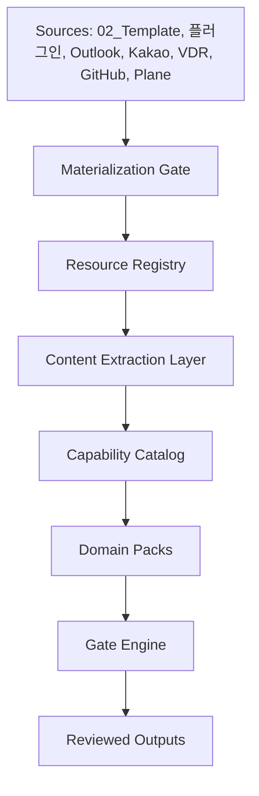
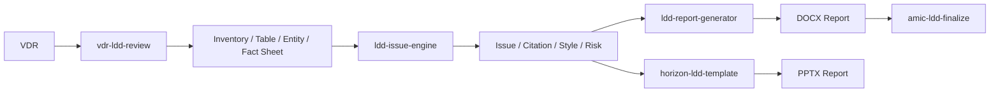
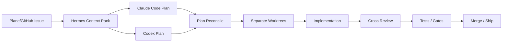

# Hermes Project Operations Harness 아키텍처

## 목표

Hermes Project Operations Harness는 개발 프로젝트와 domain-specific 업무를 같은 control plane 위에서 관리하는 플랫폼입니다. 로펌 matter 운영은 이 플랫폼 위에 올라가는 domain pack 중 하나이며, 플랫폼의 기본 중심은 project context, 다음 액션, blocker, review gate, release readiness, audit trail을 안정적으로 관리하는 것입니다.

이 시스템은 AI가 최종 결론을 내리는 제품이 아니라, 사람이 놓치기 쉬운 업무 흐름을 계속 정리하고 경고하며 검토 가능한 산출물을 만드는 운영 계층입니다.

## Hue Keynote 검증 루프 원칙

`Hue_Keynote.pdf`의 운영 원칙은 [Hue Keynote Harness Operating Loop](hue-keynote-harness-operating-loop.md), [Hermes Long Range Roadmap P1200-P3200](hermes-long-range-roadmap-p1200-p3200.md), [Hermes Long Range Roadmap P4001-P8000](hermes-long-range-roadmap-p4001-p8000.md)에 반영한다.

Hermes에서 completion claim은 evidence가 아니다. completion claim이 PASS가 되려면 `evidence_ref`, `reviewer_ref`, `hard_gate_ref`, 책임 owner, block reason 또는 next allowed action이 함께 있어야 한다. Memory Bank는 단순 저장소가 아니라 다음 실행 조건을 바꾸는 grounded recall 계층이며, 실패는 사과나 재시도가 아니라 scaffold, receipt, rollback, hard gate, memory 중 하나를 바꾸는 상태 변경으로 이어져야 한다. P4001 이후에는 Codex/Claude 대화 자체도 source material로 보존하고, user correction이나 review conflict 같은 conversation improvement signal을 plan amendment, rule extraction, hard hook, validation fixture, next execution condition 후보로 승격해야 한다.

P4601-P5000 이후 개발 콘솔의 기본 milestone review process는 `Codex implementation packet -> Harness deterministic validation -> Claude Code Opus max independent review -> finding loop and revalidation -> review receipt registration -> single-owner trust classification`이다. 현재 P8000 milestone mode에서는 human adjudication을 제외하므로 protected closeout, protected final decision, enterprise trust claim은 계속 BLOCK으로 남긴다.

P5001-P5400 Verification Orchestration Runtime은 standard validator, dual-run result, negative fixture, CI required check, GitHub Actions evidence, signed attestation verify, Claude review receipt completion을 하나의 normalization layer로 묶는다. 이 계층이 ready여도 live GitHub Actions, signed attestation verification, completed Claude review receipt with durable raw JSON이 없으면 P5400 closeout은 BLOCK이다.

P5401-P5800 Multi-Engine Orchestration은 Codex primary developer, Harness deterministic validator, Claude Code Opus max independent reviewer, external evidence observer, future reviewer candidate를 명시적 engine registry로 분리한다. reviewer는 source mutation, final approval, enterprise trust claim을 만들 수 없고, 모델 업그레이드는 alias/id, compatibility review, rollback model, receipt evidence 없이는 적용할 수 없다.

P5801-P6200 Review and Enterprise Trust Hardening은 위 리뷰 프로세스를 실제 trust tier로 고정한다. GitHub independent review, branch/ruleset evidence, required status checks, signed attestation verification, completed Claude Code Opus max receipt with durable raw JSON, single-owner exception, no-human boundary, negative fixtures를 같은 normalization plane에 올린다. 이 단계가 ready여도 single-owner mode에서는 `LOWER_TRUST_INTERNAL_ONLY`만 허용하며, independent GitHub review나 attestation 같은 외부 evidence가 없으면 enterprise trust와 protected closeout은 계속 BLOCK이다.

P6201-P6600 Product and Domain SaaS Factory는 Hermes를 여러 SaaS 개발 계획의 control harness로 만든다. HR Solution, Law Firm OS, Hermes Harness, Zendd Bridge 같은 프로젝트를 SaaS project intake와 requirement traceability matrix에 등록하고, personal-dev/law-firm/creative-document/connectors-resource/trading-read-only domain pack을 재사용 가능한 `domain -> goal -> workflow -> evidence -> review -> gate` 계약으로 관리한다. 이 단계는 제품 출시, 외부 repo/service write, raw HR/client/sensitive data ingestion, protected closeout, enterprise trust, Work OS production claim을 열지 않는다.

P6601-P7000 Controlled Execution Write and Deploy는 allowlist, sandbox/timeout, redaction/secret scan, generated patch candidate, receipt-gated apply boundary, deploy receipt, rollback binding, post-apply validation, negative fixture를 준비한다. 현재 no-human milestone mode에서는 command execution, patch apply, deploy, external project write, protected action은 계속 false다. 즉 Hermes는 실행을 준비하는 계약과 UI를 만들지만, 실제 실행 권한은 열지 않는다.

P7001-P7300 Memory Bank Storage Event and Observability Plane은 Codex/Claude transcript, claim, evidence, validation, review receipt, gate verdict, plan update, next-condition을 append-only event와 object reference로 저장하는 기반이다. transcript raw body는 기본 노출하지 않고, review receipt는 durable raw JSON object ref와 normalized finding ref로 남긴다. 이 단계는 storage/observability only이며 runtime recall과 retrieval layer는 P7301-P7600 전까지 false로 유지한다.

P7301-P7600 Retrieval Ontology and Context Recall Layer는 append-only memory event를 project, domain, workflow, phase, gate, evidence, review, transcript, next-condition ontology로 색인하고, source-cited search, extracted fact recall, conflict resolution, relation graph, next-session recall bundle, boundary filter, freshness policy로 묶는다. 이 단계의 milestone review process도 `Codex implementation packet -> Harness deterministic validation -> Claude Code Opus max independent review receipt -> finding loop and revalidation -> review receipt registration -> single-owner trust classification`이다. Recall bundle은 다음 세션 컨텍스트 후보일 뿐이고, raw transcript recall, uncited recall, cross-domain recall, auto context mutation, protected final approval, enterprise trust, Work OS production claim은 계속 false다.

P7601-P7800 Security Governance Compliance and Rule Conflict Plane은 secret/raw material leak, prompt injection, rule conflict, stale gate, incident recovery, compliance theater를 hard governance row로 만든다. 검증 규칙이 늘어나면서 생기는 충돌과 drift도 source/evidence/reviewer/gate/next-action 구조로 노출한다. 이 단계도 Claude Code Opus max review receipt를 요구하지만 reviewer mutation, protected closeout, enterprise trust, runtime execution, write, Work OS claim은 열지 않는다.

P7801-P8000 Full Work OS UI and Production Freeze는 Queue, Plans, Conversations, Evidence, Reviews, Gates, Memory, Security, Domains, Runs, Settings, Audit navigation과 closed-loop maturity evidence, operator action inbox, domain rollout matrix, API/handbook alignment, milestone Claude review ledger, trust tier publication, negative fixture, production-readiness freeze packet을 고정한다. 이 단계의 완료는 UI/운영 계약 freeze이지 production release가 아니다. L6/L7 proof, protected closeout, enterprise-independent evidence가 없으면 Work OS production claim과 enterprise trust claim은 계속 false다.

P8001-P8080 P8000 Closeout Review Clean Checkpoint는 P8000 구현분을 closeout packet으로 묶고 Claude Code Opus max review receipt, durable raw JSON, normalized finding loop, deterministic validation evidence, git status evidence를 gate로 연결한다. 이 checkpoint는 no-human milestone mode를 유지하므로 human adjudication을 다시 넣지 않는다. Codex self-approval, Claude final approval, validator-only trust, protected closeout, enterprise trust, Work OS production claim, commit/push/merge side effect는 계속 false다.

P8081-P8160 Conversation Capture Contract는 Codex와 Claude Code 대화를 Harness source material로 저장하는 계약을 고정한다. 각 source는 `engine_id`, `session_id`, `transcript_ref`, raw/full/redacted transcript ref를 가져야 하며 raw/full body는 기본 UI 비노출, redacted summary만 UI 노출 가능하다. 이 계약은 goal, phase, blocker, decision, validation item 추출 row를 만들지만, 추출 자체를 truth나 final approval로 승격하지 않는다.

P8161-P8240 Plan Registry And Progress Engine은 conversation capture source를 바탕으로 long-term plan, phase, milestone, owner engine, status를 계산한다. 각 phase는 `planned`, `in_progress`, `blocked`, `pass`, `review_pending` 중 하나의 상태를 갖고 validator, evidence, gate, Claude review receipt ref와 연결된다. stale plan, missing conversation, validation not run, review receipt missing, context drift는 UI에 표시되는 상태이지 자동 PASS가 아니다. Human gate, production PASS, enterprise PASS, protected closeout은 계속 false다.

P8241-P8400 Work OS UI v0 and Harness-Governed Development Loop는 plan progress를 Project Control Dashboard, Phase Detail View, Conversation Timeline, Review Console로 투영하고, Codex Primary Engine Lane, Claude Review Lane, Harness Validation Lane, P8400 Freeze를 같은 artifact로 묶는다. UI는 project selector, current goal, phase status, claim/evidence/gate/check/review receipt, redacted conversation summary, decision, blocker, validation event, Claude review status, finding loop, unresolved finding을 보여준다. Codex 작업은 plan/phase에 귀속되고 Claude review receipt는 milestone마다 요구되며 Harness validator 결과는 UI와 plan status에 반영된다. 이 단계도 UI/loop freeze일 뿐이므로 Human gate, Codex final approval, Claude final approval, reviewer mutation, production PASS, enterprise PASS, protected closeout, runtime execution, write action은 계속 false다.

P8401-P8600 Live Session Source Store, Read-Only API Projection, and UI Handoff Adapter는 P8400 UI/loop artifact를 입력으로 받아 Codex, Claude, Harness validator, UI handoff live session source를 append-only store row로 정규화하고, redacted conversation materializer, Work OS GET-only API projection, bounded UI handoff manifest/snapshot, cited next-session restore bundle로 넘긴다. raw/full transcript body는 object ref로만 남고 UI/API에는 redacted summary와 citation ref만 노출된다. 이 단계도 handoff contract freeze일 뿐이므로 Human gate, Codex final approval, Claude final approval, reviewer mutation, production PASS, enterprise PASS, protected closeout, runtime execution, write action, external connector write, raw transcript API exposure는 계속 false다.

P8601-P8800 Work OS Live Control Surface, Artifact-Backed API Server, and Session Ingestion Adapter는 P8600 artifact를 source로 읽어 artifact-backed GET-only API route row, Codex/Claude/Harness/UI session ingestion row, redacted timeline projection, project control surface, phase detail surface, review/finding surface, live progress refresh, bounded UI runtime contract, P8800 freeze row로 투영한다. 이 단계는 실제 Work OS 화면/API가 참조할 수 있는 local control surface 계약이지만, API write, raw/full transcript body response, session ingestion mutation, refresh mutation, protected UI action, Human gate, Codex final approval, Claude final approval, reviewer mutation, production PASS, enterprise PASS, protected closeout, runtime execution, write action, external connector write는 계속 false다.

P8801-P9000 Read-Only Work OS API Server, Live UI Binding, Browser Smoke Evidence, and P9000 Freeze는 P8800 artifact를 실제 local `node:http` 기반 GET/HEAD-only API와 browser HTML shell로 연결한다. `/api/work-os/*` route는 sanitized view model만 반환하고, UI는 project control, phase detail, redacted timeline, review console, gate console, refresh status를 read-only fetch binding으로 표시한다. Browser smoke evidence는 nonblank shell, API binding, raw/secret key 비노출, protected action control 부재, refresh GET binding을 확인한다. 이 단계도 live local control surface smoke일 뿐이므로 API write, raw/full payload key response, secret-bearing key response, refresh mutation, protected UI action, Human gate, Codex final approval, Claude final approval, production PASS, enterprise PASS, protected closeout, runtime execution, write action, external connector write는 계속 false다.

P9001-P9200 Work OS Project Runtime Handoff and Goal Execution View는 P9000 read-only API/UI smoke artifact와 API projection을 source로 삼아 여러 project/workflow의 current goal, phase, validation state, review lane, session handoff ref, next action, commit checkpoint를 read-only execution view로 투영한다. Hermes는 계속 범용 project/workflow control-plane harness이며 law-firm, Zendd, trading, creative-document, connectors/resource 같은 domain pack은 전체 제품이 아니라 project/workflow context로만 표시된다. 이 단계도 execution view freeze일 뿐이므로 domain pack product promotion, P9000 endpoint lock, raw/full session body display, Human gate completion, Codex final approval, Claude final approval, reviewer mutation, single-owner enterprise trust, protected closeout, production PASS, enterprise PASS, runtime execution, write action, external connector write, UI git write는 계속 false다.

P9201-P9400 Work OS Goal Execution API Binding and Project Drilldown Surface는 P9200 goal execution artifact를 source로 읽어 `/api/work-os/goals`, `/api/work-os/goal-detail`, `/api/work-os/project-drilldown`, `/api/work-os/next-actions`, `/api/work-os/commits`, `/api/work-os/session-handoffs`, `/api/work-os/combined-status` 같은 GET/HEAD-only drilldown route와 browser drilldown shell로 투영한다. 이 단계는 routine read-only projection tranche라 Claude Code Opus 4.8 max review는 기본 생략 대상이며, review/next-action/commit semantics가 read-only projection을 넘어 변경될 때만 closeout review packet을 준비한다. API/UI write, raw/full transcript body display, secret-bearing response key, domain pack product promotion, Human gate completion, Codex final approval, Claude final approval, reviewer mutation, single-owner enterprise trust, protected closeout, production PASS, enterprise PASS, runtime execution, write action, external connector write, UI git write는 계속 false다.

P9401-P9600 Multi-Project SaaS Control Plane은 P9400 drilldown artifact를 source로 읽어 여러 SaaS/project의 registry, repo metadata, current goal risk, validation/review state, blocker/next action matrix, domain boundary guard, operator control summary를 read-only control plane으로 묶는다. Hermes는 여전히 특정 SaaS나 domain pack 자체가 아니라 여러 SaaS 개발을 통제하는 범용 harness다. 이 단계는 multi-project visibility와 boundary guard를 강화하지만 API write, repo git write, connector write, cross-project data mixing, domain pack product promotion, Human gate completion, Codex final approval, Claude final approval, production PASS, enterprise PASS, runtime execution, write action은 계속 false다.

P9601-P9800 Requirement Traceability Kernel은 P9600 multi-project control artifact를 source로 읽어 requirement, PRD, spec, issue, test, evidence, claim, gate, check, release note, closeout state를 read-only trace graph로 연결한다. 이 단계는 evidence trust에 직접 영향을 주므로 Claude Code Opus 4.8 max 또는 최신 Opus equivalent의 read-only closeout review receipt가 P9800 freeze의 required evidence다. Coverage gap, missing requirement id, missing PRD/spec/issue, missing test/evidence, missing claim/gate/check, missing release/closeout, missing Claude review, blocking Claude finding은 BLOCK이며, Codex/Claude final approval, production PASS, enterprise PASS, runtime execution, write action, connector write는 계속 false다.

P9801-P10000 Product Build Verification Loop는 P9800 requirement trace graph를 source로 읽어 traced requirement를 feature implementation packet, test/evidence binding, review packet, Claude review receipt, normalized finding loop, revalidation evidence, closeout readiness, read-only API/UI projection으로 연결한다. 이 단계는 "기능을 만들었다"는 주장을 검증 가능한 build packet으로 재구성하는 루프이며, missing P9800 source, missing feature packet, missing test evidence, missing review packet, missing Claude receipt, blocking Claude finding, missing revalidation, unsafe authority expansion은 BLOCK이다. Codex는 implementation packet과 review packet을 준비할 수 있지만 최종 승인자가 아니며, Claude도 read-only reviewer evidence일 뿐 source mutation, final approval, protected closeout, production PASS, enterprise PASS, runtime execution, write action, connector write를 열 수 없다.

P10001-P10200 Claude Review Integration Lane은 P10000 product build verification artifact와 P10000 Claude receipt를 source로 읽어 Claude Code Opus max 또는 최신 Opus equivalent review를 Hermes의 표준 reviewer evidence lane으로 정식화한다. 이 단계는 review request packet, model/effort evidence, receipt intake, finding normalization, unresolved finding blocker, revalidation binding, read-only API/UI projection, authority boundary를 고정한다. Missing P10000 source, missing source review receipt, missing review request, missing model/effort evidence, missing completed P10200 receipt, unresolved finding, blocking finding, missing revalidation, reviewer mutation, Claude final approval, production PASS, enterprise PASS는 BLOCK이다. Claude review는 여전히 최종 승인이나 GitHub independent approval, human owner adjudication, protected closeout을 대체하지 않는다.

P10201-P10400 CI/GitHub Evidence Bridge는 P10200 Claude review integration artifact를 source로 읽어 GitHub remote binding, branch protection/ruleset, required checks, GitHub Actions run, PR review/commit SHA, signed attestation, evidence freshness/provenance를 read-only evidence plane으로 투영한다. 이 단계는 external evidence visibility와 blocker visibility를 만드는 단계이며 GitHub write, merge, branch protection mutation, required check mutation, attestation generation, release closeout, production PASS, enterprise trust는 계속 false다. Missing or stale GitHub evidence, missing PR approval, actions run commit mismatch, attestation without commit binding, raw payload exposure, final approval expansion은 external closeout BLOCK으로 표시되어야 하며, bridge ready가 release 또는 enterprise readiness를 의미하지 않는다.

P10401-P10600 Local Session Capture And Memory Store는 P10400 CI/GitHub evidence bridge artifact를 source로 읽어 Codex, Claude, Harness validator, UI handoff 세션을 durable local evidence ref로 저장하는 계약을 만든다. 이 단계는 source id, engine id, session id, run id, transcript ref, redacted summary ref, object hash/provenance ref, decision/blocker/validation/review/phase-progress event row, duplicate/stale/uncited/cross-domain drift detector, GET/HEAD-only API projection을 고정한다. Raw/full transcript body는 UI/API에 노출하지 않고, redacted summary와 citation ref만 노출 가능하다. Runtime recall, retrieval truth, source mutation, API write, Codex/Claude final approval, production PASS, enterprise PASS는 계속 false다.

P10601-P10800 Context Recall And Drift Guard는 P10600 local session capture artifact를 source로 읽어 다음 세션 context recall 후보를 citation, freshness, conflict, uncited-memory, cross-domain boundary guard로 감싼다. 이 단계는 goal/decision/blocker/validation/review/phase-progress recall candidate, citation enforcement, stale-as-current block, visible conflict, uncited memory blocker, project/domain/tenant/client/resource boundary, GET/HEAD-only API/UI projection, required Claude Opus review receipt를 고정한다. Recall bundle은 다음 세션 후보일 뿐 truth layer가 아니며 raw/full transcript recall, auto context mutation, runtime recall, API write, Codex/Claude final approval, production PASS, enterprise PASS는 계속 false다.

P10801-P11800 Global Operator Console Design System은 P10800 recall/drift guard 다음에 UI reference pack을 Hermes 전체 operator console design evidence로 승격한다. 이 단계는 `hermes-operator-console-2026-06-06`을 P9000 전용 화면으로 쓰지 않고, Global Operator Queue, Object Inspector Panel, Trace Spine, Evidence Timeline, Review Gate Detail, Readiness Rule Matrix, Review Evidence Trace, negative UI fixture, visual/accessibility regression 계약으로 재구성한다. UI는 Source -> Claim -> Requirement -> Evidence -> Gate -> Review -> Verdict -> Next Action spine을 공통 언어로 사용하며, raw/full body 노출, write/protected action, Codex/Claude final approval, production PASS, enterprise PASS, domain pack product identity는 계속 false다.

P11001-P11200 Global UI Contract는 P10801-P11000 reference intake artifact를 source로 읽어 실제 UI가 따라야 할 전역 object model, navigation IA, Object Inspector Panel, Review/Gate Boundary, Conversation Source Detail, Domain Pack Context, UI Negative Invariants, GET/HEAD-only API Projection, Accessibility/Density contract를 고정한다. 이 단계는 token/component 구현이나 제품 화면 구현이 아니라 UI 계약 freeze다. P11200이 ready여도 raw/full body 노출, secret key 노출, write/protected action, Codex/Claude final approval, production PASS, enterprise PASS, domain pack product identity, phase/tranche top navigation은 계속 false다.

P11201-P11400 Global UI Design Foundation은 P11001-P11200 Global UI Contract artifact를 source로 읽어 Global Operator Queue와 trace detail UI가 소비할 design token, table/list primitive, detail/inspector primitive, timeline primitive, boundary notice/receipt row, Readiness Rule Matrix, Review Evidence Trace, component state matrix, UI smoke fixture plan을 고정한다. 이 단계는 아직 제품 화면 구현이나 P11800 design-system freeze가 아니며, token/component foundation이 ready여도 raw/full body 노출, secret key 노출, write/protected action, Codex/Claude final approval, production PASS, enterprise PASS, domain pack product identity, KPI scorecard, review trace final approval은 계속 false다.

P11401-P11600 Global UI Operator Queue는 P11201-P11400 Design Foundation artifact를 source로 읽어 read-only Global Operator Queue, queue row/source card, Object Inspector Panel, Requirement Trace Detail, Review Gate Detail, Evidence Timeline, Conversation Source Detail, Domain Pack Detail, UI/API smoke projection을 고정한다. 이 단계는 actual operator UI의 v0 계약이지만 아직 P11800 design-system freeze가 아니며, 화면이 ready여도 raw/full body 노출, secret key 노출, write/protected action, form/button execution, API mutation, Codex/Claude final approval, production PASS, enterprise PASS, domain pack product identity, KPI dashboard home은 계속 false다.

P11601-P11800 Global UI Governance Freeze는 P11401-P11600 Operator Queue artifact를 source로 읽어 negative UI fixture, visual regression fixture, accessibility regression, read-only UI/API governance smoke, boundary copy audit, Claude Code Opus max review receipt, Claude finding loop, design-system freeze matrix를 결합한다. 이 단계는 Global Operator Console design-system freeze milestone이므로 durable Claude review evidence가 필요하지만, Claude review는 review evidence일 뿐 final approval이나 enterprise-independent trust가 아니다. P11800이 ready여도 raw/full body 노출, secret key 노출, write/protected action, form/button execution, API mutation, Codex/Claude final approval, production PASS, enterprise PASS, domain pack product identity, KPI dashboard home은 계속 false다.

P11801-P12000 SaaS Quality Gate Packs는 P11800 Global UI Governance Freeze artifact를 source로 읽어 security, permissions, data model, UX, API, performance, docs, deployment, rollback, provenance gate pack을 reusable registry로 고정한다. 이 단계는 여러 SaaS/project 개발에 공통으로 적용할 gate pack 계약을 만드는 것이며, P11800 source가 blocked이면 P12000도 blocked 상태와 source blocker를 보존하고 `ready_for_p12001_handoff=false`로 남긴다. Gate pack registry가 ready여도 raw/full body 노출, secret key 노출, write/protected action, form/button execution, API mutation, Codex/Claude final approval, production PASS, enterprise PASS, release approval, domain pack product identity는 계속 false다.

P12001-P12200 Domain Pack SDK v2는 P12000 SaaS Quality Gate Packs artifact를 source로 읽어 HR, law-firm, CRM, ERP, document, trading, future SaaS context가 같은 reusable domain-pack SDK 계약으로 Hermes에 붙도록 고정한다. 이 단계는 domain pack을 Hermes 제품 identity로 승격하지 않고, pack manifest v2, capability interface, data boundary, review authority, gate pack binding, compatibility/migration, contribution contract를 같은 행 구조로 표준화한다. P12000 source가 blocked이면 SDK contract rows는 준비되어도 P12200은 blocked 상태와 source blocker를 보존하고 `ready_for_p12201_handoff=false`로 남긴다. SDK v2 registry가 ready여도 raw/full body 노출, secret key 노출, write/protected action, connector write, Codex/Claude final approval, production PASS, enterprise PASS, domain pack product identity는 계속 false다.

P12201-P12400 Controlled Execution Sandbox는 P12200 Domain Pack SDK v2 artifact를 source로 읽어 receipt-gated command allowlist, repo-local sandbox profile, redaction and secret scan, timeout/heartbeat/kill policy, rollback/evidence binding, dry-run/no-op candidate ledger, high-risk Claude review receipt gate, read-only operator/API projection을 고정한다. 이 단계는 실제 command execution이나 receipt application을 수행하지 않으며, P12200 source가 blocked이거나 durable Claude Code Opus max execution sandbox review receipt가 없으면 P12400도 blocked 상태와 source/review blocker를 보존하고 `ready_for_p12401_handoff=false`로 남긴다. Controlled sandbox contract가 ready여도 raw/full body 노출, secret key 노출, network by default, secret read, write/protected action, connector write, Codex/Claude final approval, production PASS, enterprise PASS는 계속 false다.

P12401-P12600 Patch Candidate Lane은 P12400 Controlled Execution Sandbox artifact를 source로 읽어 generated patch candidate, diff packet, rollback plan, validation ref, Claude Code Opus max patch review receipt gate, protected scope negative fixture, read-only operator/API projection, no-direct-apply authority guard를 고정한다. 이 단계는 patch를 생성하거나 적용하지 않고, P12400 source가 blocked이거나 durable Claude patch candidate review receipt가 없으면 P12600도 blocked 상태와 source/review blocker를 보존하고 `ready_for_p12601_handoff=false`로 남긴다. Patch candidate contract가 ready여도 direct apply, file write, protected action, connector write, runtime execution, Codex/Claude final approval, production PASS, enterprise PASS는 계속 false다.

P12601-P12800 Human/Owner Adjudication Option은 P12600 Patch Candidate Lane artifact를 source로 읽어 owner adjudication receipt schema, protected closeout mapping, independent review separation, single-owner trust downgrade, adjudication queue, finding disposition, read-only operator/API projection, authority guard를 고정한다. 이 단계는 owner receipt를 protected closeout input으로만 다루며, independent GitHub review, enterprise-independent review, production PASS, enterprise PASS, Codex/Claude final approval을 대체하지 않는다. P12600 source가 blocked이거나 owner adjudication receipt가 없으면 P12800도 blocked 상태와 source/receipt blocker를 보존하고 `ready_for_p12801_handoff=false`로 남긴다.

P12801-P13000 Release Readiness Control Plane은 P12800 Human/Owner Adjudication Option artifact를 source로 읽어 release candidate, migration readiness, rollback/restore plan, incident response plan, production checklist, signed provenance/attestation gate, Claude Code Opus max release review gate, read-only release projection, release authority guard, release freeze state를 고정한다. 이 단계는 release 후보와 blocker를 운영 표면에 보여주지만 deployment, migration execution, rollback execution, release approval, protected action, production PASS, enterprise PASS, Codex/Claude final approval을 열지 않는다. P12800 source가 blocked이거나 signed provenance evidence 또는 Claude release review receipt가 없으면 P13000도 blocked 상태와 source/provenance/review blocker를 보존하고 `ready_for_p13001_handoff=false`로 남긴다.

P13001-P13400 Enterprise Trust Hardening Control Plane은 P13000 Release Readiness Control Plane artifact를 source로 읽어 independent review hardening, attestation hardening, SBOM/dependency evidence, supply-chain policy, audit trail hardening, backup/restore posture, recovery posture, Claude Code Opus max enterprise trust review gate, authority guard를 고정한다. 이 단계는 enterprise-grade trust evidence 요구조건을 더 촘촘하게 만들지만 protected closeout, deployment, release approval, production PASS, enterprise PASS, enterprise trust claim, Codex/Claude final approval을 열지 않는다. P13000 source가 blocked이거나 Claude enterprise trust review receipt가 없으면 P13400도 blocked 상태와 source/review blocker를 보존하고 `ready_for_p13401_handoff=false`로 남긴다.

P13401-P13800 Observability And Cost Plane은 P13400 Enterprise Trust Hardening Control Plane artifact를 source로 읽어 test duration, flaky check, review latency, token/cost, evidence freshness, gate failure, validation drift, read-only projection, observability authority guard를 고정한다. 이 단계는 검증 사이클의 운영 품질을 관측 가능하게 만들지만 telemetry collector, metric write, budget mutation, external provider call, raw transcript/source exposure, protected closeout, deployment, release approval, production PASS, enterprise PASS, enterprise trust claim, Codex/Claude final approval을 열지 않는다. P13400 source가 blocked이면 P13800도 blocked 상태와 source blocker를 보존하고 `ready_for_p13801_handoff=false`로 남긴다.

P13801-P14200 Product Ops Automation은 P13800 Observability And Cost Plane artifact를 source로 읽어 roadmap, sprint, issue, changelog, support feedback, customer request, Harness state link, read-only product ops projection, product ops authority guard를 고정한다. 이 단계는 product ops signal을 Harness state와 evidence에 연결하지만 roadmap write, sprint mutation, issue write, changelog publish, support reply, customer contact, external project write, raw contact/source exposure, protected closeout, deployment, release approval, production PASS, enterprise PASS, enterprise trust claim, Codex/Claude final approval을 열지 않는다. P13800 source가 blocked이면 P14200도 blocked 상태와 source blocker를 보존하고 `ready_for_p14201_handoff=false`로 남긴다.

P14201-P14600 Security And Compliance Maturity는 P14200 Product Ops Automation artifact를 source로 읽어 SOC2-style control, access review, secret scanning, prompt-injection guard, data retention, incident workflow, compliance evidence link, Claude Code Opus max security compliance review gate, security authority guard를 고정한다. 이 단계는 security/compliance maturity signal을 강화하지만 access mutation, secret read, raw secret exposure, destructive delete, incident auto close, compliance PASS, protected closeout, deployment, release approval, production PASS, enterprise PASS, enterprise trust claim, connector write, runtime execution, Codex/Claude final approval을 열지 않는다. P14200 source가 blocked이거나 Claude security compliance review receipt가 없으면 P14600도 blocked 상태와 source/review blocker를 보존하고 `ready_for_p14601_handoff=false`로 남긴다.

P14601-P15000 Multi-Engine Orchestration은 P14600 Security And Compliance Maturity artifact를 source로 읽어 engine registry, role authority matrix, routing decision contract, evidence class mapping, cross-engine conflict guard, Claude Code Opus max orchestration review gate, read-only multi-engine projection, orchestration authority guard를 고정한다. 이 단계는 Codex, Claude, CI, deterministic local validators, advisory local model의 역할과 evidence class를 분리하지만 cross-engine final approval, self-review approval, reviewer mutation, CI authority escalation, local advisory final approval, protected action routing, engine execution, protected closeout, deployment, release approval, production PASS, enterprise PASS, enterprise trust claim, connector write, runtime execution, Codex/Claude final approval을 열지 않는다. P14600 source가 blocked이거나 Claude orchestration review receipt가 없으면 P15000도 blocked 상태와 source/review blocker를 보존하고 `ready_for_p15001_handoff=false`로 남긴다.

P15001-P15400 SaaS Factory Mode는 P15000 Multi-Engine Orchestration artifact를 source로 읽어 project template contract, requirement matrix contract, validation plan contract, review lane contract, domain pack composition, release gate blueprint, bootstrap read-only projection, factory authority guard를 고정한다. 이 단계는 여러 SaaS/project 개발을 시작하기 위한 reusable blueprint를 만들지만 project creation, repo write, secret generation, connector provisioning, deployment, production PASS, enterprise PASS, enterprise trust claim, protected closeout, release approval, write/protected action, connector write, runtime execution, raw source exposure, Codex/Claude final approval을 열지 않는다. P15000 source가 blocked이면 P15400도 blocked 상태와 source blocker를 보존하고 `ready_for_p15401_handoff=false`로 남긴다.

핵심 산출물은 다음입니다.

- development daily brief
- issue, blocker, review queue, release readiness summary
- worktree, diff review, test, PR draft, rollback plan
- matter daily brief
- task and deadline register
- evidence and document matrix
- pending client question list
- weekly WIP and billing draft
- governance or litigation risk map

## 계층 구조

`02_Template`와 `플러그인` 본문 추출 결과, 하네스의 중심은 단일 domain store가 아니라 resource/capability control plane이어야 한다.

Domain pack은 다음처럼 분리한다.

- `law-firm`: LDD, 계약서, 소송서면, 회사법, 의견서, 이메일 회신, 수임제안서
- `personal-dev`: 개인 개발 프로젝트 관리, Claude Code/Codex 교차 리뷰, GitHub/Plane workflow
- `creative-content`: 웹소설, 동영상, PPTX 보고자료, agent UI 실험
- `document`: DOCX/PPTX/XLSX/PDF 추출, 서식 품질검사, 디자인 시스템

## Domain Operating Stores

초기 버전은 JSON 파일로 시작합니다. 실제 배포에서는 Postgres 또는 기존 DMS/ERP/GitHub/issue tracker의 stable ID를 기준으로 연결합니다.

Personal-dev domain의 최소 데이터 모델은 다음입니다.

- `project_id`: 내부 프로젝트 번호 또는 저장소 식별자
- `repository`: repo path, language, framework, test/build command
- `issues`: source system, issue id, priority, status, owner
- `tasks`: 다음 액션, blocker, due date, review status
- `plans`: Claude Code/Codex/shared plan candidate와 reconciliation 상태
- `worktrees`: lane, branch, touched files, cleanup state
- `diffs`: captured diff, protected file scan, review findings
- `tests`: canonical test matrix와 pass/fail evidence
- `release`: PR draft, release note, rollback plan, technical debt

Law-firm domain의 최소 데이터 모델은 다음입니다.

- `matter_id`: 내부 사건 번호
- `client`: 의뢰인
- `practice_area`: 업무 분야
- `confidentiality`: 접근등급과 처리 정책
- `team`: 파트너, 시니어, 주니어, paralegal 등 역할
- `communications`: 이메일, 메신저, 회의록 요약
- `documents`: 계약서, 의견서, 준비서면, 증거, 공시, 이사회 자료
- `tasks`: 담당자, 기한, 상태, 출처
- `deadlines`: 법원, 거래, 고객, 내부 기한
- `risks`: 법률 리스크가 아니라 운영상 검토 필요 신호
- `billing`: WIP, 비청구 항목, 견적 관련 메모

## Hermes의 역할

Hermes는 다음 일을 맡습니다.

- skill/plugin/script/template을 `Capability Catalog`에서 찾아 실행합니다.
- `AGENTS.md`와 matter data contract를 기준으로 작업 방식을 고정합니다.
- MCP 또는 terminal tool로 기존 시스템과 연결합니다.
- cron으로 매일/매주 brief를 생성합니다.
- 메신저 gateway를 통해 담당자에게 확인 요청을 보낼 수 있습니다.
- Claude Code와 Codex가 같은 프로젝트를 작업할 때 worktree, plan diff, review diff, test gate를 조율합니다.

초기 구현은 skill + CLI script 방식입니다. MCP는 시스템 연동이 안정화된 뒤 붙입니다.

## Resource/Capability Control Plane

본문 추출 결과 현재 로컬 파일 1,045개에서 다음 capability 후보가 확인됐다.

- `law_firm.ldd_vdr_review`
- `law_firm.contract_drafting_review`
- `platform.plugin_skill_registry`
- `document.format_qa`
- `law_firm.amic_style_system`
- `law_firm.corporate_documents`
- `law_firm.litigation_briefing`
- `document.pptx_design_system`
- `law_firm.legal_memo_opinion`
- `platform.extractor_workbench`
- `law_firm.email_reply`
- `law_firm.engagement_proposal`
- `personal.project_development_harness`
- `personal.creative_content_factory`

이 계층은 다음 레지스트리를 가진다.

- `Resource Registry`: 모든 파일의 경로, hash, extraction 상태, domain, sensitivity, lineage
- `Capability Catalog`: 플러그인/스킬/스크립트/템플릿을 호출 가능한 업무 능력으로 등록
- `Plugin Lineage Registry`: latest, legacy, backup, broken archive를 분리
- `Extractor Registry`: 문서 유형별 extractor chain, fact schema, validation rule
- `Template Intelligence Layer`: DOCX/PPTX 스타일, 표, 번호 체계, 문단 패턴 fingerprint

## LDD Pipeline

현재 `플러그인/05_LDD`에는 이미 다음 파이프라인이 있다.

따라서 LDD는 처음부터 독립 subsystem으로 설계한다.

- 원문 파일과 추출 사실을 분리 저장한다.
- issue, citation, risk, report paragraph를 provenance graph로 연결한다.
- `case_citer`, `law_currency_tracker`, `cross_document_validator`를 gate로 승격한다.
- 보고서 생성기와 서식/디자인 renderer를 분리한다.

## Claude Code / Codex 협업

개인 개발 하네스는 `agent-skills`의 workflow를 기반으로 한다.

원칙:

- Claude Code와 Codex는 같은 branch를 동시에 수정하지 않는다.
- Hermes는 각 agent의 계획, 변경 파일, 테스트 결과, 리뷰 의견을 저장한다.
- 중요한 변경은 상대 agent가 review lane에서 검토한다.
- 현재 P8000 no-human milestone mode에서는 Claude Code Opus max review receipt와 Harness validation을 통과해도 `single-owner + Claude-reviewed` lower-trust로만 표시한다.
- protected closeout, protected final decision, enterprise trust, 또는 실제 배포 merge 권한을 주장하려면 별도 승인 체계가 다시 열려야 한다.

## LLM 사용 경계

LLM이 해도 되는 일:

- 요약
- 누락 후보 탐지
- task 후보 제안
- client question 초안
- 내부 브리프 초안
- 문서 간 불일치 후보 표시

LLM이 단독으로 해서는 안 되는 일:

- 법률 의견 최종 판단
- 소송 전략 결정
- 법원 제출 문안 확정
- 고객에게 직접 발송
- 비밀정보 접근권한 변경
- 청구 금액 확정

## 첫 배포 범위

1. 샘플 matter JSON으로 daily brief 생성
2. KakaoTalk export와 Outlook email을 communication 후보로 수집
3. 회의록에서 task/deadline 후보 추출
4. 변호사가 review status를 붙임
5. matter별 weekly WIP report 생성

이 범위를 넘기 전에 접근권한, 감사로그, 보존정책, 고객별 동의 범위를 먼저 확정합니다.
