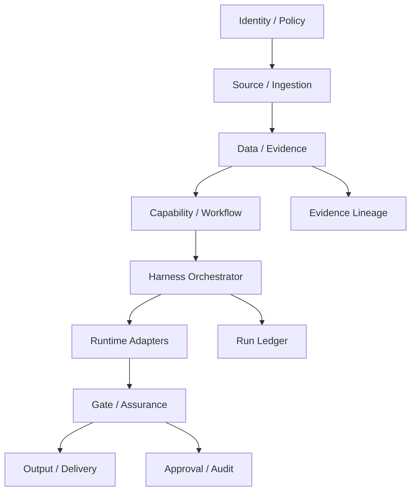

# Hermes Harness Core Contracts

작성일: 2026-05-22

## 목적

이 문서는 Hermes Harness의 1단계 계약을 고정한다. 목표는 기능을 많이 만드는 것이 아니라, 로펌용, 개인 개발용, 문서/콘텐츠용 domain pack이 모두 같은 객체와 상태 전이를 사용하게 만드는 것이다.

핵심 원칙:

- Prompt는 API가 아니다. schema와 manifest가 API다.
- Hermes, Claude Code, Codex, local script는 모두 runtime adapter다.
- 로펌용 산출물은 evidence와 approval 없이는 최종 산출물이 아니다.
- 모든 장기 작업은 재개 가능해야 한다.
- 모든 외부전송, agent 실행, gate 결과, 사람 승인은 기록으로 남아야 한다.

## Plane 구조



## 공통 필드 규칙

모든 핵심 객체는 다음 필드를 가진다.

- `schema_version`: 객체 schema 버전
- `id`: 시스템 내부 ID
- `tenant_id`: workspace 또는 조직 경계
- `created_at`: 생성 시각
- `created_by`: 사람, agent, script, connector
- `metadata`: forward-compatible 확장 필드

로펌용 객체는 가능하면 다음 필드를 추가한다.

- `matter_id`
- `client_id`
- `classification`
- `policy_snapshot_id`
- `lineage_id`

## Identity / Policy 객체

### Tenant

workspace 경계다. 로펌, 개인 연구실, 별도 실험 환경을 분리한다.

필수 필드:

- `id`
- `name`
- `tenant_type`: `law_firm`, `personal`, `lab`
- `default_policy_id`

### User

사람 사용자다.

필수 필드:

- `id`
- `tenant_id`
- `display_name`
- `roles`
- `status`

### Client

로펌용 고객 경계다.

필수 필드:

- `id`
- `tenant_id`
- `name`
- `classification_floor`

### Matter

사건/프로젝트 경계다. retrieval과 evidence 접근의 기본 단위다.

필수 필드:

- `id`
- `tenant_id`
- `client_id`
- `matter_name`
- `practice_area`
- `status`
- `classification`
- `matter_team`
- `wall_ids`

### DataClassification

자료 등급이다.

권장 등급:

- `P0_PUBLIC`
- `P1_INTERNAL`
- `P2_CLIENT_CONFIDENTIAL`
- `P3_PRIVILEGED`
- `P4_HIGHLY_RESTRICTED`
- `P5_SECRET`

### PolicySnapshot

workflow 실행 당시 적용된 정책의 불변 snapshot이다. 나중에 정책이 바뀌어도 과거 실행을 재현할 수 있어야 한다.

필수 필드:

- `id`
- `tenant_id`
- `classification_rules`
- `runtime_permissions`
- `model_permissions`
- `output_permissions`
- `approval_rules`

## Resource / Evidence 객체

### Resource

파일, 이메일, 메신저 메시지, 회의록, GitHub issue, Plane task 등 모든 원천 자료다.

필수 필드:

- `id`
- `tenant_id`
- `source_system`
- `source_uri`
- `resource_type`
- `content_hash`
- `classification`
- `matter_id`
- `materialization_status`
- `ingestion_status`

### ResourceVersion

동일 resource의 버전이다.

필수 필드:

- `id`
- `resource_id`
- `version_label`
- `content_hash`
- `created_at`

### NormalizedText

원본에서 추출한 텍스트 또는 OCR 결과다.

필수 필드:

- `id`
- `resource_id`
- `resource_version_id`
- `text_hash`
- `language`
- `extractor_id`
- `quality`

### SourceSpan

원문 위치다. 법률문서의 citation과 evidence lineage는 source span에 연결된다.

필수 필드:

- `id`
- `resource_id`
- `resource_version_id`
- `location_type`
- `locator`
- `text`
- `hash`

### EvidenceItem

산출물의 근거로 사용할 수 있는 단위다.

필수 필드:

- `id`
- `matter_id`
- `source_span_ids`
- `evidence_type`
- `summary`
- `reliability`
- `review_status`

### Fact

evidence에서 추출된 사실명제다.

필수 필드:

- `id`
- `matter_id`
- `evidence_item_ids`
- `statement`
- `fact_type`
- `confidence`
- `review_status`

### Issue

fact와 업무/법률 쟁점의 결합이다.

필수 필드:

- `id`
- `matter_id`
- `issue_type`
- `title`
- `linked_fact_ids`
- `severity`
- `status`

### Citation

산출물의 특정 부분과 source span/evidence/fact를 연결한다.

필수 필드:

- `id`
- `output_artifact_id`
- `target_path`
- `source_span_ids`
- `evidence_item_ids`
- `citation_status`

## Capability / Workflow 객체

### Capability

무엇을 할 수 있는지에 대한 실행 계약이다.

필수 필드:

- `id`
- `version`
- `domain_pack`
- `input_schema`
- `output_schema`
- `allowed_runtimes`
- `required_gates`
- `data_policy`
- `approval_policy`

### Workflow

capability를 단계적으로 실행하는 절차다.

필수 필드:

- `id`
- `capability_id`
- `version`
- `steps`
- `state_machine`

### WorkflowRun

workflow의 특정 실행이다.

필수 필드:

- `id`
- `workflow_id`
- `capability_id`
- `tenant_id`
- `matter_id`
- `status`
- `input_refs`
- `output_refs`
- `policy_snapshot_id`

### AgentRun

Hermes, Claude Code, Codex, local script, renderer 등 runtime의 특정 실행이다.

필수 필드:

- `id`
- `workflow_run_id`
- `runtime_id`
- `status`
- `input_ref`
- `output_ref`
- `logs_ref`
- `started_at`
- `completed_at`

## Gate / Approval / Output 객체

### GateResult

pre-run, in-run, post-run gate의 결과다.

필수 필드:

- `id`
- `workflow_run_id`
- `gate_id`
- `gate_stage`
- `status`
- `findings`
- `blocking`

### Approval

사람 승인, 반려, 수정 지시다.

필수 필드:

- `id`
- `workflow_run_id`
- `output_artifact_id`
- `requested_from`
- `approval_status`
- `decision`
- `decided_at`

### OutputArtifact

Markdown, DOCX, PPTX, PDF, email draft, PR draft 등 산출물이다.

필수 필드:

- `id`
- `tenant_id`
- `matter_id`
- `artifact_type`
- `artifact_uri`
- `content_hash`
- `status`
- `citation_ids`
- `created_by_run_id`

### AuditEvent

감사용 불변 이벤트다.

필수 필드:

- `id`
- `type`
- `time`
- `tenant_id`
- `actor`
- `subject`
- `correlation_id`
- `data`

## 첫 Vertical Slice 완료 기준

1단계 foundation의 첫 완료 기준은 다음 흐름이 실제 데이터로 표현되는 것이다.

```text
local file
-> Resource
-> NormalizedText
-> SourceSpan
-> EvidenceItem
-> Fact
-> OutputArtifact
-> Citation
-> GateResult
-> Approval pending
-> AuditEvent
```

이 흐름이 통과하면 이후 LDD, 계약서, 소송서면, 개인 개발, PPTX 생성 기능은 같은 계약 위에 얹을 수 있다.
