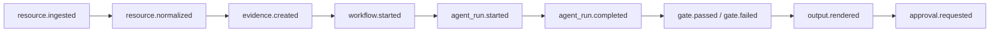

# Hermes Event Model and Run Ledger

작성일: 2026-05-22

## 목적

Event / Run Ledger는 Hermes Harness에서 “무슨 일이 언제, 누구에 의해, 어떤 정책 아래, 어떤 입력과 출력으로 일어났는가”를 재현 가능하게 남기는 계약이다.

핵심 원칙:

- 이벤트는 불변이다. 정정은 기존 이벤트 수정이 아니라 새 이벤트로 남긴다.
- 모든 workflow, agent, gate, approval, output은 event를 발행한다.
- 모든 event는 `correlation_id`로 같은 workflow/run을 연결한다.
- 모든 event는 `policy_snapshot_id`를 가질 수 있어야 한다.
- Run Ledger는 agent self-report가 아니라 실행 입력, 출력, gate, artifact, 비용을 연결한다.

## Event Envelope

모든 이벤트는 동일한 envelope를 가진다.

| 필드 | 설명 |
|---|---|
| `id` | 이벤트 ID |
| `type` | 이벤트 유형. 예: `resource.ingested` |
| `time` | 이벤트 발생 시각 |
| `tenant_id` | tenant 경계 |
| `correlation_id` | workflow/run을 묶는 ID |
| `causation_id` | 이 이벤트를 유발한 이전 이벤트 ID |
| `actor` | human, harness, Hermes, Codex, script 등 |
| `subject` | 이벤트 대상 객체 |
| `policy_snapshot_id` | 실행 당시 정책 |
| `data` | 이벤트 payload |
| `metadata` | 확장 필드 |

## 기본 Event Types

| 이벤트 | 의미 |
|---|---|
| `resource.discovered` | 파일, 이메일, 메시지, issue 등 원천 자료 발견 |
| `resource.ingested` | 원본 저장과 metadata 등록 완료 |
| `resource.normalized` | 텍스트 추출/OCR/정규화 완료 |
| `evidence.created` | source span 기반 evidence 생성 |
| `fact.extracted` | evidence에서 fact 생성 |
| `issue.created` | fact 또는 workflow에서 issue 생성 |
| `workflow.started` | workflow 실행 시작 |
| `workflow.completed` | workflow 종료 |
| `agent_run.started` | runtime adapter 실행 시작 |
| `agent_run.completed` | runtime adapter 실행 종료 |
| `gate.passed` | gate 통과 |
| `gate.failed` | gate 실패 |
| `approval.requested` | 사람 승인 요청 |
| `approval.decided` | 승인/반려/수정요청 |
| `output.rendered` | 산출물 생성 |
| `output.delivered` | 산출물 전달/게시 |
| `policy.violation.detected` | 정책 위반 감지 |
| `cost.recorded` | 비용/토큰/runtime 비용 기록 |
| `error.recorded` | 실패와 복구 상태 기록 |

## Run Ledger

Run Ledger는 workflow 실행을 재현하기 위한 장부다.

필수 구성:

- `workflow_run_id`
- `capability_id`
- `policy_snapshot_id`
- `input_refs`
- `agent_run_ids`
- `gate_result_ids`
- `approval_ids`
- `output_artifact_ids`
- `event_ids`
- `cost_records`
- `error_records`
- `status`

Run Ledger가 답해야 하는 질문:

1. 이 workflow는 어떤 capability와 version으로 실행됐는가?
2. 어떤 resource/evidence/fact를 입력으로 사용했는가?
3. 어떤 runtime이 실행됐는가?
4. 어떤 gate가 통과/실패했는가?
5. 사람이 승인했는가?
6. 어떤 output이 생성됐는가?
7. 어떤 정책 snapshot 아래 실행됐는가?
8. 비용, 토큰, runtime 시간은 얼마였는가?
9. 실패했다면 어디서 왜 실패했는가?

## 이벤트 연결 규칙

모든 이벤트는 같은 `correlation_id`를 공유할 수 있다. 직접 원인 관계는 `causation_id`로 연결한다.

## 4단계 완료 기준

4단계는 다음이 충족되면 완료다.

- `docs/event-model.md`가 존재한다.
- `schemas/core/event-ledger.schema.json`이 존재한다.
- `examples/core/event-ledger.json`이 존재한다.
- event ledger 예제가 schema와 참조 무결성 검증을 통과한다.
- `npm run validate:core`가 event ledger 검증까지 포함한다.
