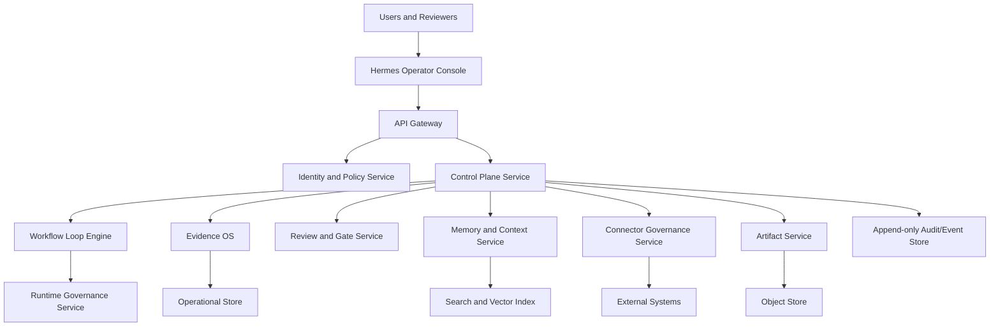

# Hermes Enterprise SaaS 사양명세서

문서 버전: v0.1 target-state
작성일: 2026-06-11
적용 범위: Hermes Project Operations Harness, Work OS Control Plane, Domain Pack Platform, Evidence OS, Review/Gate Plane, Connector Governance, Agent Runtime Governance, Enterprise SaaS 운영체계
문서 성격: 현재 구현 여부와 무관한 장기 제품/기술 사양. 현재 repository의 local harness 기능을 출발점으로 삼되, 최상위권 SaaS 제품으로 성장하기 위해 필요한 기능, 구조, 계약, 운영 요소를 모두 포함한다.

## 1. 제품 정의

### 1.1 제품명

제품명은 `Hermes`다.

정식 제품 카테고리는 다음과 같이 정의한다.

- Project Operations SaaS
- Workflow Control Plane
- Evidence-backed Work OS
- Agent Governance Platform
- Domain Pack 기반 운영 자동화 플랫폼

Hermes는 단순 task manager, chat UI, AI wrapper, 법률 SaaS, DMS, issue tracker, agent runner 중 하나가 아니다. Hermes의 본체는 여러 프로젝트와 도메인 업무를 같은 deterministic control plane 위에서 관찰, 구조화, 검증, 승인 대기, 재개, handoff하는 운영 계층이다.

### 1.2 한 문장 정의

Hermes는 프로젝트, 업무, 자료, 의사결정, 리뷰, 승인, 실행 후보, 감사 trail을 stable ID와 evidence로 묶어 사람이 검토 가능한 운영 상태로 유지하는 enterprise-grade Work OS control plane이다.

### 1.3 제품 원칙

Hermes의 장기 제품 원칙은 다음이다.

- 모든 claim은 evidence, source, reviewer, gate, owner, timestamp를 가져야 한다.
- AI는 작업자, 초안 작성자, 추출자, 검토 보조자일 수 있지만 최종 승인자나 무권한 실행자가 아니다.
- 프로젝트, 도메인, 고객, tenant, matter, resource boundary는 절대 암묵적으로 섞이지 않는다.
- domain pack은 제품 정체성이 아니라 Hermes 위에 올라가는 재사용 가능한 업무 모듈이다.
- read-only ingestion과 write/protected action은 서로 다른 maturity gate를 가진다.
- 사람의 역할은 매번 prompt를 넣는 것이 아니라 목표, 경계, 위험 허용치, 예산, 승인 조건, stop condition을 설정하는 쪽으로 이동한다.
- 운영 상태는 dashboard, API, packet, receipt, audit event로 재현 가능해야 한다.

### 1.4 비목표

Hermes는 다음을 직접 대체하지 않는다.

- 변호사, 회계사, 의사, 투자자문가 등 전문직 최종 판단
- 법률 의견, 소송 전략, filing decision, client advice의 최종 승인
- GitHub, Linear, Jira, DMS, CRM, ERP, email, calendar, cloud drive의 원본 system of record
- secret manager, payment processor, production deploy platform의 권한 체계
- 무제한 autonomous agent runtime
- 인간 검토 없는 protected closeout

Hermes는 위 시스템을 연결하고 운영 증거를 정리할 수 있지만, 기본값은 final authority와 external write authority가 닫힌 상태다.

## 2. 대상 사용자와 시장

### 2.1 핵심 사용자

| 사용자 | 핵심 니즈 | Hermes 가치 |
|---|---|---|
| Founder / Solo Builder | 여러 제품 개발 흐름을 놓치지 않기 | 목표, 작업, diff, review, release readiness를 한눈에 관리 |
| Engineering Lead | agent-assisted 개발의 품질과 근거 관리 | plan, patch, test, review, closeout evidence를 표준화 |
| Product Manager | 요구사항, 고객 피드백, release 상태 연결 | issue, spec, roadmap, blocker, release note의 traceability |
| Legal Operator | matter, evidence, deadline, attorney review 관리 | legal domain pack으로 자료와 산출물 승인 상태 분리 |
| Creative Producer | 문서, 슬라이드, 영상, asset production 관리 | creative-document pack으로 template, style, output artifact 검증 |
| Compliance / Security Owner | AI 사용과 자료 접근 통제 | audit trail, policy snapshot, access review, prompt-injection guard |
| Executive / Client Sponsor | 운영 상태와 위험을 빠르게 이해 | human-reviewable brief, blocker, risk, readiness dashboard |

### 2.2 고객 세그먼트

Hermes는 다음 단계의 고객 세그먼트를 지원해야 한다.

- Individual Pro: 개인 개발자, 1인 창업자, solo operator
- Team: 2-20명 팀, project/workflow 중심 협업
- Business: 여러 팀과 domain pack을 쓰는 조직
- Enterprise: SSO, SCIM, DLP, audit export, private deployment, compliance evidence 필요 조직
- Regulated Enterprise: 법률, 금융, 의료, 공공, 방산처럼 human gate와 감사 추적이 강한 조직

### 2.3 핵심 차별화

Hermes가 최상위권 SaaS로 서려면 다음 차별화가 선명해야 한다.

- AI chat이 아니라 evidence-backed operations layer다.
- task list가 아니라 source, decision, review, gate, receipt가 연결된 workflow graph다.
- domain SaaS 하나가 아니라 domain pack을 꽂아 확장되는 platform이다.
- agent orchestration이 아니라 authority-aware control plane이다.
- 자동화 성공 claim이 아니라 재검증 가능한 운영 근거를 만든다.
- local-first harness에서 enterprise multi-tenant SaaS까지 같은 계약을 유지한다.

## 3. 제품 범위

### 3.1 최상위 모듈

Hermes Enterprise SaaS는 다음 모듈로 구성된다.

1. Workspace and Tenant OS
2. Project and Domain Pack Registry
3. Goal, Plan, Work Packet Control Plane
4. Workflow Loop Engine
5. Evidence OS
6. Resource and Connector Governance
7. Context and Memory Grounding
8. Review, Finding, Human Gate Plane
9. Agent Runtime and Tool Governance
10. Operator Console and Work OS UI
11. Collaboration and Notification Layer
12. Reporting, Analytics, and Trust Ledger
13. Admin, Security, Compliance, and Billing
14. Developer Platform, SDK, and Marketplace
15. Deployment, Release, and Production Governance

### 3.2 공통 제품 객체

Hermes의 모든 기능은 stable ID를 중심으로 설계한다.

| 객체 | 설명 |
|---|---|
| `tenant_id` | 조직 또는 개인 tenant |
| `workspace_id` | tenant 내부 작업 공간 |
| `project_id` | 제품, repo, 업무, 장기 목표 단위 |
| `domain_pack_id` | personal-dev, law-firm, creative-document 등 업무 모듈 |
| `workflow_id` | 반복 가능한 업무 흐름 계약 |
| `workflow_run_id` | 특정 실행 또는 재계산 instance |
| `goal_id` | 사람이 지정한 목표 |
| `plan_id` | 실행 계획 또는 phase plan |
| `work_packet_id` | 작업자에게 전달되는 bounded 작업 단위 |
| `resource_id` | 원본 자료 또는 연결 객체 |
| `resource_version_id` | 자료 버전 |
| `evidence_id` | claim을 뒷받침하는 증거 단위 |
| `source_span_id` | evidence가 가리키는 원문 위치 |
| `artifact_id` | 산출물, 문서, patch, dashboard, report |
| `review_id` | Claude, human, CI, validator 등 review event |
| `finding_id` | review나 validator가 만든 문제 항목 |
| `gate_id` | 승인, 차단, readiness, policy gate |
| `receipt_id` | 외부/사람/시스템의 확인 또는 결정 기록 |
| `audit_event_id` | append-only 감사 event |

### 3.3 제품 모드

Hermes는 같은 core contract 위에서 네 가지 배포/사용 모드를 지원해야 한다.

| 모드 | 설명 | 권장 고객 |
|---|---|---|
| Local Harness | 로컬 파일, CLI, static dashboard 중심 | 개인, 초기 개발 |
| Cloud SaaS | multi-tenant web app, managed storage, integrations | 팀, business |
| Hybrid | cloud control plane + local runner + private connectors | 민감 자료 조직 |
| Enterprise Private | VPC/on-prem, customer-managed keys, private model routing | regulated enterprise |

## 4. 기능 요구사항

### 4.1 Workspace and Tenant OS

필수 기능:

- tenant 생성, workspace 생성, project 생성
- 조직, 팀, 사용자, service account 관리
- role-based access control
- attribute-based access control
- domain boundary policy
- workspace-level retention policy
- project archive, restore, export
- environment 분리: dev, staging, production, regulated
- workspace template
- onboarding checklist
- data residency 설정
- customer-managed encryption key 연동

권한 모델:

- `owner`: tenant 설정과 billing 관리
- `admin`: workspace, user, connector, policy 관리
- `operator`: workflow 실행 후보와 review queue 관리
- `contributor`: project task, draft, artifact 작성
- `reviewer`: finding, review receipt 작성
- `approver`: human gate decision 작성
- `auditor`: read-only audit, export 접근
- `external_viewer`: 제한된 packet 또는 portal 접근

### 4.2 Project and Domain Pack Registry

필수 기능:

- project type 등록: software, legal matter, document production, trading-read-only, research, operations
- domain pack manifest 등록
- domain pack capability discovery
- domain pack versioning
- compatibility matrix
- dependency contract
- pack-level schema registry
- pack-level validation command registry
- pack-level UI panel registry
- pack-level policy override
- pack lifecycle: draft, installed, active, deprecated, blocked

기본 domain pack:

- `personal-dev`: 개발 프로젝트 운영
- `law-firm`: matter, LDD, litigation, contract, citation, attorney gate
- `creative-document`: template, style, asset, DOCX/PPTX/PDF/HTML output
- `connectors-resource`: read-only ingestion, classification, quarantine, evidence surfacing
- `product-ops`: customer feedback, roadmap, release planning
- `support-ops`: ticket triage, escalation, KB article
- `finance-ops`: reconciliation, close, variance, audit support
- `sales-ops`: account research, meeting prep, follow-up
- `compliance-ops`: access review, policy evidence, incident workflow

### 4.3 Goal, Plan, Work Packet Control Plane

필수 기능:

- goal 생성, 수정, pause, resume, block, close
- goal budget, deadline, risk tier, authority boundary 설정
- phase plan template
- work packet 생성
- work packet dependency graph
- work packet scope lock
- source binding
- acceptance criteria
- validation chain
- closeout packet
- next allowed action projection
- stale goal detection
- conflicting instruction detection
- plan amendment 기록
- plan-to-implementation traceability

Work packet 필수 필드:

- `work_packet_id`
- `goal_id`
- `phase_id`
- `scope_summary`
- `allowed_files_or_sources`
- `blocked_files_or_sources`
- `input_refs`
- `output_contracts`
- `required_validations`
- `review_requirements`
- `human_gate_requirements`
- `authority_boundary`
- `budget_ceiling`
- `stop_conditions`
- `handoff_notes`

### 4.4 Workflow Loop Engine

필수 기능:

- loop definition 등록
- bounded DAG 생성
- dynamic workflow transition
- worker/verifier lane 분리
- retry policy
- correction edge
- human input wait state
- budget consumption
- model route decision
- tool route decision
- stop condition
- idempotency key
- replay window
- deterministic re-run
- workflow state projection
- error normalization
- resume/cancel
- partial completion state

Loop state:

- `created`
- `planned`
- `ready`
- `running`
- `waiting_for_source`
- `waiting_for_human`
- `waiting_for_review`
- `blocked`
- `failed`
- `completed_candidate`
- `closed`
- `archived`

Loop는 다음 authority를 기본적으로 열지 않는다.

- file write
- connector write
- external service mutation
- protected action
- deployment
- release approval
- production PASS
- enterprise PASS
- final approval

### 4.5 Evidence OS

필수 기능:

- resource registry
- resource versioning
- source span extraction
- normalized text store
- evidence item creation
- evidence classification
- evidence confidence score
- claim-evidence binding
- evidence freshness
- evidence conflict detection
- evidence coverage score
- citation object store
- evidence viewer
- evidence export bundle
- evidence redaction
- evidence quarantine
- evidence review queue

Evidence item 필수 필드:

- `evidence_id`
- `source_ref`
- `source_span_ref`
- `claim_ref`
- `classification`
- `confidence`
- `extracted_at`
- `extractor_ref`
- `review_status`
- `domain_boundary`
- `tenant_boundary`
- `retention_policy_ref`

Evidence 상태:

- `candidate`
- `needs_review`
- `approved`
- `rejected`
- `stale`
- `conflicted`
- `quarantined`
- `redacted`

### 4.6 Resource and Connector Governance

지원 connector:

- local folder
- Google Drive
- OneDrive / SharePoint
- Dropbox
- GitHub
- GitLab
- Linear
- Jira
- Slack
- Microsoft Teams
- Outlook Email
- Gmail
- Google Calendar
- Outlook Calendar
- CRM
- ERP
- DMS
- VDR
- S3-compatible object storage
- webhook
- public web connector

필수 connector 기능:

- connector registry
- consent receipt
- auth status projection
- permission scope inventory
- read-only ingestion
- incremental sync
- backfill job
- rate limit
- retry
- deduplication
- quarantine
- unsupported file handling
- secret detection
- prompt-injection detection
- connector health
- connector audit event
- connector capability matrix

Write connector는 별도 maturity gate가 필요하다.

- write action manifest
- dry-run preview
- target object lock
- human approval receipt
- rollback plan
- post-write validation
- immutable audit event
- connector-specific policy
- emergency revoke

### 4.7 Context and Memory Grounding

필수 기능:

- project memory bank
- workspace memory bank
- domain pack memory bank
- conversation source plane
- extracted fact store
- source-cited recall
- stale memory detection
- conflict detection
- user correction promotion
- next execution condition
- raw transcript non-exposure default
- memory operation review queue
- memory export and deletion

Memory event 필수 필드:

- `memory_event_id`
- `tenant_id`
- `workspace_id`
- `project_id`
- `domain_pack_id`
- `source_ref`
- `fact_or_rule`
- `confidence`
- `freshness`
- `boundary`
- `created_by`
- `created_at`
- `review_status`
- `next_execution_condition`

Memory는 다음을 금지한다.

- 출처 없는 단정
- stale fact의 current fact 승격
- raw confidential source의 무제한 노출
- cross-tenant recall
- cross-domain recall without policy
- human correction 무시

### 4.8 Review, Finding, Human Gate Plane

필수 기능:

- review packet 생성
- independent reviewer assignment
- Claude review raw receipt capture
- human review receipt
- CI/validator receipt
- finding normalization
- finding severity
- finding owner
- finding lifecycle
- adjudication workflow
- revalidation workflow
- closeout packet
- protected output guard
- single-owner lower-trust classification
- enterprise independent review evidence

Review lane:

- deterministic validator
- CI
- Claude Code independent reviewer
- Codex implementation packet
- human owner
- security reviewer
- domain expert reviewer
- external auditor

Finding 상태:

- `open`
- `acknowledged`
- `needs_remediation`
- `remediation_candidate`
- `ready_for_re_review`
- `verified_fixed`
- `accepted_risk`
- `deferred`
- `false_positive`
- `closed`

Human gate decision:

- approve
- reject
- request changes
- approve with risk
- defer
- escalate
- require independent review

Human gate는 다음을 대체하지 않는다.

- independent GitHub approval
- production deployment approval
- enterprise trust evidence
- legal professional final advice unless the authorized professional explicitly approves

### 4.9 Agent Runtime and Tool Governance

필수 기능:

- engine registry
- model registry
- model route policy
- model compatibility policy
- tool registry
- command allowlist
- sandbox policy
- timeout policy
- budget policy
- token/cost ledger
- secret redaction
- prompt-injection guard
- tool invocation ledger
- runtime adapter interface
- dry-run simulation
- runtime replay
- output destination policy
- generated patch candidate lane
- controlled execution candidate lane

Engine role:

- `primary_developer`
- `draft_generator`
- `extractor`
- `deterministic_validator`
- `independent_reviewer`
- `evidence_observer`
- `operator_assistant`
- `local_advisory_model`

금지해야 할 authority escalation:

- worker가 자기 결과를 final approve
- reviewer가 source mutate
- local advisory model이 approval evidence로 승격
- auth failure를 valid review로 계산
- review packet을 performed review evidence로 계산
- dry-run을 actual write로 계산
- generated patch candidate를 applied patch로 계산

### 4.10 Operator Console and Work OS UI

Hermes의 UI는 marketing site가 아니라 운영 콘솔이어야 한다.

핵심 화면:

- Global command center
- Project portfolio
- Project cockpit
- Goal and phase plan view
- Work packet board
- Workflow graph
- Evidence viewer
- Resource quarantine queue
- Review queue
- Finding loop
- Human gate inbox
- Release readiness cockpit
- Connector health center
- Cost and budget center
- Audit trail explorer
- Domain pack workspace
- Admin and policy console
- Report builder

Project cockpit 필수 정보:

- current goal
- active work packets
- blockers
- next allowed action
- recent evidence
- validation status
- review status
- human gate status
- budget usage
- stale source warning
- release readiness
- risk tier

UI 원칙:

- 밀도 높은 운영 정보
- 빠른 scanning
- filter, sort, grouping 기본 제공
- source/evidence/review/gate로 즉시 drill-down
- domain boundary를 시각적으로 표시
- protected action은 명확한 confirmation과 receipt 요구
- dashboard와 API projection이 같은 contract를 공유

### 4.11 Collaboration and Notification Layer

필수 기능:

- mention
- comment
- assignment
- decision thread
- review request
- approval request
- Slack/Teams/email notification
- digest
- daily brief
- weekly status
- escalation rule
- SLA timer
- handoff note
- external reviewer portal
- client-safe packet sharing

Notification event:

- blocker created
- gate waiting
- review requested
- finding opened
- finding re-review ready
- source stale
- connector auth expired
- budget exceeded
- release readiness changed
- protected action requested
- incident opened

### 4.12 Reporting, Analytics, and Trust Ledger

필수 기능:

- portfolio status
- project progress
- blocker aging
- review latency
- finding density
- evidence coverage
- validation pass rate
- flaky validator tracking
- connector health
- automation savings estimate
- token/cost dashboard
- trust debt ledger
- compliance evidence export
- executive brief
- client-safe brief

Trust ledger는 score가 아니라 evidence quality와 blocker를 보여야 한다.

Trust ledger 차원:

- source freshness
- validation freshness
- independent review coverage
- human gate coverage
- unresolved finding count
- authority boundary status
- reproducibility status
- audit completeness
- retention compliance
- connector risk

### 4.13 Admin, Security, Compliance, and Billing

Security 필수 기능:

- SSO
- SCIM
- MFA
- session policy
- IP allowlist
- device policy
- service account
- API key management
- secret scanning
- encryption at rest
- encryption in transit
- customer-managed key
- tenant isolation
- field-level redaction
- object-level permission
- audit log export
- access review
- DLP hooks
- incident response

Compliance target:

- SOC 2 Type II readiness
- ISO 27001 readiness
- GDPR support
- CCPA support
- HIPAA optional architecture boundary
- legal professional privilege support boundary
- FINRA/SEC-style retention optional extension
- eDiscovery export
- data retention and legal hold

Billing:

- seats
- workspaces
- domain packs
- connector volume
- storage
- model usage
- workflow runs
- evidence indexing
- enterprise security add-ons
- private deployment
- premium reviewer lanes

### 4.14 Developer Platform, SDK, and Marketplace

필수 기능:

- domain pack SDK
- workflow definition SDK
- connector SDK
- validator SDK
- UI panel SDK
- policy extension SDK
- local development harness
- package signing
- compatibility validator
- marketplace submission review
- marketplace install receipt
- pack sandbox
- pack permission manifest
- pack telemetry boundary

Domain pack manifest 필수 필드:

- `domain_pack_id`
- `display_name`
- `version`
- `publisher`
- `capabilities`
- `schemas`
- `workflows`
- `validators`
- `ui_panels`
- `connectors`
- `permissions`
- `data_boundary`
- `human_gate_policy`
- `review_policy`
- `compatibility`

### 4.15 Deployment, Release, and Production Governance

필수 기능:

- release candidate
- release checklist
- migration readiness
- rollback plan
- incident runbook
- production evidence bundle
- signed provenance
- SBOM
- dependency audit
- environment config boundary
- deployment approval
- post-deploy validation
- canary status
- release note
- customer impact summary
- support readiness

Hermes 자체 릴리즈에도 Hermes를 적용한다.

- Hermes repo의 phase plan
- validation matrix
- Claude independent review packet
- human adjudication receipt
- release readiness cockpit
- production gate
- trust debt ledger

## 5. 도메인 팩 상세 사양

### 5.1 personal-dev

목표:

- 개발 프로젝트의 issue, plan, worktree, diff, test, review, PR, release를 evidence-backed 운영 흐름으로 관리한다.

핵심 기능:

- repo profile detection
- issue intake
- plan reconciliation
- worktree lane
- branch and diff tracking
- protected file scan
- test matrix
- review packet
- PR draft
- release note
- rollback plan
- technical debt ledger
- CI evidence bridge

필수 산출물:

- daily development brief
- phase plan
- implementation packet
- validation receipt
- review packet
- finding loop
- closeout packet
- release readiness report

### 5.2 law-firm

목표:

- 법률 matter 운영, 자료, 증거, 일정, 초안, citation, attorney approval gate를 관리한다.

핵심 기능:

- matter profile
- conflict check interface
- team and role ledger
- deadline register
- document index
- communication intake
- LDD workflow
- litigation chronology
- claim-evidence map
- contract issue list
- citation verifier
- attorney approval matrix
- client-safe brief

법률 안전 원칙:

- Hermes는 법률 판단의 최종 주체가 아니다.
- legal-facing output은 attorney review note를 가져야 한다.
- filing, legal advice, settlement, client communication은 protected action이다.
- privileged/confidential 자료는 matter boundary를 벗어나지 않는다.

### 5.3 creative-document

목표:

- 문서, 제안서, PPT, PDF, HTML, 이미지/영상 asset 기반 산출물을 template/style/evidence와 연결해 검토 가능한 production workflow로 만든다.

핵심 기능:

- template registry
- style guide registry
- asset registry
- content outline
- DOCX/PPTX/PDF/HTML renderer
- layout validation
- citation rendering
- brand voice check
- output artifact catalog
- approval packet
- export bundle

### 5.4 connectors-resource

목표:

- 외부 자료를 안전하게 발견, 분류, 추출, quarantine, evidence 후보화한다.

핵심 기능:

- source discovery
- backfill job
- incremental sync
- file classifier
- OCR adapter
- text extraction
- hash deduplication
- source span capture
- quarantine
- evidence candidate queue
- resource audit
- retention binding

### 5.5 product-ops

목표:

- 고객 피드백, 요구사항, roadmap, sprint, release planning을 evidence-backed 상태로 관리한다.

핵심 기능:

- feedback intake
- persona and segment mapping
- requirement traceability matrix
- roadmap item registry
- prioritization model
- spec review
- release scope
- changelog draft
- launch readiness

### 5.6 support-ops

목표:

- support ticket, customer escalation, KB article, product feedback handoff를 관리한다.

핵심 기능:

- ticket intake
- severity classification
- escalation gate
- customer context packet
- response draft
- KB article candidate
- product issue handoff
- SLA dashboard

### 5.7 compliance-ops

목표:

- access review, policy evidence, compliance task, incident workflow를 관리한다.

핵심 기능:

- control inventory
- evidence request
- access review
- exception ledger
- policy acknowledgement
- incident workflow
- audit export
- compliance readiness cockpit

## 6. 시스템 아키텍처

### 6.1 논리 아키텍처

### 6.2 서비스 경계

| 서비스 | 책임 |
|---|---|
| Identity Service | tenant, user, role, SSO, SCIM, session |
| Policy Service | RBAC/ABAC, domain boundary, data policy |
| Control Plane Service | project, goal, plan, work packet, state projection |
| Workflow Loop Engine | DAG, transition, retry, idempotency, stop condition |
| Evidence OS | resource, source span, evidence item, coverage, citation |
| Connector Governance | connector registry, sync, quarantine, consent |
| Review/Gate Service | review packet, receipt, finding, human gate, closeout |
| Runtime Governance | model/tool route, sandbox, budget, command policy |
| Artifact Service | rendered output, packet, export, dashboard snapshot |
| Memory Service | grounded recall, fact store, conflict, freshness |
| Notification Service | email, Slack, Teams, webhook, digest |
| Analytics Service | metrics, trust ledger, usage, reporting |
| Billing Service | plans, usage metering, invoices |
| Audit Service | immutable audit/event stream, export |

### 6.3 저장소

| 저장소 | 용도 |
|---|---|
| Postgres | operational relational state |
| Append-only Event Store | audit, workflow events, receipt events |
| Object Storage | raw files, generated artifacts, review raw JSON |
| Search Index | text search, filtered retrieval |
| Vector Index | semantic retrieval with strict boundary filters |
| Cache | session, dashboard projection, route cache |
| Queue | connector sync, extraction, validation, notification |
| Warehouse | analytics, trust ledger, billing usage |

### 6.4 데이터 분리

필수 분리 원칙:

- tenant-level physical or strong logical isolation
- workspace-level access boundary
- project-level source scope
- domain pack boundary
- matter/client boundary for legal workflows
- raw source exposure default deny
- redacted projection as default UI payload
- audit event immutable
- deletion and retention policy enforceable

### 6.5 API 형태

Hermes는 다음 API를 제공해야 한다.

- Public REST API
- Internal service API
- Webhook API
- Event subscription API
- Export API
- Connector callback API
- Domain pack SDK API

API 원칙:

- 모든 mutation은 idempotency key를 지원한다.
- 모든 protected mutation은 receipt와 gate를 요구한다.
- 모든 list endpoint는 tenant/workspace/project/domain boundary filter를 강제한다.
- 모든 read response는 source freshness와 permission projection을 포함한다.
- 모든 write는 audit event를 남긴다.

### 6.6 이벤트 모델

대표 이벤트:

- `project.created`
- `goal.created`
- `plan.amended`
- `work_packet.created`
- `workflow_run.started`
- `workflow_run.blocked`
- `resource.discovered`
- `resource.quarantined`
- `evidence.created`
- `evidence.review_requested`
- `review.packet_created`
- `review.receipt_captured`
- `finding.opened`
- `finding.closed`
- `gate.waiting`
- `gate.approved`
- `gate.rejected`
- `protected_action.requested`
- `protected_action.executed`
- `connector.auth_expired`
- `release.candidate_created`
- `audit.exported`

## 7. 데이터 모델 상세

### 7.1 Tenant

필드:

- `tenant_id`
- `name`
- `plan`
- `data_region`
- `encryption_key_ref`
- `created_at`
- `status`
- `retention_policy_ref`
- `billing_account_ref`

### 7.2 Workspace

필드:

- `workspace_id`
- `tenant_id`
- `name`
- `default_domain_packs`
- `policy_refs`
- `created_by`
- `created_at`
- `status`

### 7.3 Project

필드:

- `project_id`
- `workspace_id`
- `project_type`
- `display_name`
- `source_system_refs`
- `domain_pack_refs`
- `responsible_owner`
- `risk_tier`
- `confidentiality`
- `status`
- `created_at`

### 7.4 Workflow Definition

필드:

- `workflow_id`
- `domain_pack_id`
- `version`
- `input_contract`
- `output_contract`
- `dag_template`
- `tool_policy`
- `model_policy`
- `evidence_policy`
- `review_policy`
- `human_gate_policy`
- `timeout_policy`
- `retry_policy`
- `validation_chain`

### 7.5 Workflow Run

필드:

- `workflow_run_id`
- `workflow_id`
- `project_id`
- `goal_id`
- `state`
- `input_refs`
- `output_refs`
- `evidence_refs`
- `review_refs`
- `gate_refs`
- `budget_usage`
- `started_at`
- `ended_at`
- `blocked_reason`
- `next_allowed_action`

### 7.6 Review Receipt

필드:

- `review_id`
- `review_type`
- `reviewer_ref`
- `reviewed_scope`
- `raw_receipt_ref`
- `normalized_receipt_ref`
- `finding_refs`
- `verdict`
- `authority_class`
- `captured_at`
- `validity_status`

### 7.7 Gate Result

필드:

- `gate_id`
- `gate_type`
- `scope_ref`
- `required_evidence_refs`
- `required_review_refs`
- `decision`
- `decision_by`
- `decision_at`
- `block_reason`
- `next_allowed_action`
- `authority_effect`

### 7.8 Audit Event

필드:

- `audit_event_id`
- `tenant_id`
- `workspace_id`
- `project_id`
- `actor_ref`
- `event_type`
- `target_ref`
- `before_hash`
- `after_hash`
- `metadata`
- `created_at`
- `request_id`
- `ip_or_device_ref`

## 8. AI, 모델, 도구 정책

### 8.1 모델 라우팅

모델 라우팅은 다음 기준으로 결정한다.

- task type
- risk tier
- data sensitivity
- required context length
- budget ceiling
- latency target
- reviewer independence
- model capability
- customer policy
- region restriction

### 8.2 모델 사용 클래스

| 클래스 | 예시 작업 | 요구 gate |
|---|---|---|
| Low-risk drafting | 내부 요약, label 제안 | source citation 권장 |
| Structured extraction | task, date, clause 추출 | schema validation |
| Review assistance | finding 후보 | independent validation |
| Legal/client-facing draft | 법률/고객 산출물 초안 | human domain expert review |
| Protected action candidate | write/deploy/send 후보 | explicit approval receipt |

### 8.3 Prompt-injection 방어

필수 기능:

- untrusted source marking
- instruction/source separation
- connector-level source trust score
- prompt-injection scanner
- tool-call policy guard
- output destination guard
- high-risk source quarantine
- reviewer-visible prompt risk note

### 8.4 비용 통제

필수 기능:

- tenant budget
- workspace budget
- project budget
- workflow budget
- model route budget
- token ledger
- cost anomaly detection
- downgrade route
- stop route
- approval-required route
- cost forecast

## 9. 보안과 권한

### 9.1 권한 계층

권한은 최소 다음 축을 결합해야 한다.

- tenant
- workspace
- project
- domain pack
- resource
- resource version
- evidence item
- artifact
- workflow run
- action class
- data classification
- user role
- user attribute
- device/session

### 9.2 Data classification

기본 등급:

- public
- internal
- confidential
- restricted
- privileged
- regulated
- secret

### 9.3 Protected action class

대표 protected action:

- external message send
- legal/client-facing output release
- production deploy
- external service write
- connector write
- file deletion
- billing action
- user permission change
- secret access
- data export
- retention deletion
- incident close

### 9.4 감사와 재현성

모든 protected action과 readiness claim은 다음을 재현할 수 있어야 한다.

- 입력 source
- 사용된 policy snapshot
- 사용된 model/tool route
- 생성된 artifact
- validation 결과
- review receipt
- human gate decision
- audit event chain
- rollback 또는 next action

## 10. 비기능 요구사항

### 10.1 성능

초기 cloud 목표:

- dashboard p95 load under 2 seconds for normal workspace
- project cockpit p95 under 2.5 seconds
- list API p95 under 500 ms with cached projection
- mutation API p95 under 800 ms excluding async jobs
- connector job throughput 10,000 resources/hour per worker pool baseline
- evidence search p95 under 1 second for scoped query

Enterprise 목표:

- 10,000 tenants
- 1,000,000 projects total
- 100,000,000 resources indexed
- 1,000,000,000 audit events
- 99.9% SaaS availability baseline
- 99.95% enterprise tier target

### 10.2 안정성

필수 기능:

- async job retry
- idempotency
- dead-letter queue
- connector backoff
- partial failure projection
- stale projection detection
- multi-region backup
- disaster recovery drill
- RPO/RTO by tier
- status page
- incident runbook

목표:

- Pro/Team: RPO 24h, RTO 24h
- Business: RPO 4h, RTO 8h
- Enterprise: RPO 1h, RTO 4h
- Regulated Enterprise: custom RPO/RTO

### 10.3 Observability

필수 지표:

- API latency
- error rate
- queue lag
- connector sync lag
- extraction failure rate
- quarantine rate
- validation pass/fail
- review latency
- finding reopen rate
- gate wait time
- budget usage
- model route distribution
- prompt-injection detection
- protected action request/approval/denial

### 10.4 접근성

UI는 다음을 만족해야 한다.

- WCAG 2.2 AA 목표
- keyboard navigation
- focus state
- color contrast
- screen reader labels
- dense table accessibility
- reduced motion mode
- locale-aware date/time
- Korean and English first-class support

### 10.5 국제화

필수 기능:

- Korean/English UI
- locale-specific date/time
- timezone per workspace and user
- multi-language source metadata
- translation status
- region-specific compliance flag

## 11. UX 정보구조

### 11.1 Global Navigation

상위 navigation:

- Home
- Projects
- Goals
- Work Packets
- Evidence
- Reviews
- Gates
- Connectors
- Reports
- Domain Packs
- Admin

### 11.2 Home

Home은 marketing hero가 아니라 오늘의 운영 상태여야 한다.

필수 섹션:

- My pending gates
- My review requests
- Blocked work
- Recently changed readiness
- Budget alerts
- Connector alerts
- Suggested next actions
- Daily brief

### 11.3 Project Cockpit

필수 탭:

- Overview
- Plan
- Work Packets
- Workflow Graph
- Evidence
- Reviews
- Findings
- Gates
- Artifacts
- Audit
- Settings

### 11.4 Evidence Viewer

필수 기능:

- source preview
- source span highlight
- claim binding
- evidence confidence
- reviewer decision
- redaction indicator
- conflict warning
- freshness warning
- export

### 11.5 Review Queue

필수 기능:

- review packet preview
- reviewed scope
- validation summary
- evidence coverage
- finding editor
- severity
- suggested disposition
- re-review request
- raw receipt reference

### 11.6 Human Gate Inbox

필수 기능:

- pending approval
- required evidence
- risk summary
- blocked action explanation
- approve/reject/request changes
- signoff note
- escalation
- audit preview

## 12. Workflow 예시

### 12.1 개발 프로젝트 closeout

1. 사용자가 goal과 phase 범위를 설정한다.
2. Hermes가 source binding과 phase plan을 생성한다.
3. Codex 또는 worker lane이 implementation packet을 만든다.
4. deterministic validator가 test와 contract를 검증한다.
5. review packet이 생성된다.
6. Claude independent review lane이 read-only review receipt를 남긴다.
7. finding이 normalized 된다.
8. blocker가 있으면 remediation work packet으로 돌아간다.
9. blocker가 없으면 human owner가 closeout adjudication을 남긴다.
10. Hermes가 lower-trust/internal 또는 enterprise-ready 상태를 evidence에 따라 분류한다.

### 12.2 법률 matter daily brief

1. connector가 email, document, calendar source를 read-only로 수집한다.
2. resource classifier가 matter boundary를 확인한다.
3. evidence 후보가 생성된다.
4. deadline, pending question, document gap 후보가 추출된다.
5. attorney review queue가 만들어진다.
6. 승인된 항목만 client-safe brief에 들어간다.
7. client-facing output은 attorney approval receipt 없이는 release되지 않는다.

### 12.3 Creative document production

1. template과 brand style이 선택된다.
2. source material이 evidence로 묶인다.
3. draft artifact가 생성된다.
4. layout validator와 citation renderer가 검증한다.
5. reviewer가 style, content, source fit finding을 남긴다.
6. approved artifact만 export bundle에 들어간다.

### 12.4 Connector backfill

1. connector consent receipt가 확인된다.
2. source inventory가 생성된다.
3. 파일이 discovered, queued, ingested, classified, normalized, indexed, extracted 상태를 거친다.
4. secret, unsupported, dataless, oversized, suspicious source는 quarantine된다.
5. extracted item만 evidence candidate가 된다.
6. evidence review queue가 생성된다.

## 13. Enterprise 운영 정책

### 13.1 Release policy

Release claim은 다음이 있어야 한다.

- release candidate id
- included changes
- validation receipt
- independent review receipt
- unresolved finding list
- migration plan
- rollback plan
- owner approval
- production readiness gate
- signed provenance

### 13.2 Incident policy

Incident workflow:

- detection
- severity assignment
- owner assignment
- affected tenant/project/resource scope
- mitigation actions
- evidence preservation
- customer communication draft
- root cause analysis
- corrective action
- closeout review

Incident close는 protected action이다.

### 13.3 Data retention

필수 기능:

- retention policy per tenant/workspace/project/domain
- legal hold
- deletion request workflow
- deletion proof
- audit event preservation policy
- export before deletion
- privileged data handling

### 13.4 Vendor and model governance

필수 기능:

- model vendor registry
- data processing terms tracking
- model version compatibility
- region restriction
- customer opt-out
- sensitive data route restriction
- model deprecation plan
- rollback model

## 14. 장기 로드맵

### 14.1 Horizon 0: Harness Foundation

목표:

- local deterministic harness 안정화
- schema, scripts, docs, tests 정리
- dashboard/API read-only projection
- domain pack manifest 확정
- evidence/review/gate core contract 확정

완료 기준:

- local CLI로 주요 workflows가 재현 가능
- docs와 schemas가 서로 맞음
- dashboard와 API가 같은 artifact를 읽음
- domain pack boundary가 검증됨

### 14.2 Horizon 1: Team SaaS

목표:

- managed web app
- user/workspace/project
- cloud storage
- review queue
- connector read-only sync
- evidence viewer
- notification
- usage billing

완료 기준:

- 팀이 Hermes 안에서 프로젝트 운영 상태를 공유
- connector source가 evidence 후보로 올라옴
- human gate와 review receipt가 UI에서 처리됨

### 14.3 Horizon 2: Business Work OS

목표:

- domain pack marketplace
- workflow builder
- project portfolio reporting
- advanced permissions
- audit export
- cost controls
- release readiness
- memory grounding

완료 기준:

- 여러 팀과 domain pack을 한 workspace에서 운영
- cross-project dashboard가 신뢰 가능한 상태를 제공
- evidence, finding, gate lifecycle이 성숙함

### 14.4 Horizon 3: Enterprise Governance

목표:

- SSO/SCIM
- customer-managed keys
- DLP
- private connectors
- compliance evidence
- advanced audit
- data residency
- legal hold
- private deployment option

완료 기준:

- enterprise security review 통과 가능
- regulated customer pilot 가능
- protected action gate가 정책적으로 강제됨

### 14.5 Horizon 4: Controlled Execution

목표:

- write action manifest
- dry-run preview
- patch candidate lane
- rollback binding
- receipt-gated apply
- connector write maturity
- production governance

완료 기준:

- 제한된 범위의 write/protected action이 evidence와 receipt 기반으로 수행 가능
- 모든 실행은 replay, audit, rollback, post-validation을 가진다.

### 14.6 Horizon 5: Platform Ecosystem

목표:

- public SDK
- third-party domain packs
- marketplace
- certification
- partner connectors
- enterprise extension framework

완료 기준:

- 외부 개발자가 Hermes-compatible pack과 connector를 만들 수 있음
- pack install과 upgrade가 permission manifest와 compatibility validator를 통과함

## 15. 성공 지표

### 15.1 Product metrics

- weekly active workspaces
- active projects per workspace
- workflow runs per project
- evidence items reviewed
- review packets completed
- findings resolved
- gates completed
- connector sources indexed
- retained paid teams
- expansion from one domain pack to multiple domain packs

### 15.2 Quality metrics

- validation pass rate
- stale source rate
- evidence coverage
- unresolved critical findings
- review latency
- gate wait time
- protected action denial correctness
- incident recurrence
- user correction rate

### 15.3 Business metrics

- activation rate
- time to first useful brief
- conversion to paid
- net revenue retention
- gross margin by model usage
- connector attach rate
- enterprise sales cycle
- support ticket volume per workspace

## 16. 주요 리스크와 대응

| 리스크 | 설명 | 대응 |
|---|---|---|
| Scope sprawl | 모든 업무를 먹으려다 제품 중심이 흐려짐 | Work OS control plane과 domain pack 경계 고정 |
| AI overclaim | AI 결과가 승인처럼 보임 | authority class, human gate, evidence-before-claim 강제 |
| Data leakage | domain/tenant/source boundary 혼선 | boundary filter, redaction, audit, DLP |
| Compliance theater | 문서만 있고 실제 통제가 없음 | policy snapshot, validator, audit event, evidence export |
| Connector fragility | 외부 API 변화와 auth 만료 | connector health, backoff, quarantine, degraded mode |
| Cost explosion | model/token 비용 통제 실패 | budget ledger, route downgrade, approval-required route |
| Reviewer bottleneck | human/Claude review가 병목 | risk tiering, batch review, finding triage, SLAs |
| Marketplace risk | third-party pack이 위험 행동 | signing, sandbox, permission manifest, review certification |
| UI overload | 운영 정보가 너무 많음 | cockpit, filters, role-specific views, progressive disclosure |

## 17. Open Questions

장기 개발 전에 결정해야 할 질문:

- Hermes의 첫 commercial wedge는 personal-dev인가, regulated operations인가, multi-domain Work OS인가?
- Cloud SaaS를 먼저 만들 것인가, local-first/hybrid를 더 성숙시킬 것인가?
- first-class source of truth를 Postgres/event-store로 둘 것인가, local artifact compatibility를 계속 동등하게 유지할 것인가?
- domain pack marketplace를 언제 열 것인가?
- controlled execution을 어느 action class부터 열 것인가?
- enterprise trust에서 independent review evidence를 어떤 외부 시스템과 연결할 것인가?
- legal/law-firm domain pack을 commercial wedge로 사용할 경우, 변호사 책임과 AI 보조 경계를 product copy와 UI에서 어떻게 고정할 것인가?

## 18. 최종 Target State

Hermes의 최종 target state는 다음이다.

- 어떤 프로젝트든 Hermes에 등록하면 goal, source, plan, work packet, evidence, review, gate, closeout이 같은 운영 문법으로 관리된다.
- 어떤 domain pack이든 Hermes contract를 따르면 source ingestion, workflow, evidence, review, approval, artifact export를 재사용할 수 있다.
- 어떤 AI worker나 reviewer가 들어와도 role, authority, evidence class가 분리된다.
- 어떤 claim도 source와 review 없이 PASS로 보이지 않는다.
- 어떤 protected action도 human gate와 audit 없이 실행되지 않는다.
- 어떤 기업 고객도 자신의 data boundary, retention, audit, compliance evidence를 설명할 수 있다.
- 개인 개발자에게는 매일 다음 작업을 잃어버리지 않게 하는 운영 코파일럿이고, enterprise에게는 AI-assisted work를 통제 가능한 business process로 바꾸는 control plane이다.
