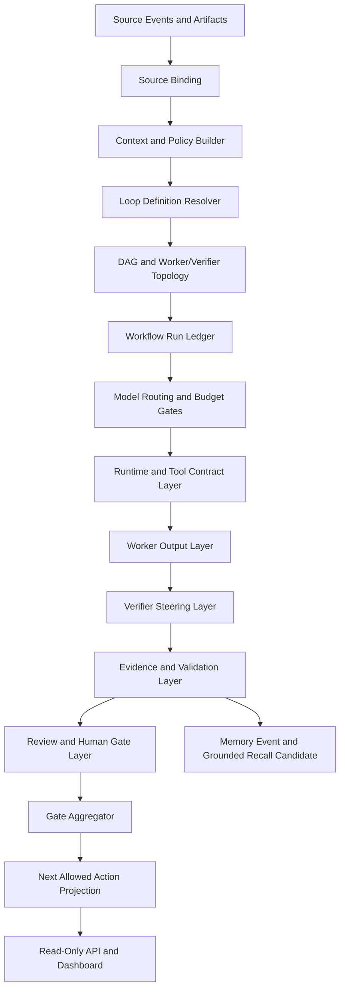

# Hermes Loop System 사양명세서

문서 버전: v1.1
작성일: 2026-06-09
적용 범위: Hermes Project Operations Harness, Work OS Control Plane, Domain Pack SDK, Connector/Resource Governance, Runtime/AgentRun Contract, Human Gate Receipt, Evidence/Review/Gate Plane

이번 버전은 loop engineering을 단순 반복이 아니라 worker/verifier steering, DAG 기반 workflow, budget control, model routing, stop condition을 포함하는 enterprise harness design으로 확장한다.

## 1. 개요

### 1.1 시스템 명칭

본 사양서에서 정의하는 시스템 명칭은 `Hermes Loop System` 또는 `Hermes Loop Engine`이다.

Hermes Loop System은 Hermes가 여러 project, workflow, domain pack, runtime, connector, evidence, review gate를 같은 deterministic control plane에서 반복적으로 관찰하고 조정하기 위한 상태 기반 운영 엔진이다.

이 시스템은 Law Firm OS 전용 엔진이 아니다. 로펌 matter 운영은 `law-firm` domain pack 중 하나이며, Hermes Loop System의 기본 정체성은 project/workflow management, 검증 가능한 실행 준비, human-reviewable 운영 brief, evidence-backed gate projection이다.

### 1.2 목적

Hermes Loop System의 목적은 단발성 agent 응답이나 느슨한 자동화가 아니라 다음 작업을 반복 가능한 운영 단위로 고정하는 것이다.

- project와 domain pack의 현재 상태를 구조화한다.
- source, evidence, review, gate, receipt, blocker를 같은 trace로 묶는다.
- 다음 action을 실행 명령이 아니라 검토 가능한 후보로 projection한다.
- runtime, connector, write action, protected action의 권한을 명시적으로 닫거나 receipt-gated 상태로 둔다.
- Codex, Claude, local validator, CI, external evidence observer의 역할과 authority를 분리한다.
- 사람이 검토할 수 있는 운영 brief, review packet, closeout packet, dashboard/API projection을 만든다.

### 1.3 중립적 정의

Hermes Loop System은 다음과 같이 정의된다.

> Hermes Loop System은 하나 이상의 project goal, workflow state, source artifact, evidence, review receipt, human gate, policy snapshot, runtime contract, connector boundary, exit condition을 입력받아, 상태를 재계산하고 blocker와 next allowed action을 산출하는 deterministic control-plane loop이다.

Hermes Loop System은 기본적으로 source mutation, connector write, production deploy, protected closeout, final approval을 수행하지 않는다.

### 1.4 비목표

Hermes Loop System은 다음을 직접 대체하지 않는다.

- Law Firm OS 제품 런타임
- 외부 SaaS backend
- DMS, email, calendar, ERP, CRM, issue tracker
- final legal judgement
- human owner adjudication
- independent GitHub approval
- production deployment pipeline
- secret manager 또는 credential broker

Hermes는 위 시스템을 read-only evidence, connector boundary, receipt-gated candidate, review packet 형태로 관리할 수 있지만, 해당 시스템의 write authority를 자동으로 획득하지 않는다.

## 2. 핵심 원칙

### 2.1 Evidence Before Claim

Completion claim은 evidence가 아니다. 모든 pass, closeout, readiness, trust claim은 최소 다음 항목을 가져야 한다.

- `evidence_ref`
- `reviewer_ref`
- `hard_gate_ref`
- `responsible_owner`
- `block_reason` 또는 `next_allowed_action`
- `verdict_authority`

### 2.2 No Silent Authority Expansion

Loop가 성공해도 다음 authority는 자동으로 열리지 않는다.

- runtime execution
- command execution
- direct file write
- generated patch apply
- connector ingestion
- connector write
- external service mutation
- raw source exposure
- secret read
- deployment
- release approval
- production PASS
- enterprise PASS
- protected closeout
- Codex final approval
- Claude final approval

### 2.3 Domain Pack Is Not Product Identity

Hermes의 기본 제품 정체성은 범용 project/workflow control plane이다.

Domain pack은 다음과 같은 reusable contract 단위다.

- `personal-dev`
- `law-firm`
- `creative-document`
- `connectors-resource`
- `trading-read-only`
- future SaaS packs

Domain pack은 Hermes 제품 identity를 대체하지 않는다.

### 2.4 Human Gate Is Input, Not Magic Pass

Human receipt는 protected action 또는 closeout의 중요한 입력이지만, 그것만으로 enterprise independent trust나 production approval을 만들지 않는다.

Single-owner mode는 `LOWER_TRUST_INTERNAL_ONLY`로 분류되어야 하며, enterprise trust에는 independent evidence가 필요하다.

### 2.5 Memory Is Grounded Recall

Hermes Memory Bank는 자유로운 기억 저장소가 아니다.

Memory operation은 다음 조건을 만족해야 한다.

- source status가 확인되어야 한다.
- evidence와 citation이 있어야 한다.
- domain boundary가 유지되어야 한다.
- freshness와 conflict 상태가 표시되어야 한다.
- next execution condition 후보로만 쓰여야 한다.

### 2.6 Worker and Verifier Are Separate

Worker가 만든 결과를 같은 Worker가 최종 판정하면 self-review blind spot이 생긴다. Hermes Loop System은 작업 수행 lane과 검증 lane을 분리해야 한다.

- Worker는 artifact, draft, candidate, extracted fact, test result를 만든다.
- Verifier는 goal fit, evidence fit, policy fit, budget fit, model-route fit, stop condition을 검토한다.
- Verifier는 Worker에게 correction instruction을 낼 수 있지만 source mutation이나 final approval을 만들 수 없다.
- Verifier 결과는 normalized finding, gate result, next allowed action으로 기록된다.

### 2.7 Prompting Moves Up To Goal Setting

Loop engineering에서 사람의 역할은 매 단계 prompt를 입력하는 것이 아니라 goal, boundary, risk tolerance, budget, human gate를 설정하는 쪽으로 이동한다.

사람은 다음을 지정한다.

- target goal
- allowed source scope
- acceptable output type
- risk tier
- budget and token ceiling
- review and approval requirement
- stop condition

Hermes는 내부적으로 worker, verifier, tool, model route, DAG node, retry, gate를 조합한다. 이 내부 조합은 사람이 검토할 수 있는 artifact로 남아야 한다.

### 2.8 DAG Before Autonomy

Hermes Loop는 "agent가 알아서 계속한다"가 아니라 DAG 또는 dynamic workflow graph에 의해 통제된다.

각 DAG node는 다음을 선언해야 한다.

- node id
- input refs
- output refs
- worker or verifier role
- model route policy
- tool policy
- budget ceiling
- retry limit
- gate dependency
- stop condition

Graph는 cycle을 직접 허용하지 않는다. 반복은 bounded retry edge, verifier correction edge, human input edge로만 표현한다.

## 3. 핵심 개념

### 3.1 Hermes Loop

Hermes Loop는 특정 project/workflow/domain pack의 상태를 재계산하고 다음 action 후보를 산출하는 반복 작업 단위이다.

각 Loop는 다음 요소로 구성된다.

| 요소 | 설명 |
|---|---|
| `loop_id` | Hermes 내부 Loop 식별자 |
| `goal_ref` | project goal 또는 phase goal |
| `workflow_ref` | capability/workflow contract 식별자 |
| `source_refs` | 입력 artifact, transcript, schema, receipt, event ref |
| `context_bundle_ref` | 권한 필터와 citation을 거친 context packet |
| `plan_ref` | 실행 계획 또는 candidate plan |
| `runtime_refs` | agent run, local script, validator, adapter contract |
| `evidence_refs` | 결과를 뒷받침하는 evidence item |
| `review_refs` | Claude, human, CI, validator review evidence |
| `gate_refs` | pre-run, in-run, post-run, hard gate result |
| `receipt_refs` | human 또는 external receipt input |
| `boundary` | 금지 authority와 allowed projection |
| `exit_condition` | completed, blocked, waiting, failed 조건 |

### 3.2 Loop Definition

Loop Definition은 Hermes가 반복 가능한 workflow를 어떻게 계산할지 선언하는 read/write-neutral contract이다.

필수 필드:

- `schema_version`
- `loop_definition_id`
- `loop_name`
- `loop_version`
- `owner_engine`
- `responsible_owner`
- `applicable_projects`
- `applicable_domain_packs`
- `capability_id`
- `workflow_id`
- `trigger_policy`
- `source_contracts`
- `context_policy`
- `runtime_policy`
- `tool_policy`
- `verification_policy`
- `human_gate_policy`
- `memory_policy`
- `evidence_policy`
- `retry_policy`
- `timeout_policy`
- `cost_policy`
- `boundary_policy`
- `exit_conditions`
- `validation_chain`

### 3.3 Loop Run

Loop Run은 특정 시점에 특정 Loop Definition이 source artifact와 policy snapshot을 기준으로 재계산된 인스턴스이다.

필수 필드:

- `loop_run_id`
- `loop_definition_id`
- `run_ledger_id`
- `correlation_id`
- `correlation_trace_id`
- `project_id`
- `domain_pack`
- `workflow_run_id`
- `source_event_ids`
- `policy_snapshot_id`
- `state_path`
- `current_state`
- `terminal_state`
- `evidence_refs`
- `review_refs`
- `gate_refs`
- `receipt_refs`
- `blocked_reason`
- `next_allowed_action`
- `authority_flags`
- `validation_result`
- `recorded_at`

### 3.4 Step

Step은 Loop Run 내부의 한 계산 단계다.

Hermes Step은 다음 유형 중 하나여야 한다.

- `source_binding`
- `context_build`
- `policy_check`
- `runtime_contract_check`
- `candidate_generation`
- `deterministic_validation`
- `review_packet_generation`
- `receipt_intake`
- `gate_aggregation`
- `dashboard_projection`
- `api_projection`
- `closeout_projection`
- `handoff_projection`

기본 Step은 source mutation을 하지 않는다.

### 3.5 Agent

Agent는 Hermes Loop에서 특정 역할을 수행하는 AI, validator, script, adapter, reviewer lane이다.

Agent 유형:

- `codex_primary_developer`
- `harness_deterministic_validator`
- `claude_read_only_reviewer`
- `local_advisory_model`
- `ci_evidence_observer`
- `github_evidence_observer`
- `human_owner_adjudicator`
- `policy_enforcement_agent`
- `memory_grounding_agent`
- `connector_boundary_agent`

Agent는 source mutation, final approval, enterprise trust claim을 만들 수 없다. 각 AgentRun은 runtime contract, output hash, log capture, artifact capture, verification requirement와 연결되어야 한다.

### 3.6 Worker Agent

Worker Agent는 goal을 달성하기 위한 실제 작업 산출물을 만드는 lane이다.

Worker Agent 산출물 예:

- extracted source facts
- normalized context
- draft plan
- candidate patch
- document summary
- issue classification
- contract clause comparison
- validation command packet
- review packet draft

Worker Agent 필수 제약:

- output은 artifact ref와 hash를 가져야 한다.
- evidence 없는 conclusion은 `unverified_candidate`다.
- protected action을 직접 수행하지 않는다.
- verifier correction을 받으면 이전 output을 덮어쓰지 않고 새 candidate revision을 만든다.

### 3.7 Verifier Agent

Verifier Agent는 Worker output을 검토하고 correction, block, pass candidate를 산출하는 lane이다.

Verifier Agent 유형:

- `goal_fit_verifier`
- `evidence_binding_verifier`
- `policy_boundary_verifier`
- `budget_verifier`
- `model_route_verifier`
- `domain_pack_verifier`
- `legal_output_verifier`
- `security_verifier`
- `human_gate_verifier`

Verifier Agent 필수 출력:

- `verifier_run_id`
- `worker_output_ref`
- `reviewed_goal_ref`
- `finding_refs`
- `correction_instruction`
- `gate_status`
- `budget_status`
- `model_route_status`
- `next_allowed_action`
- `stop_or_retry_decision`

Verifier는 Worker를 조종할 수 있지만 final approval을 만들 수 없다.

### 3.8 DAG Node

DAG Node는 Loop 내부의 작업 또는 검증 단위다.

Node 유형:

- `worker_node`
- `verifier_node`
- `tool_node`
- `budget_gate_node`
- `model_route_node`
- `human_gate_node`
- `synthesis_node`
- `stop_condition_node`

필수 필드:

- `node_id`
- `node_type`
- `depends_on`
- `input_refs`
- `output_refs`
- `role`
- `model_route_policy`
- `budget_policy`
- `retry_policy`
- `gate_policy`
- `stop_policy`
- `status`

### 3.9 Dynamic Workflow Graph

Dynamic Workflow Graph는 Loop Run 중 Verifier 결과에 따라 다음 node가 달라지는 bounded DAG다.

허용되는 dynamic edge:

- `verifier_requests_revision`
- `budget_requires_downgrade`
- `policy_requires_human_gate`
- `model_route_blocked`
- `evidence_missing`
- `goal_satisfied`
- `stop_limit_reached`

Dynamic edge는 무제한 재귀가 아니라 `retry_limit`, `budget_limit`, `time_limit`, `human_gate_required` 중 하나에 의해 제한되어야 한다.

### 3.10 Tool

Tool은 Agent 또는 Loop가 사용할 수 있는 bounded function이다.

Tool 유형:

- deterministic script
- schema validator
- local artifact reader
- read-only API projector
- dashboard builder
- connector boundary checker
- runtime adapter
- document renderer adapter
- evidence viewer
- source span inspector
- receipt validator

Tool invocation은 tool policy, sandbox policy, timeout, redaction, logging, output contract를 가져야 한다.

### 3.11 Human Gate

Human Gate는 사람이 검토, 승인, 반려, 수정, 보류, 조건부 허용을 기록하는 receipt-backed gate이다.

Human Gate는 다음 action에 필수다.

- protected closeout
- external communication
- client-facing output
- legal-domain final work product
- release approval
- deployment
- connector write
- raw source exposure
- secret-related operation
- access or permission mutation
- destructive action

### 3.12 Model Route

Model Route는 특정 node 또는 AgentRun이 어떤 runtime/model boundary를 사용할 수 있는지 결정하는 계약이다.

필수 고려 요소:

- task difficulty
- data classification
- external transfer policy
- redaction status
- model capability
- model cost
- latency target
- verifier requirement
- human approval requirement

고성능 모델은 planner/verifier/high-risk reasoning에 우선 배정하고, 저비용 모델은 classification, formatting, draft cleanup, style consistency, low-risk extraction에 배정할 수 있다.

### 3.13 Budget Gate

Budget Gate는 Loop가 반복될수록 비용이 폭발하지 않도록 막는 계약이다.

Budget Gate는 다음을 통제한다.

- max loop cost
- max node cost
- max token count
- max runtime seconds
- max verifier pass count
- max retry count
- high-cost model escalation threshold
- downgrade condition
- stop condition

## 4. 기존 Hermes 계약과 매핑

### 4.1 개념 매핑

| 외부 Loop 개념 | Hermes 전용 개념 |
|---|---|
| Loop Definition | capability/workflow contract, loop definition overlay |
| Loop Run | workflow run ledger row |
| Step Run | workflow state transition 또는 AgentRunRuntime row |
| Trigger | event envelope, schedule source, manual operator signal |
| Context Builder | context packet, workflow context builder contract |
| Planning Agent | candidate plan, work packet, action plan |
| Execution Engine | runtime contract projection, no direct execution by default |
| Tool Gateway | tool runtime policy enforcement |
| Verification Layer | deterministic validation, gate result aggregator |
| Worker Agent | AgentRunRuntime worker output, work packet candidate, artifact hash |
| Verifier Agent | verification orchestration runtime, normalized finding, gate result |
| DAG/workflow graph | workflow state model, swarm topology contract, bounded dynamic edge |
| Model Routing | model routing ledger, model policy enforcement, route model gate |
| Budget Control | cost budget ledger, token usage ledger, budget alert ledger |
| Human Approval | human gate receipt and receipt validation |
| Memory Manager | append-only memory event and grounded recall guard |
| Dashboard | Work OS read-only API/UI projection |

### 4.2 State Mapping

Hermes Loop는 source-specific 상세 상태를 Hermes DSL로 축약한다.

| Source 상태 | Hermes DSL 상태 | 설명 |
|---|---|---|
| `pending` | `started` | source가 접수되었지만 계산 전 |
| `context_building` | `started` | context packet 생성 중 |
| `planning` | `started` | candidate plan 생성 중 |
| `running` | `started` | deterministic command 또는 runtime contract 검사 중 |
| `waiting_for_approval` | `gated` | human gate 또는 review receipt 필요 |
| `waiting_for_user_input` | `waiting` | 사용자 입력 필요 |
| `retrying` | `started` | retry policy 아래 재계산 중 |
| `partially_completed` | `waiting` | 일부 evidence는 있으나 closeout 불가 |
| `completed` | `completed` | terminal evidence와 gate가 aligned |
| `failed` | `failed` | validation 또는 command failure |
| `cancelled` | `failed` | operator cancellation |
| `expired` | `failed` | timeout 또는 freshness expiry |
| `blocked` | `gated` 또는 `failed` | block reason 성격에 따라 분기 |

### 4.3 Authority Mapping

모든 Loop Run은 다음 authority flags를 명시해야 한다.

```json
{
  "runtime_execution_allowed_now": false,
  "write_action_allowed_now": false,
  "connector_ingestion_allowed_now": false,
  "connector_write_allowed_now": false,
  "raw_material_access_allowed_now": false,
  "cross_domain_access_allowed_now": false,
  "production_ready_allowed_now": false,
  "codex_final_approval_allowed": false,
  "claude_final_approval_allowed": false
}
```

특정 phase에서 authority 후보가 생기더라도 `allowed_now`와 `candidate_ready`를 분리해야 한다.

## 5. 시스템 범위

### 5.1 포함 범위

Hermes Loop System은 다음 기능을 포함한다.

- Loop Definition registry
- Loop Run ledger
- event-backed state transition
- source binding
- context packet assembly
- policy snapshot binding
- runtime/AgentRun contract binding
- deterministic validation chain
- evidence item binding
- review packet generation
- Claude read-only review receipt intake
- human gate receipt intake
- gate result aggregation
- blocker and next allowed action projection
- read-only dashboard/API projection
- memory event and grounded recall candidate projection
- connector boundary and quarantine projection
- authority boundary reporting
- cost/token/latency observability contract
- retry, timeout, resume, cancel contract

### 5.2 제외 범위

기본 Hermes Loop System은 다음을 수행하지 않는다.

- 외부 앱에 직접 접속
- credential 조회
- secret read
- connector ingestion start
- connector write
- external service mutation
- command execution by default
- direct file write by default
- generated patch apply
- protected action execution
- production deploy
- release approval
- legal final advice
- client-facing final output 발송
- enterprise trust claim

## 6. 논리 아키텍처



### 6.1 Source Binding Layer

Source Binding Layer는 Loop가 읽는 모든 입력을 stable reference로 고정한다.

입력 유형:

- project registry row
- domain pack manifest
- requirement/spec/issue/test/evidence row
- workflow run record
- agent run record
- connector boundary row
- source transcript ref
- human receipt input
- Claude review receipt
- CI/GitHub evidence ref
- artifact hash and provenance ref

필수 검증:

- source exists
- source schema version known
- source freshness within policy
- source domain boundary aligned
- source hash or object ref exists
- raw/full body not exposed unless explicitly allowed

### 6.2 Context and Policy Builder

Context Builder는 source에서 Loop가 판단할 최소 context bundle을 만든다.

필수 기능:

- project/domain filtering
- tenant/client/matter boundary check
- policy snapshot binding
- data classification
- redaction requirement declaration
- citation and source span retention
- prompt injection boundary check
- freshness and conflict marker

Context Builder는 source material을 임의로 요약해 truth로 승격하지 않는다.

### 6.3 Loop Orchestration Layer

Loop Orchestrator는 다음 책임을 가진다.

- Loop Definition 로딩
- source binding 확인
- DAG node 생성 및 의존성 확인
- worker/verifier topology 확인
- workflow state transition 계산
- model routing gate 확인
- budget gate 확인
- runtime/tool contract 확인
- validation sequence 실행 또는 실행 후보 projection
- review/gate/receipt 상태 재계산
- retry/backoff/resume/cancel contract 적용
- terminal 상태 판정
- blocker 및 next allowed action 산출

Loop Orchestrator는 반복 자체를 신뢰하지 않는다. 각 반복은 verifier finding, budget margin, model route gate, retry limit, stop condition 중 하나로 정당화되어야 한다.

### 6.4 DAG and Worker/Verifier Topology Layer

DAG and Topology Layer는 Loop 내부의 worker, verifier, tool, human gate, synthesis node를 bounded workflow graph로 고정한다.

필수 항목:

- root goal node
- worker node list
- verifier node list
- synthesis node
- shared blackboard 또는 artifact refs
- model route node
- budget gate node
- human review gate node
- retry/correction edge
- terminal stop node

필수 검증:

- worker output은 verifier node를 통과해야 accepted candidate가 된다.
- verifier node는 source mutation을 수행하지 않는다.
- correction edge는 retry limit를 가져야 한다.
- graph는 무제한 cycle을 포함하지 않는다.
- human gate가 필요한 node는 자동으로 completed가 될 수 없다.

### 6.5 Model Routing and Budget Gate Layer

Model Routing and Budget Gate Layer는 각 node가 어떤 model/runtime을 사용할 수 있는지, 그리고 반복을 계속할 비용 여력이 있는지 확인한다.

필수 항목:

- route decision
- route status
- external transfer flag
- redaction status
- required gates
- max USD
- observed or estimated USD
- input/output/total token estimate
- runtime seconds estimate
- budget margin
- alert threshold
- downgrade or stop recommendation

라우팅 원칙:

- planner/verifier/high-risk legal reasoning은 고성능 모델 후보가 될 수 있다.
- classification, formatting, low-risk extraction, style cleanup은 저비용 모델 후보가 될 수 있다.
- P2 이상 또는 privileged/sensitive 자료는 external model route가 `review` 또는 `deny`로 남아야 한다.
- budget margin이 부족하면 high-cost escalation은 block되고 cheaper route 또는 human gate가 next allowed action이 된다.

### 6.6 Runtime and Tool Contract Layer

Runtime Layer는 실제 runtime을 신뢰하지 않고 계약으로 감싼다.

필수 항목:

- adapter id
- runtime id
- risk level
- execution mode
- sandbox policy
- timeout and heartbeat
- workspace isolation
- command binding
- output contract
- output hash
- log capture
- artifact capture
- verification requirement
- acceptance authority

### 6.7 Worker Output Layer

Worker Output Layer는 작업 산출물을 accepted result가 아니라 candidate artifact로 기록한다.

필수 항목:

- worker run id
- assigned node id
- model route ref
- budget decision ref
- input refs
- output refs
- output hash
- evidence claim refs
- known uncertainty
- verifier required flag
- revision sequence

Worker output은 verifier gate를 통과하기 전까지 `unverified_candidate`다.

### 6.8 Verifier Steering Layer

Verifier Steering Layer는 Worker output을 검토하고 다음 edge를 결정한다.

가능한 결정:

- `accept_candidate`
- `request_revision`
- `request_more_evidence`
- `downgrade_model_route`
- `escalate_model_route`
- `require_human_gate`
- `stop_budget_exceeded`
- `stop_goal_satisfied`
- `block_policy_violation`

Verifier는 output 품질만 보지 않는다. goal fit, evidence binding, policy boundary, model route, budget margin, retry count, stop condition을 함께 본다.

### 6.9 Evidence and Validation Layer

Evidence Layer는 결과 claim을 검증 가능한 evidence로 연결한다.

검증 항목:

- required evidence present
- evidence source status known
- source span or citation exists
- output hash exists
- validation command passed
- negative fixture passed
- policy violation absent or blocked
- high risk result has review gate
- untrusted output is not accepted

### 6.10 Review and Human Gate Layer

Review/Gate Layer는 reviewer evidence와 human receipt를 분리한다.

Reviewer lane:

- Claude Code Opus max read-only review
- CI/GitHub required checks
- local validator result
- external evidence observer

Human lane:

- owner receipt
- protected approval receipt
- finding disposition
- correction receipt
- manual revalidation receipt

Claude review는 source mutation이나 final approval을 만들 수 없다.

### 6.11 Memory and Recall Layer

Memory Layer는 Loop 결과를 다음 세션 후보로 저장하거나 projection한다.

Memory operation 유형:

- Archive
- Sync
- Index
- Search
- Extract
- Consolidate
- Relate
- Recall

각 operation은 grounded evidence, citation, source status, domain boundary, freshness policy를 요구한다.

### 6.12 Read-Only Projection Layer

Projection Layer는 operator가 이해할 수 있는 화면과 API를 제공한다.

Projection 대상:

- current goal
- phase status
- workflow run status
- evidence readiness
- review state
- gate state
- receipt state
- worker/verifier state
- DAG node state
- model route status
- budget status
- blocker
- next allowed action
- authority boundary
- cost/token/latency summary

기본 API는 GET/HEAD-only다.

## 7. 데이터 모델

### 7.1 `HermesLoopDefinition`

```json
{
  "schema_version": "hermes-loop-definition.v1",
  "loop_definition_id": "loop.project-build-verification",
  "loop_version": "1.0.0",
  "loop_name": "Project Build Verification Loop",
  "owner_engine": "harness",
  "responsible_owner": "project_owner",
  "domain_packs": ["personal-dev", "law-firm"],
  "capability_id": "platform.product_build_verification",
  "workflow_id": "workflow.product-build-verification",
  "trigger_policy": {},
  "source_contracts": [],
  "context_policy": {},
  "runtime_policy": {},
  "tool_policy": {},
  "dag_policy": {},
  "worker_policy": {},
  "verifier_policy": {},
  "model_routing_policy": {},
  "budget_policy": {},
  "verification_policy": {},
  "human_gate_policy": {},
  "memory_policy": {},
  "evidence_policy": {},
  "boundary_policy": {},
  "exit_conditions": []
}
```

### 7.2 `HermesLoopRun`

```json
{
  "schema_version": "hermes-loop-run.v1",
  "loop_run_id": "looprun.2026-06-09.project-build-verification",
  "loop_definition_id": "loop.project-build-verification",
  "workflow_run_id": "workflow_run.p9801",
  "correlation_id": "corr.p9801",
  "project_id": "project.hermes",
  "domain_pack": "personal-dev",
  "current_state": "gated",
  "state_path": ["started", "gated"],
  "source_refs": [],
  "dag_ref": "dag.project-build-verification.p9801",
  "worker_run_refs": [],
  "verifier_run_refs": [],
  "model_route_refs": [],
  "budget_gate_refs": [],
  "evidence_refs": [],
  "review_refs": [],
  "gate_refs": [],
  "receipt_refs": [],
  "blocked_reason": "missing_claude_review_receipt",
  "next_allowed_action": "prepare_read_only_review_packet",
  "authority_flags": {
    "runtime_execution_allowed_now": false,
    "write_action_allowed_now": false,
    "connector_write_allowed_now": false,
    "production_ready_allowed_now": false
  }
}
```

### 7.3 `HermesLoopStepRun`

필수 필드:

- `step_run_id`
- `loop_run_id`
- `step_type`
- `step_sequence`
- `dag_node_id`
- `worker_run_ref`
- `verifier_run_ref`
- `model_route_ref`
- `budget_gate_ref`
- `input_refs`
- `output_refs`
- `policy_snapshot_id`
- `runtime_ref`
- `tool_ref`
- `evidence_ref`
- `gate_ref`
- `status`
- `error_code`
- `blocked_reason`
- `started_at`
- `ended_at`

### 7.4 `HermesLoopDAG`

필수 필드:

- `dag_id`
- `loop_run_id`
- `root_goal_ref`
- `node_count`
- `edge_count`
- `nodes`
- `edges`
- `topology_ref`
- `shared_blackboard_ref`
- `cycle_policy`
- `dynamic_edge_policy`
- `max_retry_depth`
- `max_verifier_pass_count`
- `terminal_node_ids`
- `human_gate_node_ids`
- `dag_status`
- `blocked_reason`

예시:

```json
{
  "schema_version": "hermes-loop-dag.v1",
  "dag_id": "dag.contract-review.001",
  "loop_run_id": "looprun.contract-review.001",
  "nodes": [
    { "node_id": "parse_contract", "node_type": "worker_node" },
    { "node_id": "verify_extraction", "node_type": "verifier_node" },
    { "node_id": "budget_check", "node_type": "budget_gate_node" },
    { "node_id": "human_review", "node_type": "human_gate_node" }
  ],
  "edges": [
    { "from": "parse_contract", "to": "verify_extraction", "edge_type": "normal" },
    { "from": "verify_extraction", "to": "parse_contract", "edge_type": "verifier_requests_revision", "max_traversal": 2 }
  ],
  "cycle_policy": "bounded_correction_edges_only",
  "dag_status": "gated"
}
```

### 7.5 `HermesLoopWorkerRun`

필수 필드:

- `worker_run_id`
- `loop_run_id`
- `dag_node_id`
- `worker_role`
- `input_refs`
- `output_refs`
- `artifact_hash`
- `model_route_ref`
- `budget_gate_ref`
- `tool_refs`
- `evidence_claim_refs`
- `uncertainty_flags`
- `revision_sequence`
- `verifier_required`
- `worker_status`

### 7.6 `HermesLoopVerifierRun`

필수 필드:

- `verifier_run_id`
- `loop_run_id`
- `dag_node_id`
- `verifier_type`
- `worker_run_ref`
- `reviewed_goal_ref`
- `reviewed_output_refs`
- `finding_refs`
- `correction_instruction`
- `gate_status`
- `budget_status`
- `model_route_status`
- `retry_decision`
- `stop_decision`
- `next_allowed_action`
- `verifier_status`

### 7.7 `HermesLoopModelRouteDecision`

필수 필드:

- `model_route_decision_id`
- `loop_run_id`
- `dag_node_id`
- `agent_role`
- `task_class`
- `risk_tier`
- `data_classification`
- `candidate_runtime_ids`
- `selected_runtime_id`
- `route_status`
- `route_mode`
- `external_transfer`
- `redaction_status`
- `required_gates`
- `estimated_quality_tier`
- `estimated_cost_tier`
- `route_blocker`

### 7.8 `HermesLoopBudgetDecision`

필수 필드:

- `budget_decision_id`
- `loop_run_id`
- `dag_node_id`
- `model_route_decision_id`
- `max_usd`
- `estimated_usd`
- `observed_usd`
- `budget_margin_usd`
- `max_input_tokens`
- `max_output_tokens`
- `estimated_total_tokens`
- `observed_total_tokens`
- `max_runtime_seconds`
- `observed_runtime_seconds`
- `max_retry_count`
- `observed_retry_count`
- `max_verifier_pass_count`
- `observed_verifier_pass_count`
- `budget_status`
- `alert_status`
- `recommended_action`

### 7.9 `HermesLoopGateResult`

필수 필드:

- `gate_result_id`
- `loop_run_id`
- `gate_type`
- `gate_status`
- `required_evidence_refs`
- `observed_evidence_refs`
- `reviewer_ref`
- `hard_gate_ref`
- `receipt_ref`
- `acceptance_authority`
- `block_reason`
- `next_allowed_action`

### 7.10 `HermesLoopAuthorityBoundary`

필수 필드:

- `boundary_id`
- `loop_run_id`
- `runtime_execution_allowed_now`
- `write_action_allowed_now`
- `connector_ingestion_allowed_now`
- `connector_write_allowed_now`
- `raw_material_access_allowed_now`
- `cross_domain_access_allowed_now`
- `production_ready_allowed_now`
- `protected_closeout_allowed_now`
- `codex_final_approval_allowed`
- `claude_final_approval_allowed`
- `unsafe_flag_count`

## 8. Trigger 요구사항

### 8.1 Trigger 유형

Hermes는 다음 trigger를 지원한다.

- manual operator request
- scheduled heartbeat
- source artifact change
- workflow run update
- evidence gap detected
- review receipt received
- human receipt received
- CI/GitHub evidence update
- connector boundary update
- memory recall candidate update
- stale handoff detected
- policy conflict detected

### 8.2 Trigger 처리 원칙

Trigger는 직접 action을 수행하지 않고 Loop Run candidate를 만든다.

필수 처리:

- idempotency key 확인
- duplicate event 제거
- source freshness 확인
- domain boundary 확인
- trigger-to-loop mapping
- pre-run gate 확인
- run queue projection

## 9. Context Builder 요구사항

Context Builder는 source를 그대로 model에 넣는 계층이 아니다. Hermes context는 검증 가능한 최소 bundle이어야 한다.

필수 기능:

- source inventory
- source classification
- boundary filter
- redaction marker
- citation map
- source span map
- conflict detector
- stale source marker
- privilege/confidentiality marker
- prompt injection marker
- context size and cost estimate
- model routing hint

출력은 `context_bundle_ref`로만 참조되어야 하며, raw/full source body 노출은 기본 false다.

## 10. Planning 요구사항

Planning Agent의 산출물은 실행 명령이 아니라 candidate plan이다.

필수 필드:

- `plan_id`
- `loop_run_id`
- `objective`
- `assumptions`
- `required_inputs`
- `missing_inputs`
- `steps`
- `tools`
- `expected_outputs`
- `approval_points`
- `risk_flags`
- `stop_conditions`
- `evidence_requirements`
- `review_requirements`
- `gate_requirements`
- `dag_requirements`
- `worker_requirements`
- `verifier_requirements`
- `model_routing_requirements`
- `budget_requirements`
- `authority_boundary`

계획은 다음을 금지해야 한다.

- no evidence PASS
- no review receipt PASS
- no automatic protected action
- no direct write
- no connector write
- no final approval by agent

Planning Agent는 "어떤 prompt를 다음에 칠지"가 아니라 "어떤 DAG node가 어떤 worker/verifier/model/budget 아래에서 실행 후보가 되는지"를 산출해야 한다.

## 11. DAG and Worker/Verifier 요구사항

### 11.1 DAG 요구사항

Hermes Loop DAG는 반복 가능한 작업 흐름을 명시적으로 표현해야 한다.

필수 기능:

- node dependency 선언
- worker/verifier role 분리
- tool node와 model route node 분리
- budget gate node 포함
- human gate node 포함 가능
- bounded correction edge
- terminal stop node
- shared artifact ref 또는 blackboard ref
- graph validation

금지:

- unbounded cycle
- hidden recursive prompt loop
- verifier 없는 high-risk worker output acceptance
- human gate 없이 protected output completion
- budget gate 없이 expensive model escalation

### 11.2 Worker 요구사항

Worker는 output candidate를 만든다.

필수 기능:

- input source refs 기록
- output artifact refs 기록
- revision sequence 기록
- uncertainty flag 기록
- evidence claim과 actual evidence 분리
- verifier required 여부 기록
- model route와 budget decision binding

Worker는 자기 output을 final로 판정하지 않는다.

### 11.3 Verifier 요구사항

Verifier는 Worker output을 goal, evidence, policy, budget, model route, stop condition 기준으로 검토한다.

검토 항목:

- goal 충족 여부
- required source 반영 여부
- citation/evidence 존재 여부
- hallucination 또는 unsupported claim 여부
- policy boundary 위반 여부
- domain boundary 위반 여부
- model route 적합성
- budget margin
- retry count
- human gate 필요 여부

Verifier 결정:

- accept candidate
- request revision
- request more evidence
- require cheaper model route
- require stronger model route
- require human gate
- block policy violation
- stop budget exceeded
- stop goal satisfied

### 11.4 Steering Loop 요구사항

Verifier correction은 다음 조건을 만족해야 한다.

- correction instruction이 구조화되어야 한다.
- 어떤 Worker output을 고치는지 명시해야 한다.
- 재작업 범위를 제한해야 한다.
- 재시도 횟수와 비용을 차감해야 한다.
- 기존 artifact를 덮어쓰지 않아야 한다.
- correction 후 다시 Verifier를 통과해야 한다.

## 12. Model Routing and Budget Control 요구사항

### 12.1 Model Routing 요구사항

Model Routing은 각 DAG node의 task class, data classification, risk tier, quality requirement, budget margin을 기준으로 runtime/model 후보를 결정한다.

권장 라우팅:

| 작업 유형 | 기본 모델 계층 | 조건 |
|---|---|---|
| 목표 분해, high-risk verifier | high-capability model | evidence/review gate 필수 |
| 단순 분류, 라벨링, 형식 정리 | low-cost model | low-risk source일 때 |
| 문체 통일, 오탈자, formatting | low-cost model | verifier spot-check 필요 |
| 복잡한 법률/계약 추론 | high-capability model 또는 human gate | legal final output 금지 |
| budget overrun 상태 | cheaper route 또는 stop | high-cost escalation block |

필수 gate:

- data classification gate
- external model policy gate
- redaction gate
- model capability gate
- cost tier gate
- verifier route gate

### 12.2 Budget Control 요구사항

Budget Control은 Loop 전체와 node별 비용을 통제한다.

필수 항목:

- max loop USD
- max node USD
- max total tokens
- max input tokens
- max output tokens
- max runtime seconds
- max retry count
- max verifier pass count
- warning threshold
- critical threshold
- unbudgeted route blocker

Budget 상태:

- `within_budget`
- `warning`
- `critical`
- `blocked_budget_exceeded`
- `blocked_unbudgeted`
- `pending_token_records`

Budget이 `critical` 또는 `blocked_*`이면 next allowed action은 다음 중 하나여야 한다.

- stop loop
- downgrade model route
- reduce context
- request human decision
- split goal
- defer non-critical node

### 12.3 Token Tracking 요구사항

Token tracking은 실제 provider record가 없을 때도 conservative estimate를 제공해야 한다.

필수 항목:

- input token estimate
- output token estimate
- total token estimate
- actual token record ref
- estimation method
- context item count
- redaction status
- route id
- budget id

추정값은 billing source가 아니라 budget guard와 observability를 위한 선행 estimate다.

### 12.4 Stop Condition 요구사항

Loop는 다음 조건에서 자동으로 멈추거나 human gate로 이동해야 한다.

- goal satisfied
- max retry reached
- max verifier pass reached
- budget exceeded
- token ceiling exceeded
- same finding repeated
- evidence missing after retry
- model route denied
- policy violation
- human approval required
- source conflict unresolved
- protected action requested

## 13. Execution 요구사항

Hermes Loop System의 기본 execution은 `contract execution`이다.

### 13.1 허용되는 실행

다음은 기본 허용 가능하다.

- read-only source inspection
- schema validation
- deterministic check command
- dashboard build
- GET/HEAD-only API smoke
- review packet generation
- receipt template generation
- candidate diff projection
- no-op dry run

### 13.2 금지되는 실행

다음은 별도 authority maturity, receipt, review, human gate 없이는 금지된다.

- command execution that mutates source
- patch apply
- connector write
- external API mutation
- credential lookup
- secret read
- raw export
- deployment
- migration
- rollback execution
- release approval

### 13.3 Retry, Resume, Cancel

Retry는 같은 source와 policy snapshot에서 재현 가능해야 한다.

필수 조건:

- retry count limit
- retry reason
- previous error ref
- changed input ref
- backoff policy
- no infinite loop guard
- operator-visible status

Resume은 stale source를 current로 위장하지 않는다.

Cancel은 terminal failure 또는 operator cancelled state로 event-backed 기록되어야 한다.

## 14. Verification 요구사항

Verification Layer는 다음 gate를 제공한다.

### 14.1 Pre-Run Gates

- source exists
- schema valid
- domain boundary valid
- policy snapshot exists
- connector/write boundary closed
- required context available
- prompt injection scan declared
- DAG topology valid
- model route gate present
- budget gate present

### 14.2 In-Run Gates

- runtime adapter registered
- tool policy matched
- timeout/heartbeat active
- output hash generated
- log capture declared
- artifact capture declared
- cost/token tracked
- worker output marked candidate
- verifier pass or finding recorded
- retry count within policy

### 14.3 Post-Run Gates

- expected artifact exists
- validation command passed
- evidence refs complete
- review refs complete when required
- human receipt complete when required
- no unresolved blocking finding
- authority flags remain safe
- budget not exceeded
- model route still policy-aligned
- verifier stop condition resolved

### 14.4 Negative Fixtures

Hermes Loop System must include negative fixtures for:

- missing evidence
- missing reviewer
- missing human receipt
- stale source
- cross-domain source leak
- raw source exposure
- secret-bearing output
- connector write attempt
- protected action attempt
- unbounded DAG cycle
- worker self-approval
- verifier missing for high-risk output
- budget exceeded but loop continues
- high-cost model escalation without gate
- Codex self-approval
- Claude final approval
- production PASS without release evidence

## 15. Human Review 요구사항

### 15.1 Review Packet

Review Packet은 reviewer가 판단해야 할 최소 bundle이다.

필수 항목:

- scope
- source refs
- diff or output refs
- validation result
- risk flags
- DAG node scope
- worker output refs
- verifier finding refs
- model route and budget status
- evidence refs
- known blockers
- requested verdict
- authority boundary
- no-mutation instruction

### 15.2 Review Receipt

Review Receipt는 reviewer evidence이다.

필수 항목:

- reviewer engine
- model id or human actor
- reviewed scope
- reviewed source refs
- reviewed worker output refs
- reviewed verifier finding refs
- findings
- severity
- blocking status
- raw receipt object ref if available
- normalized finding refs
- revalidation requirement

### 15.3 Human Owner Receipt

Human Owner Receipt는 protected closeout input이다.

필수 항목:

- actor id
- role
- authority scope
- decision
- conditions
- comment
- source refs reviewed
- timestamp
- expiry or revocation if applicable

## 16. Connector and Resource 요구사항

Connector/Resource는 Loop input일 수 있지만 기본적으로 read-only governance 대상이다.

필수 기능:

- external app registry
- connector capability matrix
- read scope declaration
- denied write scope declaration
- consent/auth receipt contract
- ingestion quarantine
- source classification
- redaction policy
- evidence mapping
- cross-app boundary guard
- access log ref

금지:

- connector provisioning by default
- credential lookup by default
- raw export by default
- ingestion start by default
- connector write by default
- cross-app join by default

## 17. API 요구사항

### 17.1 기본 API

기본 API는 GET/HEAD-only다.

권장 route:

- `GET /api/hermes/loops`
- `GET /api/hermes/loop-definitions`
- `GET /api/hermes/loop-runs`
- `GET /api/hermes/loop-run-detail`
- `GET /api/hermes/loop-dags`
- `GET /api/hermes/loop-dag-nodes`
- `GET /api/hermes/loop-worker-runs`
- `GET /api/hermes/loop-verifier-runs`
- `GET /api/hermes/loop-model-routes`
- `GET /api/hermes/loop-budget-decisions`
- `GET /api/hermes/loop-gates`
- `GET /api/hermes/loop-evidence`
- `GET /api/hermes/loop-review-receipts`
- `GET /api/hermes/loop-human-receipts`
- `GET /api/hermes/loop-authority-boundaries`
- `GET /api/hermes/loop-next-actions`

### 17.2 Mutating API

Mutating API는 기본 범위가 아니다. 향후 도입 시 다음 조건이 필요하다.

- action class registry
- receipt-gated candidate lane
- command allowlist
- write scope policy
- rollback/recovery binding
- post-action validation
- high-risk Claude review receipt
- human owner receipt
- audit event append
- protected action guard

## 18. Dashboard 요구사항

Hermes Loop Dashboard는 다음 정보를 표시해야 한다.

- project
- domain pack
- loop name
- workflow run
- current DSL state
- DAG state
- worker output state
- verifier steering state
- source freshness
- evidence readiness
- model route readiness
- budget margin
- review readiness
- human gate readiness
- blocker
- next allowed action
- authority flags
- cost/token/latency
- last updated

Dashboard는 action button을 제공하더라도 protected action을 직접 실행하지 않는다. 버튼은 receipt template, review packet, candidate preview, read-only detail view를 여는 용도여야 한다.

## 19. 운영 지표

### 19.1 Product Ops Metrics

- active loop count
- blocked loop count
- waiting receipt count
- review pending count
- evidence gap count
- stale source count
- domain boundary block count
- next allowed action count
- active DAG count
- worker candidate count
- verifier correction count

### 19.2 Quality Metrics

- validation failure rate
- blocking finding rate
- missing evidence rate
- missing review receipt rate
- stale memory recall rate
- citation coverage rate
- authority violation attempt count
- worker self-approval block count
- repeated finding rate

### 19.3 Runtime Metrics

- command duration
- token usage
- model cost
- tool failure rate
- timeout count
- retry count
- artifact capture rate
- log capture rate
- model downgrade count
- high-cost escalation count

### 19.4 Trust Metrics

- independent evidence coverage
- Claude receipt freshness
- CI/GitHub evidence freshness
- signed attestation coverage
- human receipt coverage
- single-owner trust downgrade count

### 19.5 Budget and Routing Metrics

- loop budget usage ratio
- node budget usage ratio
- token estimate variance
- budget exceeded stop count
- unbudgeted route block count
- external model route review count
- redaction-gated route count
- cheap-model successful node count
- high-capability verifier node count

## 20. 보안 및 컴플라이언스 요구사항

필수 요구사항:

- tenant/project/domain boundary
- client/matter boundary for legal pack
- role-based and attribute-based policy marker
- secret-bearing key response block
- raw/full transcript body non-exposure
- redacted summary only by default
- prompt injection boundary
- source hash and provenance
- append-only audit event contract
- retention and deletion policy
- backup/restore readiness
- incident recovery binding

Hermes Loop System은 compliance PASS를 자동 생성하지 않는다. Compliance evidence와 blocker를 projection할 뿐이다.

## 21. Roadmap

### 21.1 Phase A: Loop Overlay Contract

목표:

- `HermesLoopDefinition` schema
- `HermesLoopRun` schema
- `HermesLoopDAG` schema
- `HermesLoopWorkerRun` schema
- `HermesLoopVerifierRun` schema
- `HermesLoopModelRouteDecision` schema
- `HermesLoopBudgetDecision` schema
- existing workflow/run/runtime/evidence/review/gate mapping
- state mapping table
- authority boundary fixture

완료 기준:

- schema validates
- no write authority opened
- no connector authority opened
- no production PASS claim

### 21.2 Phase B: Loop Run Ledger Projection

목표:

- source event to loop run projection
- workflow state transition binding
- gate result binding
- blocker and next allowed action projection
- worker/verifier run refs projected
- model/budget refs projected

완료 기준:

- event-backed records
- terminal alignment checked
- missing source becomes BLOCK

### 21.3 Phase C: Context and Memory Grounding

목표:

- context bundle contract
- citation/source span binding
- memory operation candidate
- stale/conflict/domain guard

완료 기준:

- uncited recall blocked
- cross-domain recall blocked
- raw/full source body not exposed

### 21.4 Phase D: DAG and Worker/Verifier Topology

목표:

- bounded DAG contract
- swarm topology binding
- worker/verifier separation
- correction edge policy
- stop condition node

완료 기준:

- unbounded cycle blocked
- high-risk worker output requires verifier
- correction edge consumes retry/budget allowance

### 21.5 Phase E: Model Routing and Budget Control

목표:

- model routing ledger binding
- model policy enforcement binding
- cost budget ledger binding
- token usage ledger binding
- budget alert ledger binding

완료 기준:

- expensive model escalation gated
- budget exceeded loop stops or downgrades
- token estimate exists before route execution
- external model policy enforced

### 21.6 Phase F: Runtime and Tool Governance

목표:

- runtime adapter binding
- tool policy binding
- command allowlist candidate
- sandbox/timeout/log/artifact/cost contract

완료 기준:

- high-risk runtime requires verification
- untrusted output not accepted
- command execution still false unless explicitly matured

### 21.7 Phase G: Review and Human Gate Integration

목표:

- review packet
- Claude read-only receipt intake
- normalized finding loop
- human owner receipt template
- protected closeout input mapping

완료 기준:

- Claude cannot final approve
- Codex cannot self-approve
- human receipt does not create enterprise trust alone

### 21.8 Phase H: Read-Only UI/API Projection

목표:

- loop dashboard
- loop detail
- gate console
- evidence console
- review receipt console
- next allowed action console

완료 기준:

- GET/HEAD-only routes
- no protected UI action
- authority flags visible
- worker/verifier/model/budget status visible

### 21.9 Phase I: Controlled Execution Candidate Lane

목표:

- action class registry
- receipt-gated candidate lane
- command allowlist
- write scope policy
- rollback/recovery binding
- post-action validation

완료 기준:

- candidate exists
- no automatic apply
- review and human receipt required for protected action

## 22. Acceptance Criteria

Hermes Loop System v1.1 is acceptable when:

- Loop Definition and Loop Run are stable contracts.
- Existing workflow, runtime, evidence, review, gate, receipt contracts are reused rather than replaced.
- Every Loop Run exposes source refs, evidence refs, review refs, gate refs, receipt refs, blocker, next allowed action.
- Every high-risk Worker output has a Verifier run or an explicit block reason.
- Every Loop Run has a bounded DAG or a reason it is single-step.
- Every model route has policy, redaction, and cost gates.
- Every repeated verifier correction consumes retry and budget allowance.
- All authority flags are explicit.
- Missing evidence blocks PASS.
- Missing review receipt blocks high-risk closeout.
- Missing human receipt blocks protected action.
- Memory recall requires citation and source status.
- Connector write remains false by default.
- API projection remains read-only by default.
- Dashboard makes blocked state visible instead of hiding it.

## 23. Example Loop Families

### 23.1 Project Build Verification Loop

Purpose:

- Requirement, implementation packet, test evidence, review packet, Claude receipt, revalidation, closeout readiness를 연결한다.

Default blocker:

- missing feature packet
- missing test evidence
- missing Claude receipt
- blocking Claude finding
- missing revalidation
- unsafe authority expansion

### 23.2 Connector Governance Loop

Purpose:

- external app registry, connector scope, consent/auth receipt, quarantine, evidence mapping, cross-app boundary를 projection한다.

Default blocker:

- missing consent receipt
- secret read attempt
- raw export attempt
- connector write attempt
- cross-app data join attempt

### 23.3 Human Gate Receipt Loop

Purpose:

- protected approval request, owner receipt, finding disposition, correction, manual revalidation을 검증한다.

Default blocker:

- missing owner actor
- missing reviewed source refs
- invalid authority scope
- expired receipt
- unresolved blocking finding

### 23.4 Memory Recall Loop

Purpose:

- prior session, decision, blocker, validation, review, phase progress를 다음 세션 후보로 projection한다.

Default blocker:

- uncited recall
- stale source as current
- cross-domain recall
- raw transcript exposure
- conflict unresolved

### 23.5 Contract Redline Review Loop

Purpose:

- 상대방 수정본이 기존 계약 체계, 정의조항, 선행조건, 해제, 손해배상, 승인 절차와 충돌하는지 검토하고, 필요한 수정안을 원문 문체에 맞는 candidate로 projection한다.

Example DAG:

| Node | Type | Role | Model/Budget Policy | Output |
|---|---|---|---|---|
| `parse_redline` | worker | 변경사항 추출 | low-cost allowed if source is safe | redline change set |
| `verify_redline_extraction` | verifier | 누락 변경 검증 | medium/high verifier if material contract | extraction findings |
| `classify_clause_issues` | worker | 쟁점 분류 | low-cost for taxonomy, high only if complex | issue classification |
| `analyze_legal_effect` | worker | 법적 효과 후보 분석 | high-capability route candidate, human gate for final legal judgement | legal effect candidate |
| `verify_internal_consistency` | verifier | 정의/선행조건/해제/손해배상 충돌 검증 | high-capability verifier | consistency findings |
| `draft_revision_candidate` | worker | 원문 문체 기반 수정안 후보 | medium route, budget capped | revision candidate |
| `verify_style_and_authority` | verifier | 문체, 근거, client-facing 금지 확인 | low/medium plus policy gate | correction or accept candidate |
| `synthesize_review_packet` | synthesis | 결론, 근거, 수정안, 남은 확인사항 | no final legal advice | review packet |
| `human_gate` | human_gate | 변호사 승인 필요 상태 표시 | required for client-facing or final work product | receipt request |

Default blocker:

- missing original contract source
- missing redline source
- extracted changes not verified
- unsupported legal conclusion
- clause conflict unresolved
- revision candidate lacks source citation
- high-cost model escalation without budget margin
- client-facing output requested without human gate
- final legal judgement attempted by agent

Expected final output:

- review packet
- issue table
- source-cited risk notes
- revision candidate
- unresolved question list
- human approval request if needed

## 24. 결론

Hermes Loop System은 독립 제품 런타임이 아니라 Hermes control plane의 반복 계산 구조다. 핵심 경쟁력은 agent autonomy가 아니라 worker/verifier separation, bounded DAG, evidence-backed state, explicit blocker, reviewable next action, budget/model-route control, strict authority boundary, grounded memory, reusable domain-pack contract에 있다.

따라서 Hermes 전용 Loop System은 다음 방향으로 구현되어야 한다.

- workflow/run/runtime/evidence/review/gate 계약을 재사용한다.
- 외부 Law Firm OS식 Loop Engine을 그대로 이식하지 않는다.
- source mutation과 protected action을 기본 차단한다.
- worker output과 verifier judgement를 분리한다.
- DAG와 stop condition으로 반복을 통제한다.
- budget gate와 model routing으로 비용과 품질을 같이 관리한다.
- 모든 readiness를 evidence, review, receipt, hard gate에 묶는다.
- operator가 현재 상태와 다음 action을 이해할 수 있도록 read-only projection을 먼저 완성한다.
