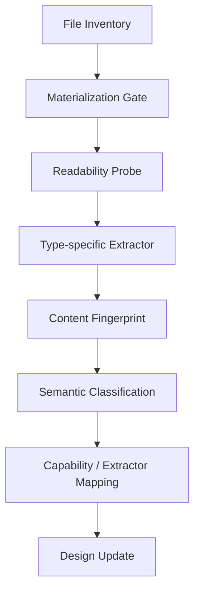
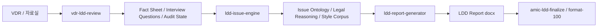
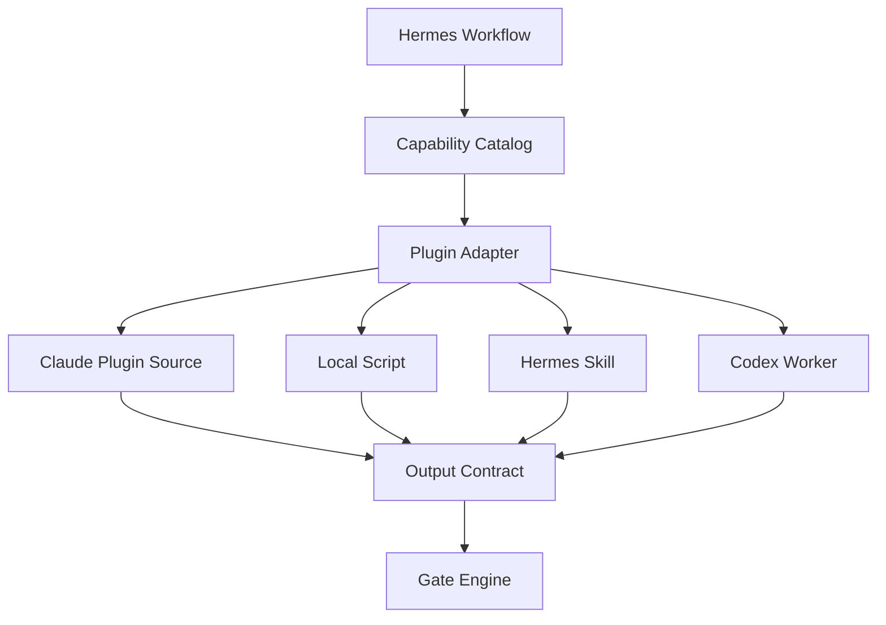
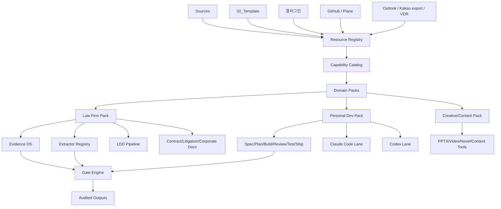

# 업무 리소스 전수점검 기반 사전 아키텍처

조사일: 2026-05-22

## 조사 범위

대상 폴더:

- `$HERMES_RESOURCE_AUDIT_ROOT`
- `$HERMES_RESOURCE_AUDIT_ROOT/플러그인`

실행 절차 문서: `docs/full-resource-audit-runbook.md`

전수점검 원칙:

- 하네스 설계에 반영할 최종 판단은 파일명/경로/확장자만으로 하지 않는다.
- OneDrive 파일은 먼저 로컬 materialization/download 상태를 확인한다.
- 모든 파일이 `readable` 또는 `unsupported_but_recorded` 상태로 분류된 뒤에만 설계 반영안을 확정한다.
- 현재 문서는 “사전 구조 가설”이며, 최종 아키텍처 문서는 아래 Full Resource Audit Protocol 완료 후 갱신한다.

현재 확인된 OneDrive 상태:

- 전체 파일: 3,836개
- 로컬 본문 읽기 가능 파일: 1,123개
- `dataless` 파일: 2,713개
- 즉, 현재 상태에서는 약 70.7% 파일이 OneDrive placeholder라서 본문 추출 대상이지만 아직 로컬에 존재하지 않는다.
- 한글 경로 정규화 후 후보 도메인은 law-firm 2,868개, personal-dev 354개, creative 162개, unclassified 452개로 분류된다.

따라서 이번 설계의 첫 번째 수정점은 `Materialization Gate`를 core ingestion 앞단에 넣는 것이다.

## 현재 본문 추출 결과

상세 문서: `docs/resource-extraction-findings.md`

현재 로컬에 내려온 `extractor-queue` 1,045개 파일은 모두 본문 추출 또는 header probe를 완료했다.

- 입력 파일: 1,045개
- 추출 성공: 1,045개
- 추출 실패: 0개
- 추출 파일 유형: `md`, `py`, `docx`, `json`, `yaml`, `zip`, `plugin`, `pptx`, `xlsx` 등

본문 기반 capability 신호:

- `law_firm.ldd_vdr_review`: 963개
- `law_firm.contract_drafting_review`: 899개
- `platform.plugin_skill_registry`: 884개
- `document.format_qa`: 781개
- `law_firm.amic_style_system`: 596개
- `law_firm.corporate_documents`: 537개
- `law_firm.litigation_briefing`: 443개
- `document.pptx_design_system`: 227개
- `law_firm.legal_memo_opinion`: 209개
- `platform.extractor_workbench`: 178개
- `law_firm.email_reply`: 156개
- `law_firm.engagement_proposal`: 86개
- `personal.project_development_harness`: 30개
- `personal.creative_content_factory`: 18개

설계상 의미:

- LDD는 가장 성숙한 domain pack이며, 이미 `vdr-ldd-review`, `ldd-issue-engine`, `ldd-report-generator`, `amic-rfi-comment`, `horizon-ldd-template`, `amic-ldd-finalize`로 이어지는 파이프라인이 존재한다.
- `agent-skills`는 개인 개발 프로젝트 관리 pack에 편입해야 한다.
- PPTX/DOCX 디자인 시스템은 로펌용과 개인용 보고자료 생성이 공유할 수 있는 `document` capability로 분리해야 한다.
- Claude 플러그인은 하네스 내부 코드로 흡수하지 말고 `Plugin Runtime Boundary` 뒤에서 버전/lineage를 관리해야 한다.

## 전체 인벤토리 요약

`02_Template` 전체는 단순 템플릿 저장소가 아니라 법률 업무 자동화 지식 저장소다.

- 전체 파일: 3,836개
- `플러그인`: 2,941개
- `계약서`: 464개
- `DD`: 192개
- `수임제안서`: 41개
- `소송서면`: 40개
- `내용증명`: 35개
- `회사법 서류`: 30개
- `이메일 회신`: 22개
- `Memorandum`: 22개

주요 확장자:

- `md`: 1,246개
- `docx`: 908개
- `py`: 295개
- `json`: 162개
- `jpg`: 153개
- `pdf`: 122개
- `plugin`: 78개
- `msg`: 76개
- `pptx`: 20개
- `hwp`: 5개

## Full Resource Audit Protocol

`02_Template`와 `플러그인`은 아래 절차를 통과해야 “전수점검 완료”로 본다.



### 1. File Inventory

모든 파일을 빠짐없이 기록한다.

필수 기록:

- path
- extension
- size
- modified_at
- OneDrive flags: `dataless`, `compressed`, `downloaded`, `keep_downloaded`
- top_level_folder
- candidate_domain
- candidate_resource_type

### 2. Materialization Gate

`dataless` 파일을 본문 점검 대상으로 넘기지 않는다.

정책:

- `dataless = true`이면 `needs_download`로 표시
- 하네스 수집기는 해당 파일을 읽기 전에 OneDrive/Finder의 “Always Keep on This Device” 상태를 요구
- 수집 작업은 `pending_materialization`, `materializing`, `readable`, `failed_timeout`, `failed_permission`, `unsupported` 상태를 가진다
- `failed_timeout`은 설계 반영에서 제외하지 않고, 별도 재시도 큐로 보낸다

중요: 현재 macOS의 `fileproviderctl evaluate`로 확인한 결과, OneDrive 항목은 `isDownloaded = 0`, `isKeepDownloaded = 0` 상태가 많다. 따라서 단순 `cat`, `sed`, `file`, `unzip`으로 읽는 방식은 전수점검 방법이 아니다.

### 3. Readability Probe

각 파일은 본문 추출 전에 최소 읽기 검사를 통과해야 한다.

- small text: first 4KB read
- docx/pptx/xlsx/plugin/zip: central directory 또는 `[Content_Types].xml` 확인
- pdf: header `%PDF`와 page count 확인
- msg/doc/hwp/xlsb: 지원 가능성만 기록하고 전문 extractor 큐로 이동
- jpg/png/svg/mp4: media metadata와 OCR/vision 필요 여부 기록

### 4. Type-specific Extractor

파일 유형별 extractor를 분리한다.

| 유형 | 1차 extractor | 2차 처리 |
|---|---|---|
| `md`, `txt`, `json`, `yaml`, `js`, `py`, `mjs` | plain text parser | skill/plugin/capability 분류 |
| `docx` | Word XML parser | 문단, 표, 스타일, 제목, 번호 체계 추출 |
| `pptx` | PPTX XML parser | slide text, layout, design token 추출 |
| `xlsx` | workbook parser | sheet/table/defined name 추출 |
| `pdf` | PDF text parser | page text, bbox, OCR 필요 여부 |
| `msg` | Outlook msg extractor | sender, recipients, date, subject, body, attachments |
| `hwp`, `doc`, `xlsb` | converter queue | LibreOffice/HWP 변환 또는 manual review |
| `jpg`, `png`, `webp` | image metadata + OCR queue | evidence screenshot / brand asset 분류 |
| `.plugin`, `zip`, `rar` | archive/plugin parser | manifest, skills, commands, scripts 추출 |

### 5. Content Fingerprint

본문을 저장하기 전에 재현 가능한 fingerprint를 만든다.

- raw file hash
- extracted text hash
- table hash
- template/style fingerprint
- plugin manifest hash
- skill instruction hash
- sample corpus hash

### 6. Semantic Classification

분류 결과는 최소 3축이어야 한다.

- `business_domain`: law-firm, personal-dev, creative, agent-platform
- `practice_area`: LDD, contract, litigation, corporate, proposal, memo, email, disclosure, pptx, development
- `resource_role`: template, precedent, method, extractor, plugin, command, output, sample, brand, code, archive

### 7. Capability / Extractor Mapping

본문 점검 결과를 다음 레지스트리에 반영한다.

- Resource Registry
- Capability Catalog
- Extractor Registry
- Template Intelligence Layer
- Evidence OS
- Development Harness Pack

### 8. Design Update Gate

최종 설계 반영은 아래 조건을 만족해야 한다.

- 전체 파일의 materialization 상태 집계 완료
- 지원 파일 유형의 본문 추출률 산출
- 미지원 파일 유형의 변환/수동검토 큐 생성
- 중복/legacy/latest plugin 분류
- LDD 문서유형별 extractor coverage matrix 작성
- 개인 개발/콘텐츠 제작용 리소스와 로펌용 리소스 분리

## 플러그인 폴더의 의미

`플러그인` 폴더는 이미 Claude/Cowork용 업무 능력이 상당히 구현된 상태다.

주요 묶음:

- `00_format-100`: 문서 서식 표준화
- `01_수임계약`, `01_수임제안서`: 수임계약서, 수임제안서, fee proposal
- `02_소송서면`: 법률서면 빌더
- `04_계약서`: MOU 등 계약서 생성
- `05_LDD`: VDR 전수검토, LDD 이슈 엔진, LDD 보고서 생성, RFI 코멘트, PPTX 산출물
- `06_회사법서류`: 주주총회 시나리오 등 회사법 문서
- `07_기타`: 메모 스타일, 이메일 회신, 법률 영어 번역
- `AMIC_skill_enhancements`: 위 기능의 v2 통합 묶음
- `_install_latest`: 설치용 최신 플러그인 패키지 모음
- `agent-skills`: 개발 프로젝트용 agent skill 모음
- `claude-for-legal`: 법무 영역별 Claude 플러그인 모음
- `Open-Generative-AI`, `UI-TARS-desktop`: 개인/개발/에이전트 UI 후보

따라서 Hermes Harness는 처음부터 `plugin registry`와 `capability catalog`를 핵심 계층으로 가져야 한다. 기존 플러그인을 버리고 새로 만드는 방식이 아니라, 기존 플러그인을 하네스가 호출하고 평가하고 버전 관리하는 구조가 맞다.

## 이미 존재하는 핵심 LDD 파이프라인

LDD는 가장 성숙한 업무 도메인이다. 현재 폴더에는 다음 3단 파이프라인이 이미 잡혀 있다.



핵심 책임:

- `vdr-ldd-review`: VDR 100% 전수검토, 인벤토리, 검토자 승인 사이클, 파일 상태, 원문 근거, 부재 확인, RFI 후보
- `ldd-issue-engine`: FACT를 이슈 ID, 법리 슬롯, 판례/법령 인용, 작성자 스타일, 리스크 등급으로 변환
- `ldd-report-generator`: LDD 본보고서 docx 생성
- `amic-ldd-finalize`, `format-100`: 문서 후처리, 서식 정규화, Word 품질 게이트

이 구조는 Hermes의 법무 도메인팩에서 그대로 승격해야 한다.

## 문서 유형별 Extractor 설계에 반영할 자산

현재 `LDD VDR 자료별 검토방법론` 및 `vdr-ldd-review`에는 문서유형별 extractor의 초기 지식이 들어 있다.

이미 확인된 영역:

- 회사일반: 법인등기부, 정관, 주주명부, 자본변동내역, 주총/이사회 의사록, SHA, RCPS/BW/CB, 내부규정, 특수관계자 거래
- 인허가/법령준수: 영업 인허가, 환경/산업안전/위생, 소비자보호, 표시광고, 약관, 개인정보, 외환, 자본시장, 공시, ESG
- 영업계약: 서비스 약관, B2B 위탁/공급, 도급/제휴, 운송/물류, 대리점/재판매, SaaS/앱 인프라, 마케팅/광고, MOU
- 금융계약: 은행차입, 사채, CB/BW/EB, PF, 보증, 담보, 리스, 외화차입
- 인사노무: 임직원 현황, 근로계약, 임금, 근로시간, 4대보험, 노사관계, 산업재해, 스톡옵션, 고용승계
- 소송분쟁: 민사, 형사, 행정처분, 행정심판/소송, 규제기관 조사, ADR, 보전처분, 소비자분쟁
- 지식재산권: 특허, 실용신안, 디자인, 상표, 도메인, 저작권, SW/OSS, 영업비밀, 라이선스, IP 귀속
- 보험: 의무보험, 재산보험, 책임보험, 자동차보험, 인보험, 근재, 단체상해, W&I 영향

이미 구현된 extractor 후보:

- `inventory_builder.py`
- `extract_pdf.py`
- `table_extractor.py`
- `entity_extractor.py`
- `entity_normalizer.py`
- `cross_document_validator.py`
- `issue_mapper.py`
- `report_handoff.py`
- `state_manager.py`
- table parsers: `shareholders`, `directors`, `litigation`, `financials`, `meeting_minutes`

추가로 하네스 설계에 넣어야 할 extractor family:

- `corporate_registry_extractor`
- `articles_extractor`
- `shareholder_register_extractor`
- `cap_table_extractor`
- `board_minutes_extractor`
- `shareholder_meeting_minutes_extractor`
- `investment_contract_extractor`
- `sha_extractor`
- `spa_bta_extractor`
- `disclosure_schedule_extractor`
- `license_permit_extractor`
- `commercial_contract_extractor`
- `finance_contract_extractor`
- `employment_contract_extractor`
- `litigation_case_extractor`
- `ip_rights_extractor`
- `insurance_policy_extractor`
- `privacy_data_processing_extractor`
- `public_disclosure_extractor`
- `email_msg_extractor`
- `hwp_extractor`
- `pptx_report_extractor`

## 설계상 반드시 추가해야 하는 계층

이번 폴더 점검 결과, 기존 계획에는 아래 계층을 더 앞쪽에 넣어야 한다.

### 1. Resource Registry

`02_Template` 전체를 하네스의 공식 리소스로 등록하는 계층이다.

역할:

- 템플릿, 예시, 실측 사례, 방법론, 스킬, 플러그인, 명령어, 스크립트의 위치와 버전을 기록
- 어느 산출물이 어느 템플릿/방법론/스킬 버전으로 만들어졌는지 추적
- OneDrive 파일의 로컬 hydration 상태와 읽기 실패 상태를 기록

필수 스키마:

- `resource_id`
- `resource_type`: template, plugin, skill, script, reference, sample, output, archive
- `domain`: law-firm, personal-dev, creative, generic-agent
- `practice_area`
- `path`
- `content_hash`
- `source_folder`
- `read_status`
- `version`
- `sensitivity`
- `usable_as_training_sample`
- `requires_human_review`

### 2. Capability Catalog

기존 Claude 플러그인/스킬을 하나의 능력 목록으로 승격한다.

예시 capability:

- `vdr.full_review`
- `ldd.fact_extraction`
- `ldd.issue_mapping`
- `ldd.report_generation`
- `ldd.report_finalization`
- `rfi.comment_generation`
- `engagement.draft`
- `proposal.fee`
- `litigation.brief_builder`
- `memo.style_conversion`
- `email.reply_korean`
- `contract.mou_generation`
- `company_law.shareholder_meeting`
- `docx.brand_formatting`
- `pptx.design_system`
- `agent.spec_plan_build_review_ship`

필수 스키마:

- `capability_id`
- `owning_domain_pack`
- `entrypoints`: skill, command, script, plugin
- `input_contract`
- `output_contract`
- `dependencies`
- `quality_gates`
- `human_review_policy`
- `allowed_instances`
- `version`

### 3. Plugin Runtime Boundary

Claude 플러그인을 하네스 내부 기능으로 흡수하기보다, 별도 runtime adapter로 호출해야 한다.

이유:

- 플러그인은 버전이 많고 중복이 많다.
- 일부는 설치용 패키지, 일부는 unpacked source, 일부는 legacy다.
- Claude Code/Codex/Hermes가 동시에 같은 플러그인을 수정하면 충돌 가능성이 크다.

권장 구조:



### 4. Template Intelligence Layer

Word/PDF/PPTX/HWP 양식은 단순 파일이 아니라 산출물 스타일의 원천이다.

필요 기능:

- 템플릿 분류: 계약서, 소송서면, 의견서, 수임제안서, LDD, 회사법, 이메일, PPTX
- 템플릿 fingerprint: 제목, 목차, 표 구조, 번호 체계, 폰트, 스타일, clause heading
- template-to-capability 매핑
- sample-to-style-corpus 변환
- 금지 샘플/실제 사건 샘플/공개 가능 샘플 구분

### 5. Extractor Registry

문서 유형별 extractor가 늘어날수록 `if document_type then parser` 방식은 금방 무너진다.

필요한 레지스트리:

- `document_type`
- `classification_rules`
- `extractor_chain`
- `fact_schema`
- `cross_document_rules`
- `absence_rules`
- `citation_rules`
- `confidence_policy`
- `fallback_policy`
- `review_ui_fields`

예시:

```yaml
document_type: shareholder_register
extractor_chain:
  - text_or_table_extraction
  - shareholder_table_parser
  - entity_normalizer
  - cap_table_validator
fact_schema:
  - shareholder_name
  - share_class
  - share_count
  - ownership_ratio
  - acquisition_date
cross_document_rules:
  - compare_with_corporate_register
  - compare_with_articles
  - compare_with_investment_contracts
review_required: true
```

### 6. Development Harness Pack

`agent-skills` 폴더는 개인 개발 프로젝트용 하네스 설계에 바로 반영해야 한다.

포함해야 할 개발 workflow:

- spec
- plan
- build
- review
- test
- simplify
- ship
- API/interface design
- frontend UI engineering
- browser testing
- CI/CD automation
- source-driven development
- doubt-driven development
- security hardening

이 계층은 Claude Code와 Codex를 동시에 쓰는 현재 계획과 잘 맞는다. Hermes는 이 workflow를 Plane/GitHub issue와 연결하고, Claude/Codex가 만든 산출물을 서로 교차 리뷰하게 하면 된다.

## 통합 아키텍처 제안



## 최종 판단

이 문서의 판단은 “전수 본문 점검 전의 사전 설계 방향”이다. 최종 설계 확정은 Full Resource Audit Protocol 완료 후 한다.

기존 설계의 방향은 맞지만, 이번 폴더 점검을 반영하면 하네스의 중심은 다음처럼 바뀌어야 한다.

기존 구상:

- Matter 중심
- LDD/소송/계약서 기능을 domain pack으로 추가
- Claude/Codex는 개발 보조

수정 후 구상:

- `Resource Registry`가 최상위 기억 계층
- `Capability Catalog`가 실행 가능한 업무 능력의 통제 계층
- `Extractor Registry`가 법무 품질의 핵심 계층
- `Evidence OS`가 로펌용 산출물의 신뢰성 계층
- `Plugin Runtime Boundary`가 Claude 플러그인 자산을 안전하게 재사용하는 계층
- `Development Harness Pack`이 개인 개발 프로젝트 관리를 담당

즉, Hermes Harness는 단순 "업무 자동화 앱"이 아니라 다음이 되어야 한다.

> 템플릿, 플러그인, 문서, 실측 사례, extractor, 에이전트, 산출물, 리뷰 기록을 하나의 증거 기반 운영체계로 묶는 control plane.

## 우선 구현 순서

1. `02_Template`와 `플러그인` 전체 파일 인벤토리 생성
2. OneDrive `dataless` 파일 목록과 용량 산정
3. 사용자 또는 OneDrive 설정으로 대상 폴더를 “Always Keep on This Device” 처리
4. materialization 완료 여부 재검사
5. 지원 파일 유형별 본문 extractor 실행
6. 미지원 파일 유형(`hwp`, `doc`, `msg`, `xlsb`, `rar`) 변환/전문 extractor 큐 생성
7. `resource-registry.schema.json` 작성
8. `capability-catalog.schema.json` 작성
9. `extractor-registry.schema.json` 작성
10. 기존 Claude 플러그인 중 latest/legacy/duplicate 분리
11. LDD 3단 파이프라인을 Hermes capability로 등록
12. 문서 유형별 extractor family를 registry에 등록
13. personal-dev pack에 `agent-skills` workflow를 편입
14. Plane/GitHub와 연결해 Claude Code/Codex 교차 리뷰 workflow를 붙임

첫 구현은 작게 하더라도, 설계 확정은 1~6번을 통과한 뒤 해야 한다. 특히 현재처럼 다수 파일이 `dataless`인 상태에서는 본문 기반 설계 반영을 완료했다고 보면 안 된다.
