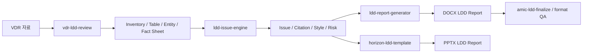
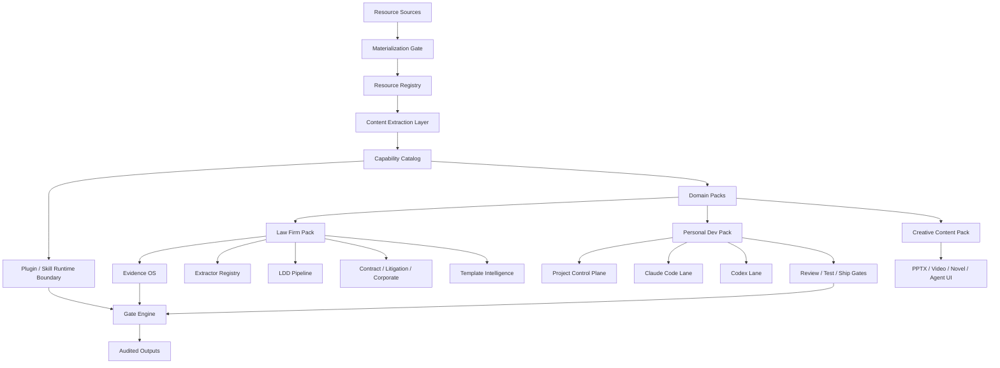

# 리소스 본문 추출 결과와 설계 반영안

조사일: 2026-05-22

## 현재 결론

`02_Template`와 `플러그인` 폴더는 단순 참고자료 폴더가 아니라 이미 상당 부분 구현된 업무 자동화 자산 저장소다. 특히 로펌용 LDD 영역은 템플릿, Claude 플러그인, 스킬, 명령어, 파이썬 extractor, 테스트, 보고서 생성기, PPTX 디자인 시스템까지 함께 존재한다.

다만 전체 3,836개 중 2,713개가 아직 OneDrive `dataless` placeholder 상태다. 따라서 최종 설계 확정은 보류해야 하지만, 현재 로컬에 있는 1,045개 파일은 전부 본문 추출에 성공했다.

## 추출 실행 결과

명령:

```bash
npm run resource:audit
npm run resource:extract
```

산출물:

- `/Users/jws/Documents/Codex/Hermes/audits/resource-audit/latest/resource-audit.json`
- `/Users/jws/Documents/Codex/Hermes/audits/resource-audit/latest/extraction/resource-extraction.json`
- `/Users/jws/Documents/Codex/Hermes/audits/resource-audit/latest/extraction/capability-signals.json`
- `/Users/jws/Documents/Codex/Hermes/audits/resource-audit/latest/extraction/summary.md`

현재 상태:

- 전체 파일: 3,836개
- OneDrive materialization 필요: 2,713개
- 본문 추출 대상: 1,045개
- 본문 추출 성공: 1,045개
- 본문 추출 실패: 0개

추출된 파일 유형:

- `md`: 665개
- `py`: 105개
- `docx`: 93개
- `json`: 58개
- `yaml`: 49개
- `zip`: 30개
- `plugin`: 16개
- `pptx`: 4개
- `xlsx`: 1개

## 확인된 Capability 후보

본문 기반 신호로 확인된 capability 후보는 다음이다.

- `law_firm.ldd_vdr_review`: 963개
- `law_firm.contract_drafting_review`: 899개
- `platform.plugin_skill_registry`: 884개
- `document.format_qa`: 781개
- `law_firm.amic_style_system`: 596개
- `law_firm.corporate_documents`: 537개
- `law_firm.litigation_briefing`: 443개
- `document.pptx_design_system`: 227개
- `law_firm.legal_memo_opinion`: 209개
- `platform.extractor_workbench`: 178개
- `law_firm.email_reply`: 156개
- `law_firm.engagement_proposal`: 86개
- `personal.project_development_harness`: 30개
- `personal.creative_content_factory`: 18개

이 수치는 최종 업무량 추정이 아니라, 현재 로컬 파일에서 해당 capability에 연결될 수 있는 자산 수다. 하나의 파일이 여러 capability에 동시에 연결될 수 있으므로 합계는 전체 파일 수보다 크다.

## 로펌용 자산: LDD가 중심축

현재 확인된 LDD 자산은 다음 구조로 봐야 한다.



본문 추출로 확인된 주요 플러그인/패키지:

- `vdr-ldd-review` v0.6.0: 5 skills, 5 commands, 29 scripts
- `ldd-report-generator` v1.9.0 및 kplus v1.10.x 계열
- `amic-rfi-comment` v1.1.0
- `horizon-ldd-template` v1.0.x
- `amic-ldd-finalize` v1.0.0
- `korea-japan-ldd` v1.0.0

본문 추출로 확인된 핵심 extractor 코드:

- `inventory_builder.py`
- `extract_pdf.py`
- `table_extractor.py`
- `entity_extractor.py`
- `entity_normalizer.py`
- `cross_document_validator.py`
- `issue_mapper.py`
- `case_citer.py`
- `law_currency_tracker.py`
- `report_handoff.py`
- `annex_generator.py`
- `generate_ldd_report.py`
- `standard_tables.py`
- `verify_paragraph_match.py`
- `verify_prose.py`

테이블/문서 유형별 parser 후보:

- shareholders
- directors
- litigation
- financials
- meeting minutes
- permits
- borrowings
- insurance
- annual events
- real estate
- vehicles
- violations

설계 반영:

- LDD는 단순 RAG 기능이 아니라 독립된 `Evidence OS + Extractor Registry + Report Writer` 시스템으로 승격한다.
- `vdr-ldd-review`, `ldd-issue-engine`, `ldd-report-generator`, `amic-ldd-finalize`, `horizon-ldd-template`를 각각 capability adapter로 등록한다.
- 기존 플러그인 패키지는 버전 lineage가 많으므로 최신/legacy/backup을 분리하는 `Plugin Lineage Registry`가 필요하다.
- LDD 산출물은 원문 파일, 추출 사실, 이슈 매핑, 보고서 문단, 표, 인용, 검증 결과가 연결되는 provenance graph를 가져야 한다.

## 문서/디자인 자산

DOCX:

- LDD 보고서 역설계 자료가 다수 확인됨
- `template_amic_v10`, `template_amic_v15`, `template_amic_v17`, `AMIC_LDD_Template_aux` 등 템플릿 lineage 존재
- 문단/표/스타일 검증 스크립트가 같이 존재

PPTX:

- `template_base.pptx`: 19 slides, 1 master, 5 layouts
- `HORIZON_LDD_Template.pptx`: 11 slides, 1 master, 5 layouts
- `amic_ldd_master_v2.pptx`: 5 slides, 1 master, 5 layouts
- `amic_ldd_master.pptx`: 1 slide, 1 master, 5 layouts

설계 반영:

- `Template Intelligence Layer`는 DOCX만이 아니라 PPTX까지 포함해야 한다.
- 보고서 생성은 `content writer`와 `format/design renderer`를 분리한다.
- PPTX 보고자료 생성 디자인 시스템은 로펌용 LDD뿐 아니라 개인 프로젝트용 보고자료 생성에도 재사용 가능한 shared capability로 둔다.

## 개인 개발/콘텐츠 자산

현재 로컬 추출에서 확인된 개인 개발 자산:

- `agent-skills`
- `Open-Generative-AI`
- `UI-TARS-desktop`
- `Sulphur2_설치키트`

`agent-skills`에 포함된 workflow:

- idea refinement
- planning and task breakdown
- incremental implementation
- test-driven development
- API/interface design
- security hardening
- browser testing
- git workflow/versioning
- documentation/ADR
- source-driven development
- doubt-driven development
- deprecation/migration
- code simplification
- performance optimization

설계 반영:

- 개인 프로젝트용 하네스는 “할 일 목록”이 아니라 `Spec -> Plan -> Build -> Review -> Test -> Ship -> Learn` 루프를 관리해야 한다.
- Claude Code와 Codex는 같은 작업공간을 동시에 만지는 방식이 아니라, 각자 독립 worktree/branch에서 산출물을 만들고 Hermes가 plan diff, review diff, test gate를 조정하는 구조가 맞다.
- Open-Generative-AI/UI-TARS/Sulphur2는 별도 `creative_content_factory`와 `agent_ui_lab` capability로 분리한다.

## 전체 하네스 설계 수정안



핵심 설계 원칙:

- 하나의 Hermes Harness core를 두고 domain pack을 분리한다.
- 로펌용과 개인용은 데이터 저장소, 권한, 실행 policy를 분리한다.
- `Capability Catalog`는 모든 플러그인/스킬/스크립트/템플릿을 호출 가능한 업무 능력으로 승격한다.
- `Plugin Runtime Boundary`는 Claude 플러그인을 직접 흡수하지 않고 adapter로 감싼다.
- `Evidence OS`는 로펌용 산출물의 원문, 근거, 추론, 리뷰, 최종 문단의 연결을 보존한다.
- `Project Control Plane`은 개인 개발 프로젝트에서 Claude Code와 Codex의 계획/구현/리뷰를 조율한다.

## 구현 순서

1. `Materialization Gate`를 운영 절차로 고정한다.
2. `Resource Registry`에 모든 파일의 hash, extraction status, domain, capability 신호를 저장한다.
3. `Capability Catalog`에 현재 확인된 14개 capability 후보를 등록한다.
4. `Plugin Lineage Registry`로 latest/legacy/backup 플러그인 패키지를 분리한다.
5. `Extractor Registry`에 LDD 문서유형별 parser와 fact schema를 등록한다.
6. LDD 1차 end-to-end wrapper를 만든다: inventory -> extraction -> issue -> report -> final QA.
7. 개인 개발 pack을 만든다: Plane/GitHub issue -> Claude plan -> Codex plan -> reconcile -> worktree build -> cross-review -> test gate.
8. PPTX/DOCX renderer를 shared document capability로 분리한다.
9. UI는 처음부터 별도 앱을 크게 만들기보다 Plane/GitHub를 control UI로 쓰고, Hermes dashboard는 registry/capability/status 조회용으로 뒤에 붙인다.

## 아직 확정하면 안 되는 것

남은 2,713개 OneDrive placeholder 파일이 내려오기 전에는 다음 판단을 확정하지 않는다.

- 계약서/소송서면/회사법/의견서 템플릿의 최종 coverage
- Outlook `.msg`, HWP, legacy DOC 계열 extractor 우선순위
- 로펌용 전체 capability ranking
- 개인 콘텐츠 제작 pack의 실제 규모
- 미지원 파일 변환 정책

즉 현재 설계는 “읽힌 1,045개에 근거한 강한 구조 초안”이고, 최종 설계 lock은 materialization 완료 후 다시 추출해야 한다.
