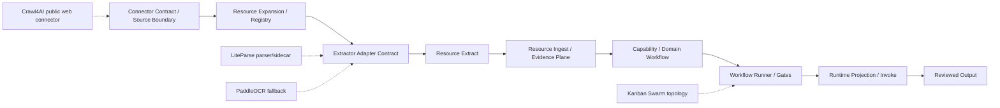

# Safe Adapter Integration Plan

작성일: 2026-05-30

이 문서는 Crawl4AI, LiteParse, PaddleOCR, Hermes Kanban Swarm을 Hermes Law Firm Harness에 안전하게 이식하기 위한 단계별 계획이다. 목표는 새 도구를 무조건 추가하는 것이 아니라, 현재 deterministic 구현보다 나은 부분만 신중하게 승격하고 기존 구현은 검증 가능한 fallback으로 보존하는 것이다.

현재 worktree에는 별도 Trading Pack 추가 작업이 진행 중이다. 이 계획과 후속 구현은 Trading Pack 관련 파일, 스키마, 스크립트, 테스트를 수정하지 않는다. 공통 계약 또는 package script를 변경해야 할 때도 Trading Pack 항목은 보존하고, adapter integration 전용 변경만 추가한다.

## 최종 판단

| 대상 | 결론 | 이유 |
|---|---|---|
| Crawl4AI | 신규 public web connector | 현재 pipeline에는 공개 웹 전용 connector가 명확하지 않다. 기존 browser/runtime을 대체하지 않고 P0/P1 URL snapshot 입구로 추가한다. |
| LiteParse | 부분 승격 | PDF와 image는 primary 후보로 승격한다. DOCX/PPTX/XLSX는 기존 OpenXML probe를 primary로 유지하고 LiteParse는 layout sidecar 또는 shadow comparison으로 둔다. |
| PaddleOCR | OCR fallback 승격 | 전체 primary가 아니라 scanned PDF, image-only, low-confidence 결과에서 기존 `pdf_header_probe`보다 먼저 시도하는 local OCR fallback으로 둔다. |
| Kanban Swarm | workflow orchestration 확장 | 기존 workflow runner와 gate를 대체하지 않는다. Swarm topology artifact와 Hermes runtime projection을 추가한다. |

## 기준 Pipeline



## Current Codebase Anchors

| 영역 | 현재 위치 | 이식 지점 |
|---|---|---|
| Connector contract | `src/connector-contract-v2.mjs` | `CONNECTOR_BLUEPRINTS`에 public web connector blueprint 추가 |
| Connector scripts | `scripts/*-connector.mjs` | `scripts/public-web-connector.mjs` 추가 |
| Extractor contract | `src/extractor-adapter-contract.mjs` | `OCR_POLICIES`, `ADAPTER_DEFINITIONS`에 LiteParse/PaddleOCR 등록 |
| Extraction execution | `src/resource-extract.mjs` | `extractByExtension()`을 adapter chain으로 교체 |
| Evidence promotion | `src/resource-ingest.mjs` | source span locator와 normalized text metadata 확장 |
| Workflow packets | `src/control-plane-work-packets.mjs` | swarm candidate metadata 추가 |
| Workflow runner | `src/workflow-state-machine-runner.mjs` | swarm topology runner plan candidate 추가 |
| Runtime invocation | `src/runtime-invoker.mjs` | Hermes swarm projection은 dry-run 기본값 유지 |
| Runtime bindings | `examples/core/runtime-command-bindings.json` | Hermes binding은 유지, projection metadata만 추가 가능 |
| Tests | `test/matter-harness.test.mjs` | fixture comparison, policy rejection, dry-run projection 추가 |

## Phase 0: Baseline Freeze

목표: 현재 deterministic 동작을 교체 전 기준선으로 고정한다.

작업:

- `npm run validate`와 `npm test` 결과를 기록한다.
- `resource:extractor-adapters`, `resource:extractor-registry`, `resource:extract`, `resource:ingest`, `workflows:runner`, `runtime:invoke`의 현 artifact 구조를 확인한다.
- 기존 `docx_word_xml_probe`, `pptx_open_xml_probe`, `xlsx_open_xml_probe`, `pdf_pdftotext_probe`, `pdf_header_probe`를 fallback baseline으로 명명한다.
- 기존 dirty worktree가 있으면 이 계획과 무관한 변경은 그대로 보존한다.

산출물:

- `artifacts/adapter-integration-baseline/latest/baseline-report.json`
- `artifacts/adapter-integration-baseline/latest/summary.md`

완료 기준:

- 모든 현재 extractor id와 fallback 역할이 baseline report에 기록된다.
- 기존 검증 명령의 통과/실패 상태가 기록된다.
- 이후 phase가 기존 baseline을 삭제하거나 덮어쓰지 않는다는 invariant가 문서화된다.

## Phase 1: Adapter Selection Policy

목표: 문서 유형별 primary, sidecar, fallback 체인을 코드로 선언한다.

추가 파일:

- `schemas/adapter-selection-policy.schema.json`
- `src/adapter-selection-policy.mjs`
- `scripts/adapter-selection-policy.mjs`
- `docs/adapter-selection-policy.md`

수정 파일:

- `package.json`
- `test/matter-harness.test.mjs`

정책 초안:

| Extension | Primary | Sidecar | Fallback |
|---|---|---|---|
| `pdf` | `liteparse_local` | none | `paddleocr_local`, `pdf_pdftotext_probe`, `pdf_header_probe`, `manual_review` |
| `png/jpg/jpeg/webp` | `liteparse_local` | none | `paddleocr_local`, `manual_review` |
| `docx` | `docx_word_xml_probe` | `liteparse_layout_sidecar` | `manual_review` |
| `pptx` | `pptx_open_xml_probe` | `liteparse_layout_sidecar` | `manual_review` |
| `xlsx` | `xlsx_open_xml_probe` | `liteparse_layout_sidecar` | `manual_review` |

필수 policy field:

- `classification_limit`
- `network_access_allowed`
- `external_service_allowed`
- `model_download_allowed`
- `local_command_required`
- `fallback_on_missing_command`
- `human_review_required`
- `output_status`

완료 기준:

- selection policy가 JSON schema를 통과한다.
- `lit` 또는 `paddleocr`가 설치되어 있지 않아도 policy check는 통과한다.
- P2 이상 외부 web adapter 사용이 policy에서 차단된다.

## Phase 2: LiteParse Shadow Mode

목표: LiteParse를 곧바로 교체하지 않고 기존 extractor와 병렬 비교한다.

추가 파일:

- `src/liteparse-adapter.mjs`
- `scripts/liteparse-adapter.mjs`
- `examples/document-parser-fixtures/`

수정 파일:

- `src/extractor-adapter-contract.mjs`
- `src/resource-extract.mjs`
- `package.json`
- `test/matter-harness.test.mjs`

계약 변경:

- `ADAPTER_DEFINITIONS`에 `liteparse_local` 추가
- document type binding은 PDF/image primary candidate, Office sidecar candidate로 구분
- `network_access_allowed: false`
- `external_service_allowed: false`
- `ocr_server_url_allowed: false`를 기본값으로 둔다

실행 변경:

- `resource-extract.mjs`에 `extractWithAdapterChain(file, options)` 추가
- shadow mode에서는 기존 extractor output을 canonical로 유지하고 LiteParse output은 `comparison.sidecar`에만 저장
- `lit parse <file> --format json --max-pages <n> --quiet` 형태로만 호출
- remote input, stdin URL pipe, HTTP OCR server 옵션은 차단한다

비교 지표:

- `text_length_delta`
- `page_count`
- `source_span_count`
- `bbox_count`
- `table_signal_count`
- `mean_confidence`
- `timeout_or_failure`
- `determinism_hash_stable`

완료 기준:

- fixture에서 기존 extractor와 LiteParse 결과가 모두 기록된다.
- LiteParse 실패가 기존 extraction 실패로 전파되지 않는다.
- output에는 command path, version, timeout, stderr hash가 남는다.

## Phase 3: LiteParse Partial Promotion

목표: Shadow 결과가 충분히 좋을 때 PDF/image만 primary로 승격한다.

수정 파일:

- `src/adapter-selection-policy.mjs`
- `src/resource-extract.mjs`
- `src/resource-ingest.mjs`
- `docs/extractor-adapter-contract.md`

승격 조건:

- PDF/image fixture에서 text coverage와 source span 품질이 기존보다 높다.
- `lit` 미설치 환경에서 기존 fallback이 유지된다.
- timeout, unsupported file, encrypted file은 quarantine 또는 fallback으로 처리된다.
- Office 문서의 기존 XML extraction은 계속 primary다.

구현:

- `pdf`와 image extension에 한해 `liteparse_local`을 primary로 설정한다.
- DOCX/PPTX/XLSX는 `liteparse_layout_sidecar`만 실행한다.
- `source_span.locator`에 `page`, `bbox`, `screenshot_ref`를 보존할 수 있게 확장한다.
- `normalized_text.metadata`에 `parser_chain`, `primary_extractor`, `fallback_extractor`, `sidecar_extractor`를 저장한다.

완료 기준:

- PDF/image fixture의 selected extractor가 LiteParse로 기록된다.
- DOCX/PPTX/XLSX fixture의 selected extractor는 기존 OpenXML probe로 기록된다.
- `resource:ingest`가 bbox metadata를 잃지 않는다.

## Phase 4: PaddleOCR Local Fallback

목표: 기존 `pdf_header_probe`로 끝나던 스캔/이미지 문서를 local OCR fallback으로 구조화한다.

추가 파일:

- `src/paddleocr-adapter.mjs`
- `scripts/paddleocr-adapter.mjs`
- `docs/local-ocr-adapter.md`
- `examples/ocr-fixtures/`

수정 파일:

- `src/extractor-adapter-contract.mjs`
- `src/resource-extract.mjs`
- `src/adapter-selection-policy.mjs`

계약 변경:

- `ocr-fallback-policy.paddleocr_local_only.v1` 추가
- `allowed_tools`: `filesystem.read`, `paddleocr`
- `blocked_tools`: `external_ocr_api`, `cloud_document_ai`, `network.fetch`, `model.download`
- `human_review_required: true`

호출 조건:

- LiteParse result가 image-only 또는 low confidence다.
- PDF text layer가 없거나 `pdftotext` 결과가 비어 있다.
- 이미지 파일이다.
- operator가 local OCR model 설치를 사전에 승인했다.

금지:

- 실행 중 모델 다운로드
- cloud OCR API
- non-local HTTP OCR server
- privileged/client-confidential 파일의 외부 전송

완료 기준:

- OCR fixture에서 `paddleocr_local`이 fallback으로 선택된다.
- OCR unavailable 상태가 extraction failure가 아니라 fallback/quarantine으로 기록된다.
- output에 `page`, `bbox`, `confidence`, `language`, `engine_version`, `model_hash`가 남는다.

## Phase 5: Crawl4AI Public Web Connector

목표: Crawl4AI를 public web source connector로 추가하되 legal research agent나 confidential query path로 만들지 않는다.

추가 파일:

- `src/public-web-connector.mjs`
- `scripts/public-web-connector.mjs`
- `schemas/public-web-resource-connector.schema.json`
- `docs/public-web-connector.md`
- `examples/public-web-connector/allowed-public-pages.json`
- `examples/public-web-connector/fixtures/`

수정 파일:

- `src/connector-contract-v2.mjs`
- `package.json`
- `test/matter-harness.test.mjs`

Connector contract:

- `connector.public_web.v2`
- `source_system: public_web`
- `auth_mode: none_or_public_only`
- `credential_ref_required: false`
- `network_access_required: true`
- `least_privilege_scopes: ["public_url.read"]`
- `expected_resource_types: ["public_web_page", "public_web_snapshot"]`

Policy:

- only `P0_PUBLIC` and tightly scoped `P1_INTERNAL`
- URL allowlist required
- query-based crawling disabled
- private IP, localhost, `file://`, `data:`, `blob:`, internal hostnames blocked
- proxy escalation, CAPTCHA solver, authenticated browser profile disabled
- cloud Crawl4AI API disabled

Output:

- fetched URL
- canonical URL
- content hash
- fetched_at
- crawl4ai version
- markdown snapshot path
- raw HTML snapshot path when allowed
- robots/terms review status when provided
- `human_review_required: true`

완료 기준:

- fixture mode works without network.
- live mode is opt-in and blocked without allowlist.
- P2/P3 classification attempts fail with policy violation rows.
- connector output becomes a resource expansion candidate, not a direct LLM prompt.

## Phase 6: Kanban Swarm Topology Projection

목표: Hermes Kanban Swarm을 workflow runner 대체물이 아니라 dry-run topology projection으로 추가한다.

추가 파일:

- `schemas/swarm-topology.schema.json`
- `src/swarm-topology-contract.mjs`
- `scripts/swarm-topology-contract.mjs`
- `docs/swarm-topology-contract.md`

수정 파일:

- `src/control-plane-work-packets.mjs`
- `src/workflow-state-machine-runner.mjs`
- `src/runtime-invoker.mjs`
- `examples/core/runtime-adapters.json`
- `examples/core/runtime-command-bindings.json`
- `package.json`

Topology model:

- `root_task`
- `workers`
- `verifier`
- `synthesizer`
- `shared_blackboard_path`
- `matter_scope`
- `document_scope`
- `max_concurrency`
- `claim_ttl`
- `retry_policy`
- `stale_detection_policy`
- `human_review_gate`
- `protected_action_execution_allowed: false`

Workflow integration:

- Work packets may mark `swarm_candidate: true`.
- Workflow runner emits topology candidate only after transition guards pass.
- Runtime invoker records Hermes command projection in dry-run mode.
- Actual `hermes kanban swarm` execution remains blocked until explicit human approval and isolated runtime policy exist.

완료 기준:

- Swarm topology artifact validates against schema.
- Runner plan records verifier and synthesizer gates.
- No worker execution occurs in default test mode.
- Human review waiting states continue to hold.

## Phase 7: Evidence Plane Metadata Integration

목표: LiteParse/PaddleOCR/Crawl4AI가 만든 richer metadata를 Evidence Plane에서 잃지 않는다.

수정 파일:

- `src/resource-ingest.mjs`
- `schemas/core/resource-evidence.schema.json`
- `src/source-span-store.mjs`
- `src/evidence-viewer-data-api.mjs`

변경:

- `source_span.location_type` 확장: `whole_document`, `page`, `bbox`, `html_section`, `table_cell`
- `source_span.locator`에 `page_number`, `bbox`, `html_selector`, `snapshot_ref`
- `normalized_text.metadata`에 `parser_chain`, `confidence`, `language`, `engine_version`
- `evidence_item.metadata`에 `review_reason`, `extraction_quality`, `source_snapshot_hash`

완료 기준:

- 기존 whole-document source span fixture는 계속 통과한다.
- bbox/page/html section span fixture가 schema를 통과한다.
- evidence viewer data API가 richer locator를 읽어도 delivery/client-facing 상태로 승격하지 않는다.

## Phase 8: Regression Gates

목표: 새 adapter가 기존 안전 경계를 우회하지 못하게 한다.

테스트 추가:

- LiteParse unavailable fallback test
- LiteParse PDF primary test
- Office OpenXML primary preservation test
- PaddleOCR unavailable quarantine/fallback test
- Crawl4AI P2/P3 rejection test
- Crawl4AI private URL rejection test
- Crawl4AI fixture no-network test
- Swarm dry-run no-execution test
- Runtime invoke protected action false test

검증 명령:

```powershell
npm run validate
npm test
npm run resource:extractor-adapters -- --check
npm run resource:extractor-registry -- --check
npm run workflows:runner -- --check
npm run runtime:invoke -- --runtime hermes --prompt "dry run only"
```

완료 기준:

- 모든 new adapter path가 no-network fixture mode로 검증 가능하다.
- green test가 단순 smoke가 아니라 policy rejection과 fallback behavior를 포함한다.
- 실패한 external command가 data loss 또는 direct client-facing output으로 이어지지 않는다.

## Phase 9: Promotion Decision Report

목표: 실제 교체 여부를 artifact로 남기고 운영자가 이해할 수 있게 한다.

추가 파일:

- `src/adapter-promotion-report.mjs`
- `scripts/adapter-promotion-report.mjs`
- `docs/adapter-promotion-report.md`

Report fields:

- adapter id
- document type or workflow stage
- previous primary
- proposed primary
- decision: `promoted`, `sidecar_only`, `fallback_only`, `blocked`, `deferred`
- evidence basis
- failed fixtures
- residual risks
- human approval status

최종 expected decisions:

| Adapter | Expected final status |
|---|---|
| `liteparse_local` for PDF/image | `promoted` after comparison passes |
| `liteparse_local` for DOCX/PPTX/XLSX | `sidecar_only` |
| `paddleocr_local` | `fallback_only` |
| `crawl4ai_public_web` | `new_connector` |
| `hermes_kanban_swarm_projection` | `dry_run_projection` |

완료 기준:

- promotion report가 current adapter-selection policy와 일치한다.
- 모든 promoted path에 fallback path가 남아 있다.
- report가 attorney/human review gate와 pending review posture를 유지한다.

## Non-Goals

- Trading Pack 구현, schema, scripts, tests, pack manifest를 수정하지 않는다.
- Crawl4AI를 legal research agent로 만들지 않는다.
- P2/P3/P4 matter data를 public web query나 remote crawler input으로 보내지 않는다.
- LlamaParse cloud, Crawl4AI cloud, cloud OCR API를 기본 경로로 추가하지 않는다.
- Existing OpenXML probes를 삭제하지 않는다.
- Workflow runner, gate engine, human review state model을 Kanban Swarm으로 대체하지 않는다.
- Client-facing output delivery를 자동화하지 않는다.

## Completion Audit Checklist

- Adapter selection policy exists and validates.
- LiteParse is shadow-tested before promotion.
- PDF/image partial promotion is evidence-backed.
- Office OpenXML primary path is preserved.
- PaddleOCR is local-only fallback.
- Crawl4AI is P0/P1 public web connector only.
- Kanban Swarm is topology/dry-run projection only.
- Evidence Plane preserves bbox/page/html source span metadata.
- All new paths have fixture tests and policy rejection tests.
- `npm run validate` and `npm test` results are recorded after implementation.
